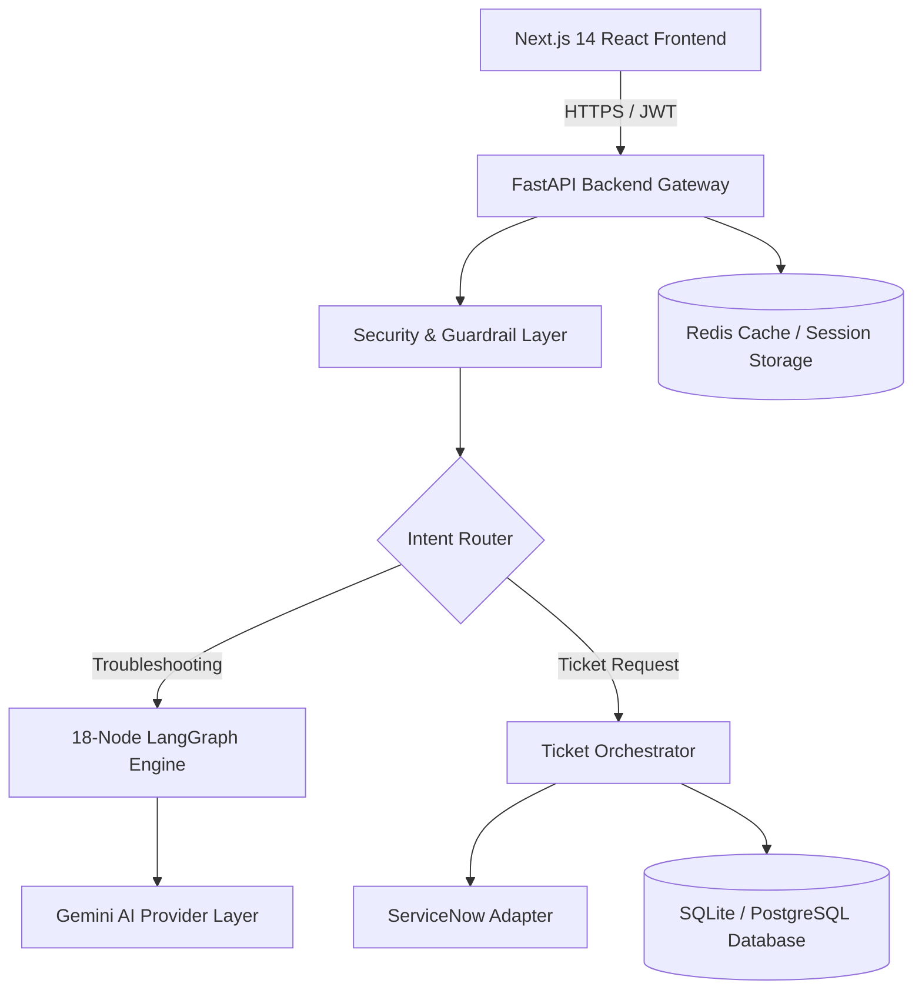

# Release Notes — Version 1.0.0 (Initial Stable Release)

> **Release Date:** July 26, 2026  
> **Project:** Bridgestone IT AI Support Assistant  
> **Version Tag:** `v1.0.0`

---

## Overview

We are proud to announce the **v1.0.0 Initial Stable Release** of the **Bridgestone IT AI Assistant**.

The Bridgestone IT AI Assistant is an enterprise-grade AI support solution designed to automate internal IT helpdesk resolution, streamline privileged access approvals, and integrate directly with ITSM platforms like ServiceNow.

This release represents a feature-complete Proof of Concept (POC) demo and production foundation, featuring an 18-node LangGraph troubleshooting pipeline, dynamic ServiceNow ticket synchronization, a dedicated Manager Approval Portal, an IT Admin Fulfillment Queue, and an enterprise Analytics Dashboard.

---

## New Features in v1.0.0

### 1. AI Conversational IT Support
- **Multi-Turn Troubleshooting Engine**: Interactively guides employees through diagnostic steps for common IT issues (VPN, Outlook, Printer, Password Reset, Hardware, Software).
- **PromptGuard Security Filter**: Pre-filters input text for prompt injections and malicious content before invoking LLM models.
- **Resilient AI Provider Layer**: Powered by Google Gemini with automatic failover from `gemini-3.5-flash` to `gemini-3.1-flash-lite` on rate-limit or quota limits (`RESOURCE_EXHAUSTED` / HTTP 429).

### 2. Intelligent ServiceNow Ticket Orchestration
- **Automatic Ticket Creation**: Dynamically classifies user intent into standard `INCIDENT` tickets or `SERVICE_REQUEST` items.
- **Bi-Directional ServiceNow Adapter**: Syncs incident numbers (`INC`), categories, subcategories, assignment groups, and CMDB Configuration Items (CIs).
- **ServiceNow Metadata Validator**: Validates choice fields against ServiceNow sys_choice metadata with automated fallback rules.

### 3. Manager Approval Portal
- **Service Request Queue**: Displays pending `SERVICE_REQUEST` and `PRIVILEGED_ACTION` tickets requiring manager authorization.
- **Approval & Rejection Workflows**: Managers can approve or reject requests with audit notes.
- **Approval History Tracking**: Approved requests transition to `READY_FOR_ADMIN` and remain visible in the Manager Portal "Approved Requests" tab.

### 4. IT Admin Queue & Temporary Admin Access (Mock LAPS)
- **Admin Processing Queue**: Centralized queue for IT administrators to review and fulfill approved requests.
- **Enterprise Admin Access Card**: Fulfills privileged software requests by issuing temporary administrator credentials with an interactive 15-minute countdown timer and password reveal toggle.
- **Mock Integration**: Explicitly designed with mock credentials (`.\Administrator` / `Temp@4821#`) for safe demonstration prior to Phase 2 Windows LAPS and CyberArk PAM integration.

### 5. Knowledge Base Administration
- **Article Lifecycle Management**: Admin tools to create, edit, publish, version, and archive Knowledge Base articles.
- **RAG-Powered Diagnosis**: Published KB articles are automatically retrieved and integrated into AI diagnostic steps.

### 6. Executive Analytics & Observability
- **Real-Time Dashboards**: Metrics for ticket volume, category distribution, resolution times, and team performance.
- **SLA Engine & Escalation Monitoring**: Tracks SLA thresholds (`HEALTHY`, `WARNING_75`, `WARNING_90`, `BREACHED`) with background monitoring.
- **Incident Clustering**: Groups recurring incident patterns to recommend systemic KB fixes.

---

## Architecture

The application follows a clean 3-tier architecture:



---

## Tech Stack

### Backend Framework & Core
- **Language:** Python 3.12
- **API Gateway:** FastAPI & Uvicorn
- **AI Framework:** LangChain & LangGraph (18-Node State Machine)
- **LLM Provider:** Google GenAI SDK (`gemini-3.5-flash`, `gemini-3.1-flash-lite`)
- **Database ORM:** SQLAlchemy & Alembic
- **Caching & Sessions:** Redis & In-Memory Fallback Cache
- **Task Scheduling:** APScheduler
- **Testing:** Pytest (690+ unit and integration tests)

### Frontend Framework
- **Framework:** Next.js 14 (App Router)
- **Language:** TypeScript
- **Styling:** Vanilla CSS & Tailwind CSS
- **Icons:** Lucide React
- **Data Visualization:** Recharts

---

## Known Limitations

1. **Temporary Administrator Credentials (Mock Integration)**
   - The credentials issued during privileged access fulfillment (`.\Administrator` / `Temp@4821#`) are static mock values designed for demonstration. Integration with live Windows LAPS, CyberArk PAM, or Azure PIM will be implemented in Phase 2.
2. **Microsoft Graph & Azure Entra ID Adapters**
   - User directory and group endpoints (`/microsoftgraph/*`, `/entra/*`) currently operate in mock mode.
3. **Database Engine for Local Demo**
   - The default development environment uses SQLite (`bridgestone_it_agent.db`). Production deployments should configure PostgreSQL via environment variables.

---

## Future Roadmap

- **Phase 2.1 — Enterprise PAM Integration**: Integrate live Windows LAPS API and CyberArk Privileged Access Manager for dynamic single-use admin credential rotation.
- **Phase 2.2 — Live Directory Synchronization**: Enable live Microsoft Graph API and Azure Entra ID sync for organizational hierarchy lookup.
- **Phase 2.3 — Voice & Telephony Channel**: Add WebRTC voice channel support for phone-based IT helpdesk assistance.
- **Phase 2.4 — Multi-Tenant Enterprise Cloud Deployment**: Kubernetes Helm chart package and multi-tenant DB isolation.

---

## Installation & Setup

### 1. Prerequisites
- Python 3.12+
- Node.js 18+
- npm or yarn

### 2. Backend Setup
```bash
cd backend
python -m venv venv_312
.\venv_312\Scripts\activate

# Install dependencies
pip install -r requirements.txt

# Run backend dev server
python -m uvicorn app.main:app --host 127.0.0.1 --port 8000
```

### 3. Frontend Setup
```bash
cd frontend

# Install dependencies
npm install

# Run frontend dev server
npm run dev
```

The application will be accessible at:
- **Frontend App:** `http://localhost:3000`
- **FastAPI Documentation:** `http://localhost:8000/docs`

---

## Upgrade Notes

This is the **v1.0.0 Initial Stable Release**. No upgrade path from earlier pre-release versions is required. For new installations, the SQLite database table schema will automatically initialize on startup.
