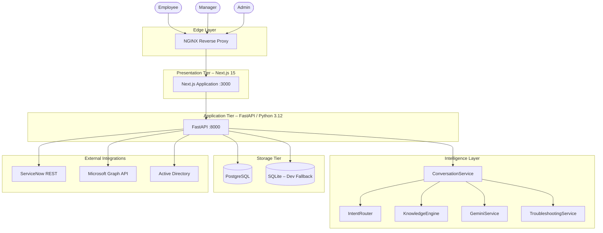
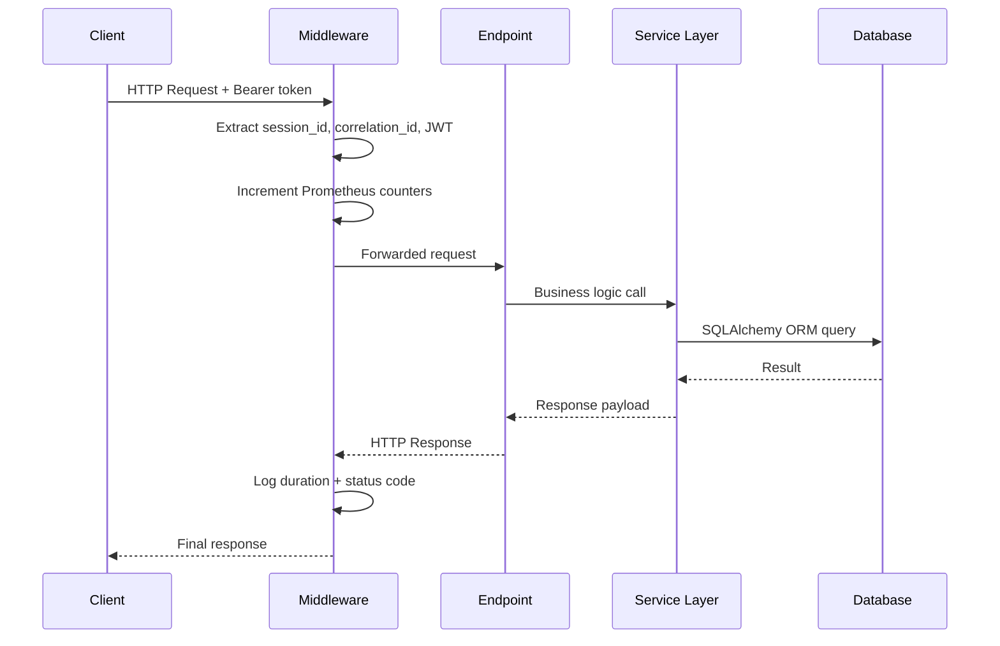
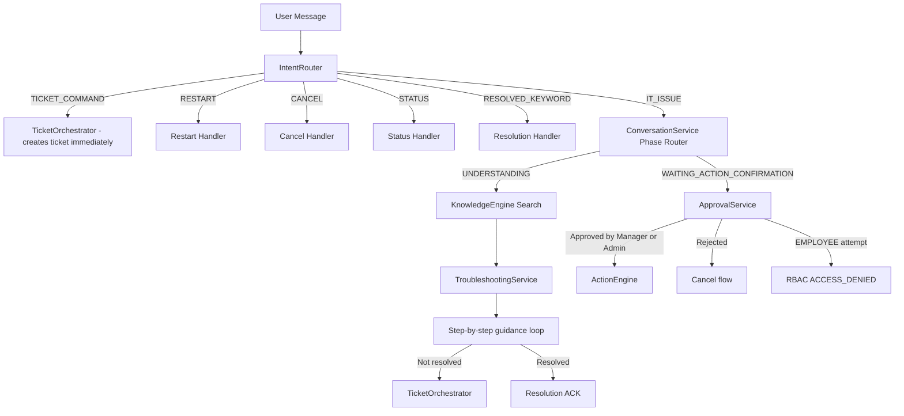
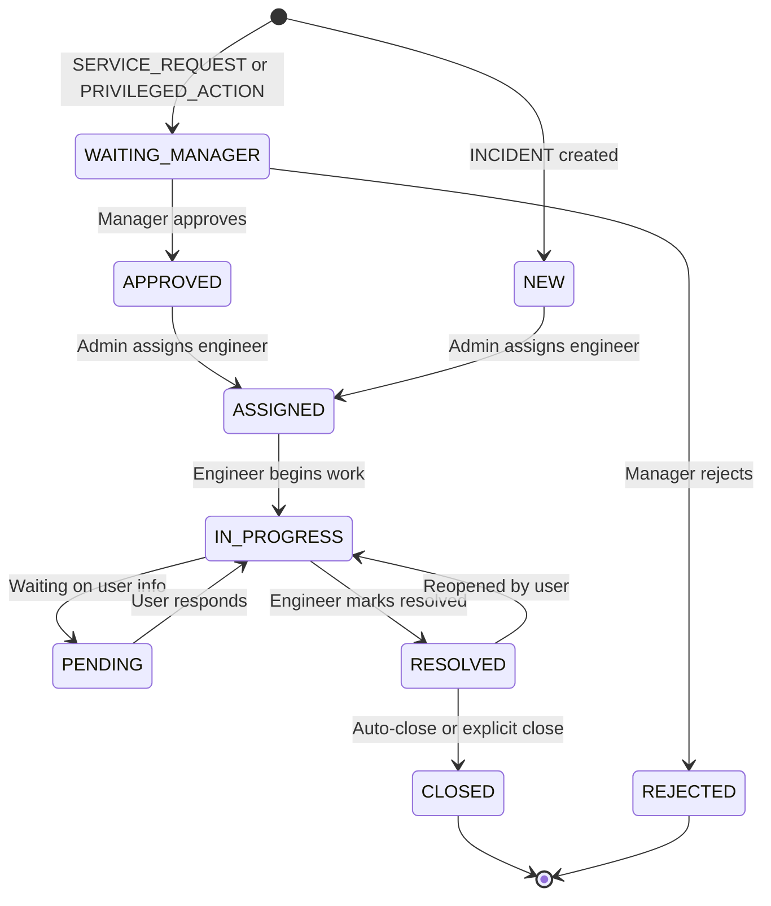

# Architecture – Bridgestone IT Agent

> **Version:** 1.0.0 | **Last updated:** 2026-07-11

---

## 1. Overview

Bridgestone IT Agent is a containerised, enterprise-grade AI IT-support platform.  
It consists of four runtime tiers communicating over a private Docker bridge network.



---

## 2. Tier Details

### 2.1 Edge Layer – NGINX

| Attribute | Value |
|-----------|-------|
| Image | `nginx:stable-alpine` |
| Role | TLS termination, path-based routing |
| Routes | `/` → Frontend `:3000` · `/api/` → Backend `:8000` |
| Config | `infrastructure/nginx/` |

NGINX is the single public entrypoint. All backend traffic flows through `/api/` path rewrites; the frontend serves everything else.

---

### 2.2 Presentation Tier – Next.js Frontend

| Attribute | Value |
|-----------|-------|
| Framework | Next.js 15, React, TypeScript |
| Port | 3000 |
| Config | `NEXT_PUBLIC_API_URL` environment variable |
| Auth | JWT bearer token in `localStorage` |

**Key UI Components**

| Component | Purpose |
|-----------|---------|
| `AppShell.tsx` | Navigation shell, role-based sidebar |
| `SupportChatView.tsx` | AI chat interface |
| `ITSMQueueView.tsx` | Admin/Manager ticket queue |
| `ManagerPortal.tsx` | Approval workflow portal |
| `KnowledgeBase.tsx` | KB article viewer and editor |
| `AnalyticsView.tsx` | Dashboard metrics and charts |
| `DeviceDashboard.tsx` | Enterprise device management |
| `ExecutionCenter.tsx` | IT action execution history |
| `MyTicketsView.tsx` | Employee ticket self-service |

---

### 2.3 Application Tier – FastAPI Backend

| Attribute | Value |
|-----------|-------|
| Framework | FastAPI, Python 3.12 |
| Port | 8000 |
| Entry point | `app/main.py` |
| ASGI server | Uvicorn |

**Request lifecycle:**



**Middleware chain (applied in order):**

1. `CORSMiddleware` – allowlist from `CORS_ORIGINS` env var
2. `monitor_requests` – request ID, correlation ID, JWT extraction, Prometheus metrics, structured JSON logging
3. `global_exception_handler` – converts all unhandled exceptions to `{"detail":..., "error_code":...}` JSON

---

### 2.4 Intelligence Layer – AI Pipeline

The AI pipeline is **stateless at the service level**. All conversation state lives in `ConversationState` objects serialised to the database.



**IntentRouter priority order (deterministic, never reordered):**

1. `TICKET_COMMAND` – "create ticket", "raise incident", "open a ticket", "escalate"
2. `RESTART` – "restart", "start over", "new issue"
3. `CANCEL` – "cancel", "abort", "stop", "never mind"
4. `STATUS` – "ticket status", "check ticket", "my ticket"
5. `RESOLVED_KEYWORD` – "working", "fixed", "solved", "issue resolved"
6. `IT_ISSUE` – keyword/regex classification into category
7. `GENERAL` – fallback, routed to Gemini free conversation

**IT Issue Categories:**

| Category | Trigger Keywords |
|----------|-----------------|
| `VPN` | vpn, global protect, remote access |
| `OUTLOOK` | outlook, email, mailbox, exchange |
| `PRINTER` | printer, printing, print queue, spooler |
| `SOFTWARE_INSTALLATION` | install, chrome, zoom, teams, software |
| `NETWORK` | wifi, network, internet, connectivity |
| `PASSWORD_RESET` | password, reset password, locked out |
| `SAP` | sap, erp, sap gui |
| `GENERAL` | anything else |

---

### 2.5 Storage Tier

| Database | Use case |
|----------|----------|
| PostgreSQL (primary) | All persistent data: tickets, users, sessions, audit logs, SLA records |
| SQLite (dev fallback) | Automatic fallback when PostgreSQL is unreachable |

PostgreSQL connection pooling (`connection.py`):

| Setting | Value |
|---------|-------|
| `pool_size` | 20 |
| `max_overflow` | 10 |
| `pool_timeout` | 30 s |
| `pool_recycle` | 1800 s |
| `pool_pre_ping` | `True` |

SQLite settings: WAL journal mode, NORMAL synchronicity, `NullPool`.

---

## 3. Background Jobs (APScheduler)

| Job | Frequency | Purpose |
|-----|-----------|---------|
| `sla_monitor_job` | Every 60 s | Evaluates all open tickets for SLA state transitions and breach escalations |
| `auto_close_job` | Configurable | Auto-closes tickets resolved beyond idle threshold |
| `cleanup_job` | Configurable | Removes stale sessions and aged data |
| `notification_job` | Configurable | Dispatches pending notification records |

---

## 4. ITSM Ticket Lifecycle



**ITSM Classification Rules (priority order):**

1. Category/description matches privileged keywords → `PRIVILEGED_ACTION`
2. Category is in service-catalog set → `SERVICE_REQUEST`
3. Anything else → `INCIDENT`

---

## 5. SLA Escalation Engine

| SLA State | Trigger |
|-----------|---------|
| `HEALTHY` | < 75% SLA window consumed |
| `WARNING_75` | 75–89% consumed |
| `WARNING_90` | 90–99% consumed |
| `BREACHED` | 100%+ consumed |
| `ESCALATED_LEVEL_1` | Immediately on breach |
| `ESCALATED_LEVEL_2` | Breach + 30 minutes |
| `ESCALATED_LEVEL_3` | Breach + 60 minutes |

Notification recipients per state:

| State | Recipients |
|-------|-----------|
| `WARNING_75` | Manager |
| `WARNING_90` | Manager, Admin |
| `BREACHED` and above | Manager, Admin |

---

## 6. External Integrations

| Integration | Adapter class | Default mode |
|-------------|---------------|-------------|
| ServiceNow REST API | `ServiceNowAdapter` | Mock |
| Microsoft Graph API | `MicrosoftGraphAdapter` | Mock |
| Azure AD / Entra ID | `ActiveDirectoryAdapter` | Mock |
| VPN Gateway | `VPNAdapter` | Mock |

All adapters expose `is_mock` detection and fall back gracefully to mock data when real credentials are absent.

---

## 7. Observability

| Signal | Implementation |
|--------|---------------|
| Structured logs | JSON format with `request_id`, `correlation_id`, `session_id`, `user`, `role`, `endpoint` |
| Prometheus metrics | `GET /metrics` – counters and histograms for HTTP, DB, LLM, security events |
| Health check | `GET /health` – returns `{"status": "healthy"}` |
| System status | `GET /system-status` – deep check of DB, Gemini, adapters, scheduler |

---

## 8. Directory Structure

```
bridgestone-it-agent/
├── backend/
│   ├── app/
│   │   ├── adapters/          # ServiceNow, Graph, AD, VPN adapters
│   │   ├── agents/            # Specialised LLM agent implementations
│   │   ├── api/               # Router modules: auth, analytics, devices, executions
│   │   ├── core/              # Security, JWT, RBAC, metrics, logging context
│   │   ├── database/          # SQLAlchemy models, connection, session
│   │   │   └── models/        # ticket, user, audit_log, sla, device, etc.
│   │   ├── integrations/      # ServiceNow integration models
│   │   ├── jobs/              # APScheduler job definitions
│   │   ├── services/          # All business logic services
│   │   └── tools/             # IT tool implementations (VPN, Outlook, printer, etc.)
│   └── knowledge_base/        # JSON knowledge-base articles by category
├── frontend/
│   └── src/
│       ├── app/               # Next.js App Router pages
│       ├── components/        # Feature-level UI components
│       └── lib/               # API client, utilities, auth helpers
├── infrastructure/
│   ├── compose/               # docker-compose.dev.yml / docker-compose.prod.yml
│   ├── docker/                # Per-service Dockerfiles
│   ├── env/                   # dev.env / prod.env environment files
│   ├── monitoring/            # Prometheus and Grafana configs
│   └── nginx/                 # NGINX reverse proxy config
├── docs/                      # All project documentation
└── knowledge_base/            # KB JSON articles (VPN, Outlook, Printer, SAP, etc.)
```
