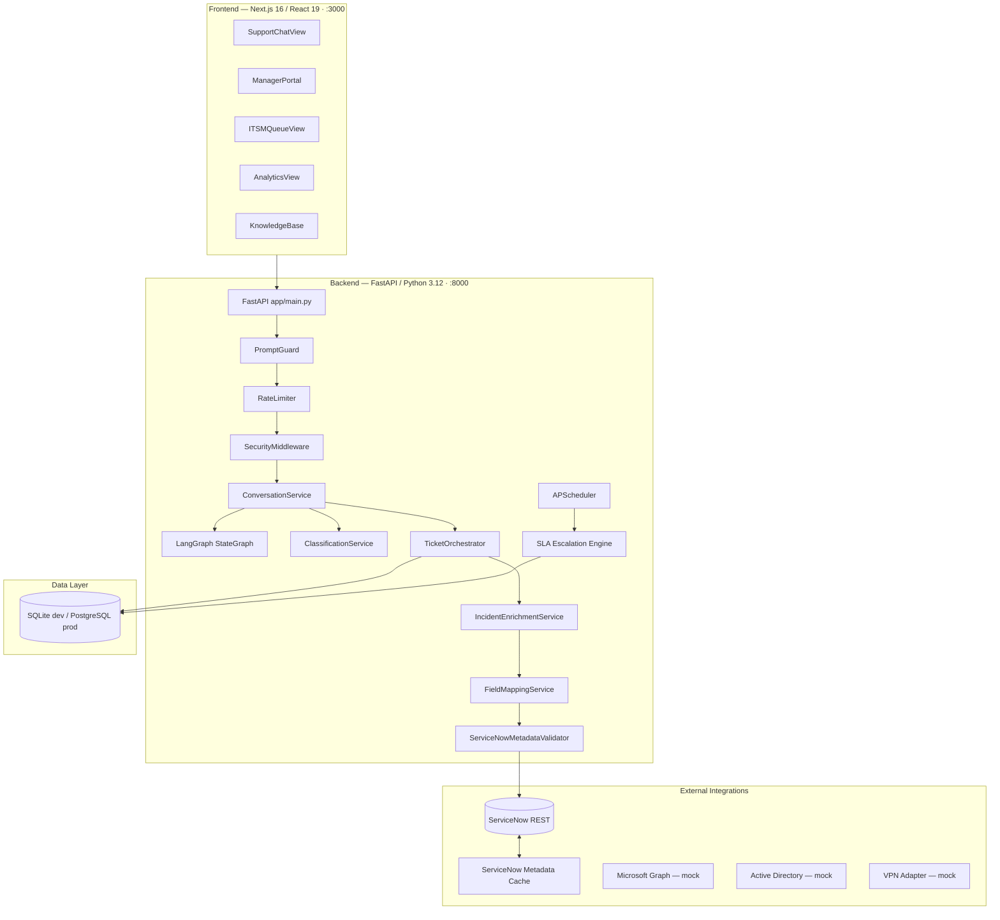
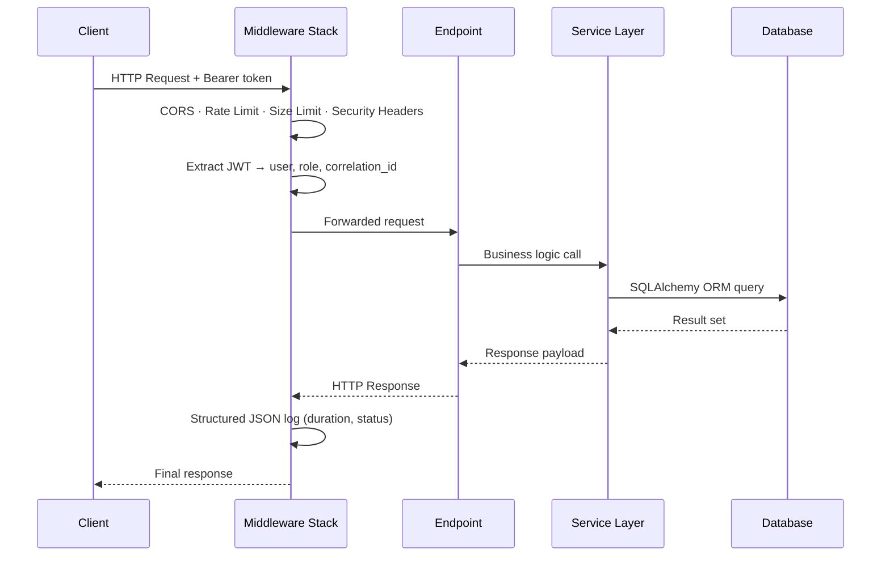
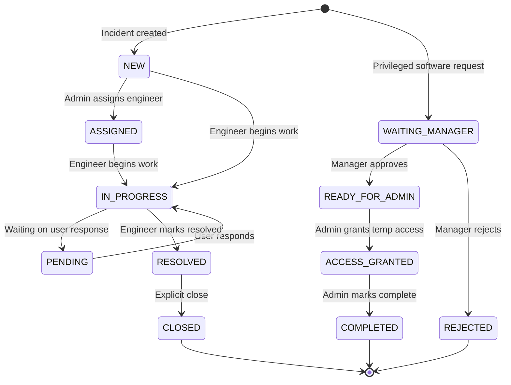

# Architecture

> **Project:** Bridgestone IT AI Assistant · **Last updated:** 2026-07-26

---

## Overview

The Bridgestone IT AI Assistant is a proof-of-concept agentic AI IT support system. It is structured as a three-tier application: a Next.js frontend, a FastAPI backend containing the LangGraph AI pipeline, and a SQLite (dev) or PostgreSQL (production) data layer. External integrations connect to ServiceNow for incident management.



---

## Request Lifecycle

Every HTTP request passes through the following middleware chain before reaching a handler:

1. **CORSMiddleware** — Allowlist-based origin check.
2. **RateLimitMiddleware** — Sliding-window per-IP limiter; enforced on `/chat`, `/auth/login`, `/upload`.
3. **SecurityHeadersMiddleware** — Injects `X-Content-Type-Options`, `X-Frame-Options`, `X-XSS-Protection`, configurable HSTS, and CSP.
4. **RequestSizeLimitMiddleware** — Returns HTTP 413 if `Content-Length` exceeds `MAX_REQUEST_SIZE_KB`.
5. **monitor_requests** — Assigns `request_id` and `correlation_id`, extracts and validates the JWT, records structured JSON log on response.
6. **RoleChecker dependency** — FastAPI dependency on each protected endpoint; raises HTTP 403 if the user's role is insufficient.



---

## Frontend Portals

| Component | File | Audience |
|---|---|---|
| AI Support Chat | `SupportChatView.tsx` | Employee |
| Manager Portal | `ManagerPortal.tsx` | Manager |
| IT Admin Queue | `ITSMQueueView.tsx` | Admin |
| Analytics Dashboard | `AnalyticsView.tsx` | Admin |
| Knowledge Base | `KnowledgeBase.tsx` | Admin |
| My Tickets | `MyTicketsView.tsx` | Employee |
| Enterprise Admin Access Card | `EnterpriseAdminAccessCard.tsx` | Employee (shown post-approval) |

Navigation items are filtered by role at render time; employees never see the Admin Queue or Manager Portal links.

---

## Backend Services

| Service | File | Responsibility |
|---|---|---|
| `ConversationService` | `services/conversation_service.py` | Orchestrates the chat turn; routes to LangGraph or direct handler |
| `ClassificationService` | `services/classification_service.py` | Gemini/Claude-powered ITSM classification with Pydantic validation |
| `TicketOrchestrator` | `services/ticket_orchestrator.py` | Coordinates ticket creation across local DB and ServiceNow |
| `IncidentEnrichmentService` | `services/incident_enrichment_service.py` | Resolves category metadata and SLA values |
| `FieldMappingService` | `services/field_mapping_service.py` | Builds the ServiceNow incident payload |
| `ServiceNowMetadataValidator` | `services/servicenow_metadata_validator.py` | Validates every field against cached SN metadata |
| `ServiceNowMetadataCache` | `services/servicenow_metadata_cache.py` | TTL-based cache of categories, groups, CMDB CIs |
| `ServiceNowClient` | `services/servicenow_client.py` | OAuth2 + Basic Auth HTTP client for SN REST API |
| `SlaEscalationService` | `services/sla_escalation_service.py` | Evaluates open tickets every 60 s; updates SLA state |
| `PromptGuard` | `services/prompt_guard.py` | Three-tier prompt injection classifier |
| `AuditService` | `services/audit_service.py` | Reads audit logs, action history, approvals, agent traces |
| `AIProvider` | `services/ai_provider.py` | Gemini and Claude provider abstraction |

---

## Background Jobs

The APScheduler starts on application startup and runs in-process:

| Job | Interval | Purpose |
|---|---|---|
| `sla_monitor_job` | Every 60 s | Evaluates every open ticket for SLA state transitions and breach escalation |

---

## Ticket Lifecycle



---

## SLA Escalation Engine

The SLA monitor runs every 60 seconds and transitions tickets through seven states:

| State | Trigger | Notified Parties |
|---|---|---|
| `HEALTHY` | < 75% SLA elapsed | — |
| `WARNING_75` | 75–89% elapsed | Assigned team, Manager |
| `WARNING_90` | 90–99% elapsed | Assigned team, Manager, Admin |
| `BREACHED` | 100%+ elapsed | All — `SlaEscalationHistory` record created |
| `ESCALATED_LEVEL_1` | Immediately on breach | All |
| `ESCALATED_LEVEL_2` | Breach + 30 min | All |
| `ESCALATED_LEVEL_3` | Breach + 60 min | All |

---

## External Integrations

| Integration | Adapter | Live Mode | Mock Mode |
|---|---|---|---|
| ServiceNow REST API | `ServiceNowAdapter` / `servicenow_client.py` | OAuth2 + Basic Auth to live instance | `SERVICENOW_USE_MOCK=true` |
| Microsoft Graph API | `MicrosoftGraphAdapter` | Requires MS Graph credentials | Mock only in this POC |
| Azure AD / Entra ID | `ActiveDirectoryAdapter` | Requires AD connection | Mock only in this POC |
| VPN Gateway | `VPNAdapter` | Requires VPN endpoint | Mock only in this POC |

All adapters expose an `is_mock` property. The system logs the mode at startup.

---

## Directory Structure

```
bridgestone-it-agent/
├── backend/
│   ├── app/
│   │   ├── adapters/              # External system adapters
│   │   ├── api/                   # Auth and Analytics routers
│   │   ├── core/                  # Security, rate limiter, tracing, JSON logger
│   │   │   ├── json_logger.py
│   │   │   ├── rate_limiter.py
│   │   │   ├── security.py
│   │   │   ├── security_middleware.py
│   │   │   └── tracing.py
│   │   ├── database/
│   │   │   ├── models/            # SQLAlchemy ORM models
│   │   │   ├── repositories/      # Repository pattern DAOs
│   │   │   ├── connection.py      # Engine + startup schema migration
│   │   │   └── session.py
│   │   ├── graph/                 # LangGraph StateGraph
│   │   │   ├── graph.py
│   │   │   ├── state.py
│   │   │   └── nodes/
│   │   ├── jobs/                  # APScheduler job definitions
│   │   ├── services/              # All business logic
│   │   └── main.py                # FastAPI app entry point
│   ├── tests/
│   ├── knowledge_base/
│   └── requirements.txt
├── frontend/
│   └── src/
│       ├── app/                   # Next.js App Router pages
│       └── components/
│           ├── SupportChatView.tsx
│           ├── ITSMQueueView.tsx
│           ├── ManagerPortal.tsx
│           ├── AnalyticsView.tsx
│           ├── KnowledgeBase.tsx
│           └── shared/EnterpriseAdminAccessCard.tsx
├── infrastructure/                # Docker Compose configs
├── docs/
└── README.md
```

---

## Related Documents

- [AI Workflow](./ai-workflow.md) — LangGraph pipeline, node descriptions, routing logic
- [ServiceNow Integration](./servicenow.md) — Incident creation pipeline, metadata validation
- [Database](./Database.md) — All ORM models and schema details
- [Security](./Security.md) — RBAC, JWT, prompt injection guard, audit logging
- [API Reference](./API.md) — All endpoints with request/response schemas
- [Deployment](./Deployment.md) — Local and Docker deployment guide
