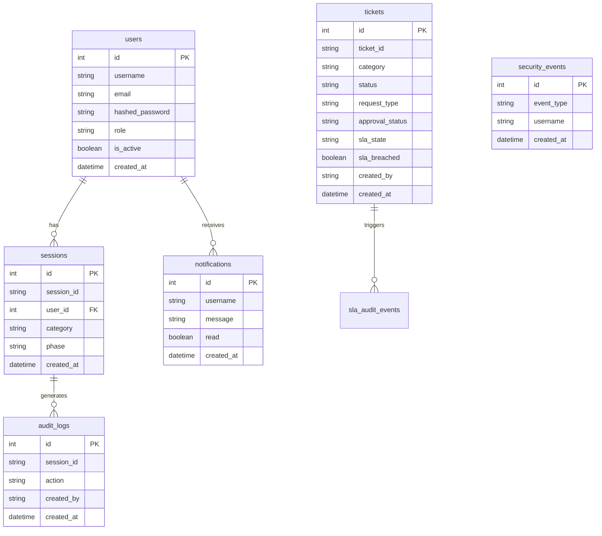

# Database – Bridgestone IT Agent

> **Version:** 1.0.0 | **Last updated:** 2026-07-11

---

## 1. Database Strategy

The application supports two database backends:

| Backend | When used |
|---------|-----------|
| **PostgreSQL** | Primary database for all environments; configured via `DATABASE_URL` env var |
| **SQLite** | Automatic development fallback when PostgreSQL is unreachable (file: `bridgestone_it_agent.db`) |

The connection strategy is implemented in `backend/app/database/connection.py`:

1. Read `DATABASE_URL` from environment
2. Attempt PostgreSQL connection
3. On failure: log warning and fall back to SQLite
4. Apply WAL mode + NORMAL synchronicity for SQLite; full connection pool for PostgreSQL

---

## 2. Connection Configuration

### PostgreSQL (production)

```python
engine = create_engine(
    DATABASE_URL,
    pool_size=20,
    max_overflow=10,
    pool_timeout=30,
    pool_recycle=1800,
    pool_pre_ping=True
)
```

| Parameter | Value | Purpose |
|-----------|-------|---------|
| `pool_size` | 20 | Max persistent connections in the pool |
| `max_overflow` | 10 | Additional connections beyond pool_size |
| `pool_timeout` | 30 s | Wait time before raising timeout |
| `pool_recycle` | 1800 s | Recycle connections after 30 minutes |
| `pool_pre_ping` | True | Test connection before use |

### SQLite (development fallback)

```python
engine = create_engine(
    "sqlite:///bridgestone_it_agent.db",
    connect_args={"check_same_thread": False, "timeout": 30.0},
    poolclass=NullPool
)
```

WAL mode is enabled via SQLAlchemy event listener:
```sql
PRAGMA journal_mode=WAL;
PRAGMA synchronous=NORMAL;
```

---

## 3. ORM Framework

- **ORM:** SQLAlchemy 2.x
- **Session management:** `SessionLocal = sessionmaker(autocommit=False, autoflush=False, bind=engine)`
- **Dependency injection:** `get_db_context()` FastAPI dependency yields a session and closes it in `finally`

---

## 4. Data Models

### 4.1 `users`

Stores authenticated users.

| Column | Type | Notes |
|--------|------|-------|
| `id` | Integer PK | Auto-increment |
| `username` | String(50) | Unique, indexed |
| `email` | String(100) | Unique |
| `hashed_password` | String(255) | bcrypt hash |
| `role` | String(50) | `EMPLOYEE` \| `MANAGER` \| `ADMIN` |
| `is_active` | Boolean | Default `True` |
| `created_at` | DateTime | UTC timestamp |

---

### 4.2 `tickets`

Core ITSM ticket entity.

| Column | Type | Notes |
|--------|------|-------|
| `id` | Integer PK | Auto-increment |
| `ticket_id` | String(50) | Unique, e.g. `TKT-001` |
| `category` | String(50) | VPN, OUTLOOK, PRINTER, etc. |
| `description` | Text | Ticket description |
| `issue_description` | Text | Original user-reported issue |
| `assigned_team` | String(100) | Assigned IT team |
| `priority` | String(50) | CRITICAL, HIGH, MEDIUM, LOW |
| `sla_hours` | Integer | SLA deadline in hours |
| `status` | String(50) | See ticket states below |
| `servicenow_id` | String(100) | Mapped ServiceNow incident ID |
| `created_by` | String(100) | Username of creator |
| `created_at` | DateTime | UTC |
| `updated_at` | DateTime | UTC, auto-updated |
| `request_type` | String(50) | `INCIDENT` \| `SERVICE_REQUEST` \| `PRIVILEGED_ACTION` |
| `manager` | String(100) | Assigned manager username |
| `approval_status` | String(50) | `PENDING` \| `APPROVED` \| `REJECTED` \| `NOT_REQUIRED` |
| `assignment_group` | String(100) | ITSM assignment group |
| `sla_state` | String(50) | `HEALTHY` \| `WARNING_75` \| `WARNING_90` \| `BREACHED` \| `ESCALATED_LEVEL_1..3` |
| `sla_breached` | Boolean | True once SLA is breached |
| `sla_breached_at` | DateTime | UTC timestamp of first breach |
| `assigned_engineer` | String(100) | Individual engineer name |
| `waiting_since` | DateTime | When ticket entered PENDING state |
| `waiting_duration_sec` | Integer | Total wait time in seconds |
| `reminders_sent` | Integer | Count of reminder notifications |
| `resolved_at` | DateTime | UTC timestamp of resolution |
| `closed_at` | DateTime | UTC timestamp of closure |
| `reopen_count` | Integer | Number of times reopened |
| `reopened_by` | String(100) | Username who reopened |
| `reopened_at` | DateTime | UTC timestamp of last reopen |
| `reopen_reason` | Text | Reason for reopening |
| `cluster_id` | Integer | Cluster grouping ID |

**Ticket Status Values:**

```
NEW → WAITING_MANAGER → APPROVED → ASSIGNED → IN_PROGRESS → PENDING → RESOLVED → CLOSED
                                                                              ↗
                                                               REJECTED ────
```

---

### 4.3 `sessions`

Conversation session records.

| Column | Type | Notes |
|--------|------|-------|
| `id` | Integer PK | |
| `session_id` | String(100) | UUID, unique |
| `user_id` | Integer | FK to users |
| `category` | String(50) | Issue category |
| `phase` | String(50) | Conversation phase |
| `created_at` | DateTime | UTC |
| `updated_at` | DateTime | UTC |

---

### 4.4 `audit_logs`

Every significant action is logged here.

| Column | Type | Notes |
|--------|------|-------|
| `id` | Integer PK | |
| `session_id` | String(100) | Reference to session |
| `action` | String(100) | Action performed |
| `details` | Text | JSON payload |
| `created_by` | String(100) | Username |
| `created_at` | DateTime | UTC |
| `correlation_id` | String(100) | Request correlation ID |

---

### 4.5 `approval_history`

Records all manager approval decisions.

| Column | Type | Notes |
|--------|------|-------|
| `id` | Integer PK | |
| `session_id` | String(100) | |
| `recommended_action` | String(100) | e.g. `VPN_ACCESS_RESTORATION` |
| `approval_status` | String(50) | `PENDING` \| `APPROVED` \| `REJECTED` \| `ACCESS_DENIED` |
| `approved_by` | String(100) | Manager/Admin username |
| `created_at` | DateTime | UTC |

---

### 4.6 `action_history`

Records executed IT actions.

| Column | Type | Notes |
|--------|------|-------|
| `id` | Integer PK | |
| `action_type` | String(100) | e.g. `VPN_RESET`, `SOFTWARE_INSTALL` |
| `performed_by` | String(100) | Username |
| `target_user` | String(100) | Who the action was performed for |
| `result` | Text | JSON result |
| `created_at` | DateTime | UTC |

---

### 4.7 `notifications`

User-facing notification records.

| Column | Type | Notes |
|--------|------|-------|
| `id` | Integer PK | |
| `username` | String(100) | Recipient |
| `message` | Text | Notification content |
| `type` | String(50) | Notification type |
| `read` | Boolean | Default False |
| `created_at` | DateTime | UTC |

---

### 4.8 `security_events`

Authentication and authorisation event log.

| Column | Type | Notes |
|--------|------|-------|
| `id` | Integer PK | |
| `event_type` | String(50) | `LOGIN` \| `LOGOUT` \| `FAILED_LOGIN` \| `PERMISSION_DENIED` |
| `username` | String(100) | |
| `details` | Text | Human-readable description |
| `correlation_id` | String(100) | |
| `created_at` | DateTime | UTC |

---

### 4.9 `rbac_audit_logs`

RBAC enforcement decision records.

| Column | Type | Notes |
|--------|------|-------|
| `id` | Integer PK | |
| `user` | String(100) | |
| `role` | String(50) | |
| `action` | String(100) | `PERMISSION_GRANTED` \| `ACCESS_DENIED` |
| `details` | Text | JSON with reason and context |
| `created_at` | DateTime | UTC |

---

### 4.10 `agent_traces`

Stores AI reasoning traces for observability.

| Column | Type | Notes |
|--------|------|-------|
| `id` | Integer PK | |
| `session_id` | String(100) | |
| `step` | String(100) | Agent reasoning step name |
| `input` | Text | Input to the agent |
| `output` | Text | Agent output |
| `correlation_id` | String(100) | |
| `created_at` | DateTime | UTC |

---

### 4.11 `scheduled_jobs`

APScheduler job registry in the database.

| Column | Type | Notes |
|--------|------|-------|
| `id` | Integer PK | |
| `job_name` | String(100) | Unique |
| `is_enabled` | Boolean | |
| `last_run_time` | DateTime | UTC |
| `next_run_time` | DateTime | UTC |

---

### 4.12 `execution_history`

Job execution history records.

| Column | Type | Notes |
|--------|------|-------|
| `id` | Integer PK | |
| `job_name` | String(100) | |
| `status` | String(50) | `SUCCESS` \| `FAILED` |
| `parameters` | Text | JSON |
| `started_at` | DateTime | UTC |
| `completed_at` | DateTime | UTC |
| `agent_version` | String(50) | |
| `department` | String(100) | |

---

### 4.13 `sla_audit_events`

SLA state transition audit trail.

| Column | Type | Notes |
|--------|------|-------|
| `id` | Integer PK | |
| `ticket_id` | String(50) | |
| `event_type` | String(50) | `WARNING_75` \| `WARNING_90` \| `BREACHED` \| `ESCALATED_L1..3` |
| `sla_state` | String(50) | |
| `elapsed_hours` | Float | |
| `remaining_hours` | Float | |
| `created_at` | DateTime | UTC |

---

### 4.14 `sla_escalation_history`

Escalation action records.

| Column | Type | Notes |
|--------|------|-------|
| `id` | Integer PK | |
| `ticket_id` | String(50) | |
| `escalation_level` | String(50) | `L1` \| `L2` \| `L3` |
| `escalated_to` | String(100) | Username or team |
| `created_at` | DateTime | UTC |

---

### 4.15 `service_catalog`

Service request catalog items.

| Column | Type | Notes |
|--------|------|-------|
| `id` | Integer PK | |
| `category` | String(100) | |
| `name` | String(255) | Display name |
| `description` | Text | |
| `requires_approval` | Boolean | |
| `is_active` | Boolean | |

---

### 4.16 `service_requests`

User service request submissions.

| Column | Type | Notes |
|--------|------|-------|
| `id` | Integer PK | |
| `request_id` | String(50) | Unique, e.g. `REQ-001` |
| `catalog_item_id` | Integer | FK to service_catalog |
| `requested_by` | String(100) | |
| `status` | String(50) | `SUBMITTED` \| `PENDING_APPROVAL` \| `APPROVED` \| `REJECTED` \| `FULFILLED` |
| `approved_by` | String(100) | |
| `created_at` | DateTime | UTC |

---

### 4.17 `devices`

Enterprise device inventory.

| Column | Type | Notes |
|--------|------|-------|
| `id` | Integer PK | |
| `device_id` | String(100) | Unique identifier |
| `hostname` | String(255) | |
| `ip_address` | String(50) | |
| `os` | String(100) | |
| `status` | String(50) | `ONLINE` \| `OFFLINE` \| `MAINTENANCE` |
| `assigned_user` | String(100) | |
| `department` | String(100) | |
| `last_seen` | DateTime | UTC |

---

## 5. Database Schema Diagram



---

## 6. Observability Hooks

The database connection has SQLAlchemy event listeners for observability:

| Event | Metric |
|-------|--------|
| `before_cursor_execute` | Records query start time |
| `after_cursor_execute` | Records query duration → `db_query_duration_seconds` histogram |
| `after_cursor_execute` | Increments `db_transactions_total` |
| `handle_error` | Increments `db_failures_total` |

---

## 7. Database Initialization

On first startup, SQLAlchemy creates all tables automatically via `Base.metadata.create_all(engine)` if they do not exist. There is no migration tool (Alembic) configured; schema changes require manual column additions or a fresh database.

To add missing columns to an existing database:
```python
# Example: add missing columns using SQLite PRAGMA
ALTER TABLE execution_history ADD COLUMN status TEXT;
ALTER TABLE execution_history ADD COLUMN parameters TEXT;
```
