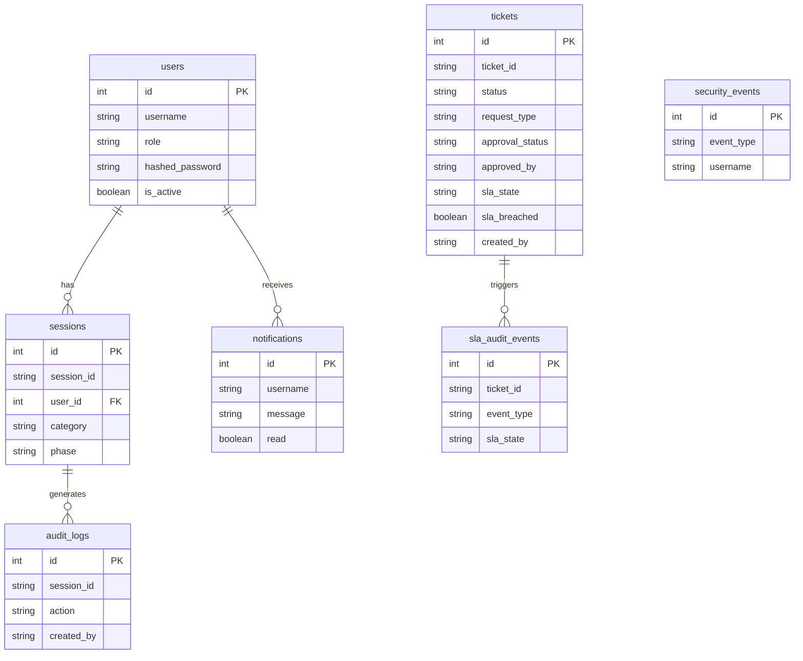

# Database

> **Project:** Bridgestone IT AI Assistant · **Last updated:** 2026-07-26

---

## Database Strategy

| Backend | When used |
|---|---|
| **SQLite** | Default for development; auto-created at `backend/bridgestone_it_agent.db` |
| **PostgreSQL** | Set `DATABASE_URL` to a PostgreSQL connection string for production |

The connection strategy is in `backend/app/database/connection.py`:

1. Read `DATABASE_URL` from environment
2. If PostgreSQL URL: connect with connection pool
3. If SQLite (or PostgreSQL unreachable): fall back to SQLite with WAL mode

**Automatic schema migration on startup:** Missing columns (`approved_by`, `approval_notes`, `approved_at`, and others) are added automatically via `ALTER TABLE` statements in `connection.py` before the application accepts requests. No manual migration steps are required.

---

## Connection Configuration

### PostgreSQL (production)

```python
engine = create_engine(
    DATABASE_URL,
    pool_size=20,
    max_overflow=10,
    pool_timeout=30,
    pool_recycle=1800,
    pool_pre_ping=True
)
```

### SQLite (development)

```python
engine = create_engine(
    "sqlite:///bridgestone_it_agent.db",
    connect_args={"check_same_thread": False, "timeout": 30.0},
    poolclass=NullPool
)
```

WAL mode enabled via event listener:
```sql
PRAGMA journal_mode=WAL;
PRAGMA synchronous=NORMAL;
```

---

## ORM Framework

- **ORM:** SQLAlchemy 2.x
- **Session:** `SessionLocal = sessionmaker(autocommit=False, autoflush=False, bind=engine)`
- **Dependency injection:** `get_db_context()` FastAPI dependency — yields a session, closes in `finally`

---

## Data Models

### `users`

| Column | Type | Notes |
|---|---|---|
| `id` | Integer PK | Auto-increment |
| `username` | String(50) | Unique, indexed |
| `email` | String(100) | Unique |
| `hashed_password` | String(255) | bcrypt hash |
| `role` | String(50) | `EMPLOYEE` \| `MANAGER` \| `ADMIN` \| `SUPERADMIN` |
| `is_active` | Boolean | Default `True` |
| `created_at` | DateTime | UTC |

---

### `tickets`

Core ITSM entity.

| Column | Type | Notes |
|---|---|---|
| `id` | Integer PK | |
| `ticket_id` | String(50) | Unique, e.g. `INC000001` |
| `category` | String(50) | VPN, OUTLOOK, SOFTWARE_INSTALLATION, etc. |
| `description` | Text | |
| `issue_description` | Text | Original user-reported issue |
| `assigned_team` | String(100) | |
| `priority` | String(50) | `CRITICAL` \| `HIGH` \| `MEDIUM` \| `LOW` |
| `sla_hours` | Integer | SLA deadline in hours |
| `status` | String(50) | See ticket states below |
| `servicenow_id` | String(100) | ServiceNow INC number |
| `created_by` | String(100) | Username |
| `created_at` | DateTime | UTC |
| `updated_at` | DateTime | UTC auto-updated |
| `request_type` | String(50) | `INCIDENT` \| `SERVICE_REQUEST` \| `PRIVILEGED_ACTION` |
| `manager` | String(100) | Assigned manager username |
| `approval_status` | String(50) | `PENDING` \| `APPROVED` \| `REJECTED` \| `NOT_REQUIRED` |
| `approved_by` | String(100) | Manager username who approved (**added by migration**) |
| `approval_notes` | Text | Manager approval notes (**added by migration**) |
| `approved_at` | DateTime | UTC timestamp of approval (**added by migration**) |
| `assignment_group` | String(100) | ServiceNow assignment group |
| `sla_state` | String(50) | `HEALTHY` \| `WARNING_75` \| `WARNING_90` \| `BREACHED` \| `ESCALATED_LEVEL_1..3` |
| `sla_breached` | Boolean | `True` once SLA is breached |
| `sla_breached_at` | DateTime | UTC timestamp of first breach |
| `assigned_engineer` | String(100) | |
| `waiting_since` | DateTime | When ticket entered `PENDING` |
| `waiting_duration_sec` | Integer | Total wait time in seconds |
| `reminders_sent` | Integer | Reminder notification count |
| `resolved_at` | DateTime | |
| `closed_at` | DateTime | |
| `reopen_count` | Integer | |
| `reopened_by` | String(100) | |
| `reopened_at` | DateTime | |
| `reopen_reason` | Text | |
| `cluster_id` | Integer | Cluster grouping ID |

**Ticket Status Values:**

```
NEW → ASSIGNED → IN_PROGRESS → PENDING → RESOLVED → CLOSED
NEW → WAITING_MANAGER → READY_FOR_ADMIN → ACCESS_GRANTED → COMPLETED
                      → REJECTED
```

---

### `sessions`

| Column | Type | Notes |
|---|---|---|
| `id` | Integer PK | |
| `session_id` | String(100) | UUID, unique |
| `user_id` | Integer | FK to `users` |
| `category` | String(50) | Issue category |
| `phase` | String(50) | Conversation phase |
| `created_at` | DateTime | UTC |
| `updated_at` | DateTime | UTC |

---

### `audit_logs`

| Column | Type | Notes |
|---|---|---|
| `id` | Integer PK | |
| `session_id` | String(100) | |
| `action` | String(100) | |
| `details` | Text | JSON payload |
| `created_by` | String(100) | |
| `created_at` | DateTime | UTC |
| `correlation_id` | String(100) | |

---

### `approval_history`

| Column | Type | Notes |
|---|---|---|
| `id` | Integer PK | |
| `session_id` | String(100) | |
| `recommended_action` | String(100) | e.g. `SOFTWARE_INSTALLATION` |
| `approval_status` | String(50) | `PENDING` \| `APPROVED` \| `REJECTED` \| `ACCESS_DENIED` |
| `approved_by` | String(100) | |
| `created_at` | DateTime | UTC |

---

### `action_history`

| Column | Type | Notes |
|---|---|---|
| `id` | Integer PK | |
| `action_type` | String(100) | e.g. `SOFTWARE_INSTALL` |
| `performed_by` | String(100) | |
| `target_user` | String(100) | |
| `result` | Text | JSON |
| `created_at` | DateTime | UTC |

---

### `notifications`

| Column | Type | Notes |
|---|---|---|
| `id` | Integer PK | |
| `username` | String(100) | Recipient |
| `message` | Text | |
| `type` | String(50) | |
| `read` | Boolean | Default `False` |
| `created_at` | DateTime | UTC |

---

### `security_events`

| Column | Type | Notes |
|---|---|---|
| `id` | Integer PK | |
| `event_type` | String(50) | `LOGIN` \| `LOGOUT` \| `FAILED_LOGIN` \| `PERMISSION_DENIED` |
| `username` | String(100) | |
| `details` | Text | |
| `correlation_id` | String(100) | |
| `created_at` | DateTime | UTC |

---

### `rbac_audit_logs`

| Column | Type | Notes |
|---|---|---|
| `id` | Integer PK | |
| `user` | String(100) | |
| `role` | String(50) | |
| `action` | String(100) | `PERMISSION_GRANTED` \| `ACCESS_DENIED` |
| `details` | Text | JSON with reason and context |
| `created_at` | DateTime | UTC |

---

### `agent_traces`

| Column | Type | Notes |
|---|---|---|
| `id` | Integer PK | |
| `session_id` | String(100) | |
| `step` | String(100) | Agent node name |
| `input` | Text | Input to the node |
| `output` | Text | Node output |
| `correlation_id` | String(100) | |
| `created_at` | DateTime | UTC |

---

### `sla_audit_events`

| Column | Type | Notes |
|---|---|---|
| `id` | Integer PK | |
| `ticket_id` | String(50) | |
| `event_type` | String(50) | `WARNING_75` \| `WARNING_90` \| `BREACHED` \| `ESCALATED_L1..3` |
| `sla_state` | String(50) | |
| `elapsed_hours` | Float | |
| `remaining_hours` | Float | |
| `created_at` | DateTime | UTC |

---

### `sla_escalation_history`

| Column | Type | Notes |
|---|---|---|
| `id` | Integer PK | |
| `ticket_id` | String(50) | |
| `escalation_level` | String(50) | `L1` \| `L2` \| `L3` |
| `escalated_to` | String(100) | |
| `created_at` | DateTime | UTC |

---

### `scheduled_jobs`

| Column | Type | Notes |
|---|---|---|
| `id` | Integer PK | |
| `job_name` | String(100) | Unique |
| `is_enabled` | Boolean | |
| `last_run_time` | DateTime | UTC |
| `next_run_time` | DateTime | UTC |

---

### `execution_history`

| Column | Type | Notes |
|---|---|---|
| `id` | Integer PK | |
| `job_name` | String(100) | |
| `status` | String(50) | `SUCCESS` \| `FAILED` |
| `parameters` | Text | JSON |
| `started_at` | DateTime | UTC |
| `completed_at` | DateTime | UTC |
| `agent_version` | String(50) | |
| `department` | String(100) | |

---

### `service_catalog`

| Column | Type | Notes |
|---|---|---|
| `id` | Integer PK | |
| `category` | String(100) | |
| `name` | String(255) | |
| `description` | Text | |
| `requires_approval` | Boolean | |
| `is_active` | Boolean | |

---

### `service_requests`

| Column | Type | Notes |
|---|---|---|
| `id` | Integer PK | |
| `request_id` | String(50) | Unique, e.g. `REQ-001` |
| `catalog_item_id` | Integer | FK to `service_catalog` |
| `requested_by` | String(100) | |
| `status` | String(50) | `SUBMITTED` \| `PENDING_APPROVAL` \| `APPROVED` \| `REJECTED` \| `FULFILLED` |
| `approved_by` | String(100) | |
| `created_at` | DateTime | UTC |

---

### `devices`

| Column | Type | Notes |
|---|---|---|
| `id` | Integer PK | |
| `device_id` | String(100) | Unique |
| `hostname` | String(255) | |
| `ip_address` | String(50) | |
| `os` | String(100) | |
| `status` | String(50) | `ONLINE` \| `OFFLINE` \| `MAINTENANCE` |
| `assigned_user` | String(100) | |
| `department` | String(100) | |
| `last_seen` | DateTime | UTC |

---

## Entity Relationship Overview



---

## Schema Migration

On startup, `connection.py` executes `ALTER TABLE` statements to add any columns that do not exist yet. This handles upgrades from older database files without requiring a full migration tool:

```python
# Example of the auto-migration pattern used
try:
    db.execute("ALTER TABLE tickets ADD COLUMN approved_by TEXT")
except OperationalError:
    pass  # Column already exists
```

This covers:
- `tickets.approved_by`
- `tickets.approval_notes`
- `tickets.approved_at`
- `execution_history.status`
- `execution_history.parameters`

---

## Related Documents

- [Architecture](./architecture.md) — Connection pooling, ORM session management
- [Deployment](./Deployment.md) — Database backup and restore
