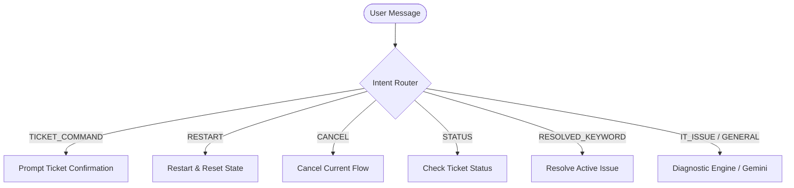

# End-to-End Testing & QA Verification Checklist

This document details the comprehensive testing suite and QA checklists for validating the Bridgestone IT Agent platform. It spans user authentication, intent classification, ITSM workflows, manager approvals, IT admin LAPS provisioning, and security/audit trail compliance.

---

## 📋 1. Authentication & Role-Based Access Control (RBAC)

Verify that the system strictly logs and enforces access permissions based on active roles.

| Role | Allowed Actions | Restricted Actions |
| :--- | :--- | :--- |
| **Employee** | Start support chat, request software/access, view own tickets, use granted LAPS password. | Access Admin ITSM Queue, Approve tickets, View dashboard analytics, Grant/Revoke LAPS passwords. |
| **Manager** | View subordinate ticket requests, Approve/Reject Service Requests, View own tickets. | Access Admin ITSM Queue, Direct LAPS password generation. |
| **Admin** | Access IT Admin ITSM Queue, Grant/Revoke LAPS passwords, View dashboard analytics. | Bypass manager approval for software requests. |

### QA Checklist:
- [ ] **Role Identification**: Log in as an Employee. Confirm that the sidebar does not display "ITSM Admin Queue" or "Manager Portal".
- [ ] **Manager Permissions**: Log in as a Manager. Verify that only "Manager Portal" and standard Employee options are visible.
- [ ] **Admin Permissions**: Log in as an Admin. Verify that all components, including the "ITSM Admin Queue" and "Analytics Dashboard", are fully accessible.
- [ ] **API Route Enforcement**: Send direct HTTP requests to Admin endpoints (e.g., `/api/admin/laps/grant`) using an Employee token. Confirm that the server returns a `403 Forbidden` status.

---

## 🧭 2. Support Chat & Intent Routing

Verify that user prompts route cleanly to the correct state machine triggers and handle edge cases gracefully.



### QA Checklist:
- [ ] **TICKET_COMMAND routing**: Enter "create ticket" or "open incident" mid-conversation. Verify the bot shifts state to `WAITING_TICKET_CONFIRMATION` and prompts with: *"Would you like me to open a ticket for this issue?"*
- [ ] **Compound Routing Priority**: Enter `"restart and cancel"`. Confirm it routes to `RESTART` rather than `CANCEL` (per priority rules), resetting the chat conversation to the `UNDERSTANDING` phase.
- [ ] **Cancel mid-workflow**: In the middle of troubleshooting, enter `"cancel"`. Confirm the bot aborts the troubleshooting session, logs a cancellation event, and returns to `UNDERSTANDING` with a confirmation.
- [ ] **Ticket Status Check**: Enter `"check ticket status"`.
  - If no ticket is active, verify: *"You don't have any active support requests."*
  - If a ticket is active, verify it returns the correct ServiceNow ticket number (e.g., `INC0012345`) and current queue state.
- [ ] **Resolution Detection**: Enter `"it's working now"` or `"problem fixed"` during troubleshooting. Verify the bot transitions to the `RESOLVED` phase.

---

## 🛠️ 3. ITSM Classification & Workflows

Ensure requests are classified accurately as **Incidents**, **Service Requests**, or **Privileged Actions** based on intent.

> [!IMPORTANT]
> **Service Requests** and **Privileged Actions** MUST trigger the approval chain (Manager Approval → IT Admin Grant), whereas standard **Incidents** route directly or troubleshoot within the session.

- [ ] **Incident Verification**: Enter a standard non-privileged issue (e.g., *"VPN not connecting"*). Verify the bot starts the diagnostic workflow or retrieves matching KB articles.
- [ ] **Service Request Routing**: Enter a software request (e.g., *"I need SAP access"* or *"Install MS Visio"*). Verify that:
  - The request is categorized as `SERVICE_REQUEST`.
  - A Service Request ticket is generated.
  - The status is set to `WAITING_MANAGER` (requiring manager approval).
- [ ] **Privileged Action Routing**: Enter a request requiring local administrative rights (e.g., *"I need to restart the Print Spooler"* or *"Modify registry keys"*). Verify that:
  - The request is categorized as `PRIVILEGED_ACTION`.
  - An Incident is created with status `WAITING_MANAGER_APPROVAL`.
  - The AI Diagnosis timeline event logs high confidence (e.g., `90%+`).

---

## 👔 4. Manager Portal Approvals & Reject Flows

Verify that managers can manage pending access requests for their direct reports.

- [ ] **Pending Requests List**: Access the Manager Portal as a manager. Confirm that pending requests from direct reports appear under the "Pending Approvals" tab with fields: *Ticket ID*, *Requester*, *Requested Item*, and *Time Created*.
- [ ] **Approval Flow**: Click "Approve" on a pending Service Request.
  - Verify that the ticket transitions to `WAITING_ADMIN_APPROVAL` (or `WAITING_ADMIN`).
  - Verify that the ticket is removed from the manager's pending list.
  - Verify that a notification is sent to the Employee chat informing them that their manager has signed off.
- [ ] **Rejection Flow**: Click "Reject" on a pending request.
  - Verify that the ticket is updated to `REJECTED` status.
  - Verify that the ticket status label updates to "Declined by Manager".
  - Verify that the Employee's active chat session resets, and they receive a decline message.

---

## 🛡️ 5. ITSM Queue & IT Admin Actions

Verify the IT Admin dashboard actions for approved tickets.

- [ ] **Queue Visibility**: Access the ITSM Queue as an IT Admin. Confirm that tickets approved by managers appear with status `WAITING_ADMIN`.
- [ ] **LAPS Grant Button**: Verify that the action column displays a prominent **Grant LAPS** button for approved privileged requests.
- [ ] **LAPS Provisioning**: Click **Grant LAPS**.
  - Verify that a temporary, randomized LAPS password is generated and stored securely in the DB.
  - Verify that the ticket status transitions to `TEMP_ADMIN_GRANTED`.
  - Verify that the Employee's active chat session updates with the step-by-step LAPS instructions and a 15-minute countdown.

---

## 🔑 6. LAPS Secure Panel UX & Expiry Lifecycle

Verify the security controls and user interface elements of the LAPS credential panel.

> [!WARNING]
> Credentials must remain masked by default, copyable via a secure API, and completely inaccessible after the 15-minute expiry timer passes.

```
+--------------------------------------------------+
| 🔐 Temp Administrator Password Ready             |
|                                                  |
| Password: [ ********** ]  [👁️ Show]  [📋 Copy]    |
| Expires in:  14m 58s                             |
| Audit ID: AUD-9831A                              |
+--------------------------------------------------+
```

- [ ] **Masking**: On the Employee's Ticket Details page, verify the password is masked by default (`••••••••`).
- [ ] **Unmask Toggle**: Click the eye icon. Verify that it unmasks to reveal the password and shifts back to masked on toggle.
- [ ] **Copy to Clipboard**: Click the copy icon. Verify that the unmasked password is copied to the clipboard and a toast confirmation is shown.
- [ ] **Active Countdown**: Confirm that the 15-minute countdown timer decreases in real time.
- [ ] **Auto-Revocation**: Wait for the timer to reach `00:00`.
  - Verify that the password field displays `[ EXPIRED ]`.
  - Verify that the clipboard copy button is disabled.
  - Verify that the backend changes the status to `CLOSED` and clear the LAPS credentials from the DB.
- [ ] **Manual Revocation**: Within the chat, enter `"done"` or `"completed"` before the 15 minutes expire.
  - Verify that the bot immediately revokes LAPS access.
  - Verify that the ticket status is updated to `CLOSED`.

---

## 📝 7. Audit Logging & Enterprise Timeline Events

Ensure all administrative and privileged events write immutable logs for security compliance.

- [ ] **LAPS Grant Logging**: After granting LAPS access, verify the database `rbac_audit_log` contains an entry:
  - `actor`: `<admin_username>`
  - `action`: `GRANT_LAPS`
  - `ticket_id`: `<ticket_num>`
  - `details`: Includes timestamp and user.
- [ ] **LAPS Revocation Logging**: After the LAPS timer expires or the user says "done", verify that a revocation log is created with event type `LAPS_REVOKED` and actor `system`.
- [ ] **Manager Approval Logging**: Verify the ticket timeline lists a `MANAGER_APPROVED` event with the manager's name and decision.
- [ ] **Database Integrity**: Confirm that password values are never written to the audit logs, history, or plain text database tables (only temporary retrieval from memory/active fields, cleared on close).

---

## 🔒 8. Security Boundary & Edge-Case Checks

Verify that access control rules cannot be bypassed.

- [ ] **Indirect LAPS Access Attempt**: Log in as User A. Try to fetch LAPS credentials for User B's ticket via the API (e.g., GET `/api/tickets/<UserB_ticket_id>/laps`). Confirm the system returns a `403 Forbidden` response.
- [ ] **Direct Privilege Access Bypass**: Start a chat and request local admin access. When the approval confirmation prompt appears (*"Would you like me to request approval?"*), try to approve the request yourself as an Employee by typing `"I approve this action"`. Verify that:
  - The system detects the approval request.
  - It checks your role (`EMPLOYEE`) and denies execution.
  - An `ACCESS_DENIED` audit log is filed.
  - The conversation status moves to `ACCESS_DENIED`.
- [ ] **ServiceNow Failure Recovery**: Simulate a connection failure to ServiceNow. Verify the agent enters `WAITING_SN_RECOVERY` mode, saves a draft ticket, and provides the user with Helpdesk contact details.
