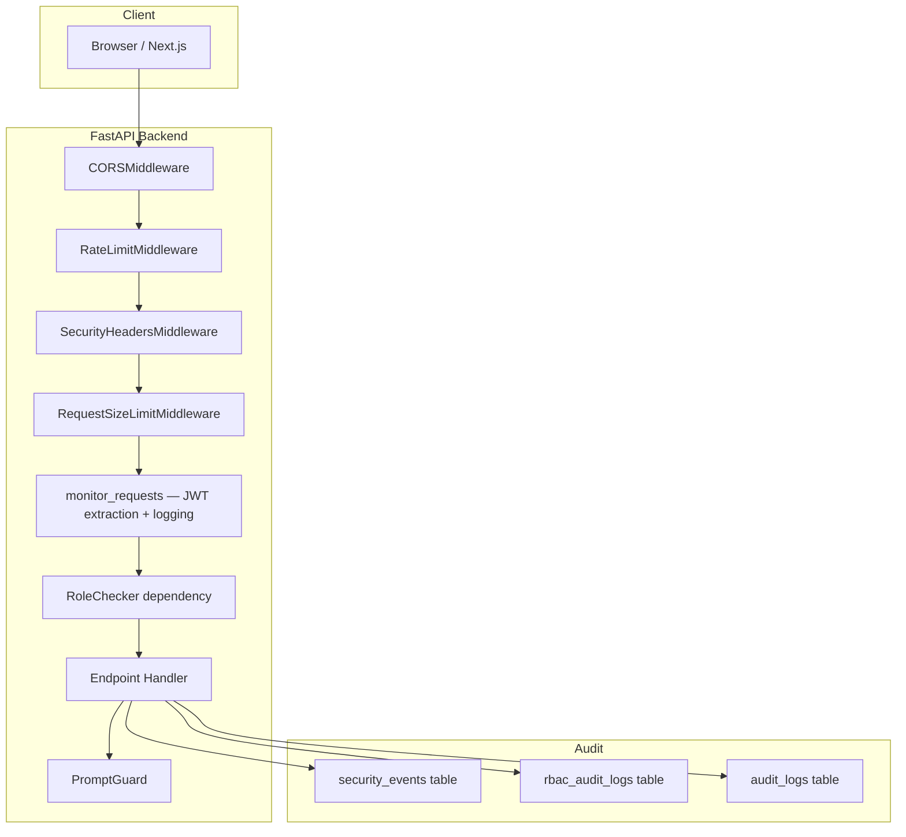
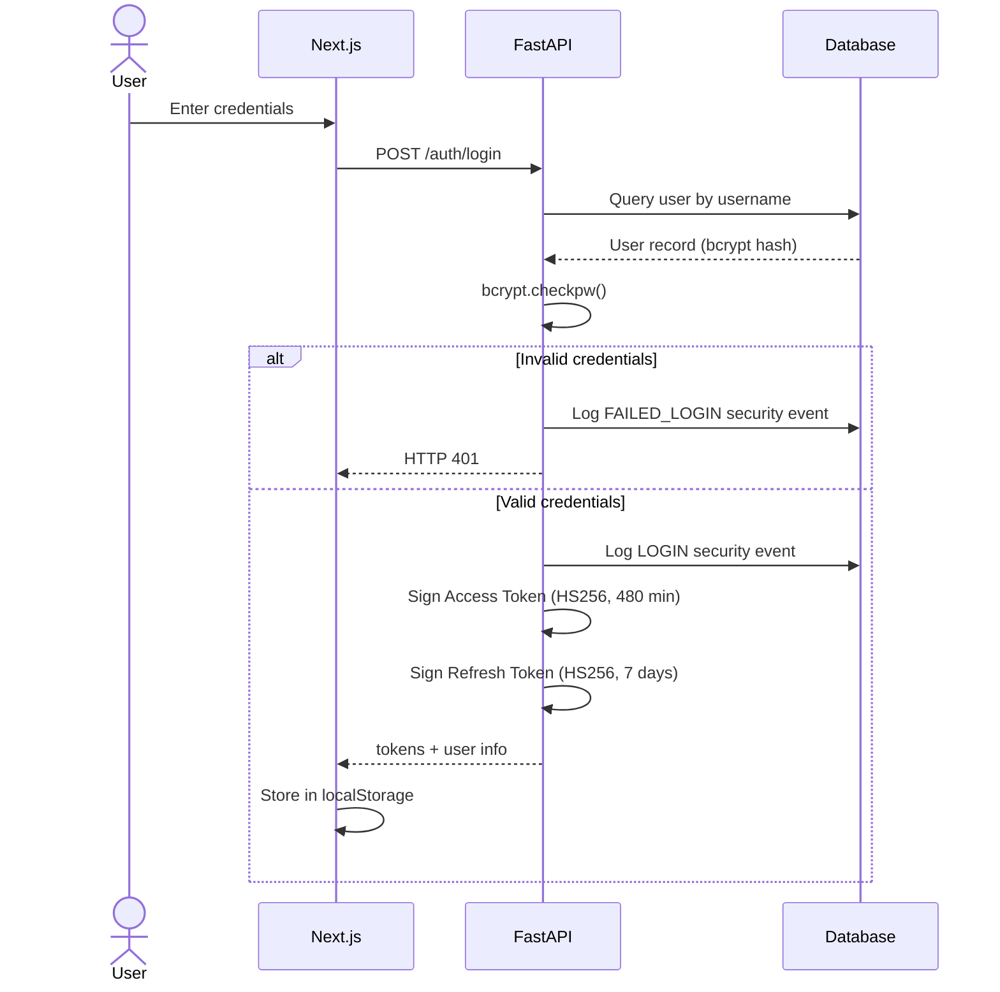

# Security

> **Project:** Bridgestone IT AI Assistant · **Last updated:** 2026-07-26

---

## Security Architecture



---

## Authentication

### JWT Tokens

All protected endpoints require a valid **JWT (HS256)** access token in the `Authorization: Bearer` header.

| Token type | Lifetime | Purpose |
|---|---|---|
| Access token | 480 minutes (configurable via `JWT_EXPIRY_MINUTES`) | Authenticates API requests |
| Refresh token | 7 days | Obtain a new access token without re-login |

Token payload:
```json
{
  "sub": "employee",
  "role": "EMPLOYEE",
  "exp": 1234567890,
  "type": "access"
}
```

### Secret Key

Set `JWT_SECRET_KEY` in `.env` to a randomly generated value of at least 32 bytes.

> [!CAUTION]
> The application ships with a development fallback key. **Never deploy without setting `JWT_SECRET_KEY` to a randomly generated value.**

```bash
openssl rand -hex 32
```

### Password Hashing

All passwords are stored as bcrypt hashes with a per-user salt:
```python
bcrypt.hashpw(password.encode("utf-8"), bcrypt.gensalt())
```

### Authentication Flow



---

## Role-Based Access Control (RBAC)

### Role Hierarchy

```
EMPLOYEE  <  MANAGER  <  ADMIN  <  SUPERADMIN
```

### Permission Matrix

| Permission | EMPLOYEE | MANAGER | ADMIN |
|---|---|---|---|
| `create_ticket` (via chat) | ✅ | ✅ | ✅ |
| `view_own_tickets` | ✅ | ✅ | ✅ |
| `view_all_tickets` | ❌ | ✅ | ✅ |
| `approve_manager_requests` | ❌ | ✅ | ✅ |
| `reject_manager_requests` | ❌ | ✅ | ✅ |
| `grant_admin_access` | ❌ | ❌ | ✅ |
| `complete_ticket` | ❌ | ❌ | ✅ |
| `view_audit_logs` | ❌ | ❌ | ✅ |
| `view_analytics` | ❌ | ❌ | ✅ |
| `manage_knowledge_base` | ❌ | ❌ | ✅ |
| `view_security_logs` | ❌ | ❌ | ✅ |

### Enforcement — Two Levels

**1. Endpoint level** — `RoleChecker` FastAPI dependency:
```python
@router.post("/admin/tickets/{id}/grant-access")
def grant_access(user = Depends(RoleChecker(["ADMIN"]))):
    ...
```

**2. Business logic level** — `rbac_service.has_permission()`:
```python
if not has_permission(user_role, "approve_privileged_action"):
    return build_access_denied_response(role, action)
```

Every RBAC denial is recorded in `rbac_audit_logs` with user, role, attempted action, timestamp, and correlation ID.

---

## Prompt Injection Guard

`PromptGuard` (`services/prompt_guard.py`) classifies every user message before it enters the AI pipeline:

| Risk Level | Action |
|---|---|
| `HIGH` | Request blocked; HTTP 400 returned; entry written to RBAC audit log |
| `MEDIUM` | Suspicious fragment removed; pipeline continues with sanitised input |
| `LOW` | Request allowed through; structured warning log entry created |

---

## Rate Limiting

An in-process sliding-window rate limiter is applied per-IP address. No external Redis dependency is required.

| Endpoint group | Default limit | Window |
|---|---|---|
| `/chat` | 30 requests | 60 seconds |
| `/auth/login` | 10 requests | 60 seconds |
| `/upload` | 10 requests | 60 seconds |

Configure via `RATE_LIMIT_CHAT`, `RATE_LIMIT_CHAT_WINDOW`, `RATE_LIMIT_LOGIN`, `RATE_LIMIT_LOGIN_WINDOW` environment variables.

---

## Security Headers

The `SecurityHeadersMiddleware` injects the following headers on every response:

| Header | Value |
|---|---|
| `X-Content-Type-Options` | `nosniff` |
| `X-Frame-Options` | `DENY` |
| `X-XSS-Protection` | `1; mode=block` |
| `Strict-Transport-Security` | Configurable (set `HSTS_ENABLED=true` in production) |
| `Content-Security-Policy` | Configurable |

---

## CORS

CORS origins are controlled by the `CORS_ORIGINS` environment variable (comma-separated list).

**Development defaults:**
```
http://localhost:3000, http://127.0.0.1:3000
```

**Production:** Restrict to your domain only.

> [!WARNING]
> Never use wildcard `*` in production CORS origins.

---

## Security Event Logging

All authentication and authorisation events are recorded in the `security_events` table and available at `GET /admin/security-logs`.

| Event type | Trigger |
|---|---|
| `LOGIN` | Successful user login |
| `FAILED_LOGIN` | Invalid credentials or deactivated account |
| `LOGOUT` | Explicit logout via `/auth/logout` |
| `PERMISSION_DENIED` | `RoleChecker` blocked a request |

---

## Audit Logging

### RBAC Audit Log (`rbac_audit_logs`)

Every RBAC enforcement decision — both grants and denials — is recorded with:
- `user`, `role`, `action`, `details` (JSON)
- `created_at` (UTC ISO timestamp)
- `correlation_id`

This log is append-only by convention; rows are never updated or deleted.

### Structured Request Log

Every request produces a JSON log entry:

```json
{
  "timestamp": "2026-07-26T06:12:06.643094Z",
  "level": "INFO",
  "logger": "it-agent-backend",
  "message": "FastAPI Endpoint GET '/tickets'",
  "request_id": "req-bdd7b27d",
  "correlation_id": "corr-cfe260ca",
  "user": "admin",
  "role": "ADMIN",
  "endpoint": "/tickets",
  "execution_time": 0.041,
  "status_code": 200
}
```

---

## Request Size Limiting

The `RequestSizeLimitMiddleware` checks `Content-Length` before reading the request body. If the payload exceeds `MAX_REQUEST_SIZE_KB` (default: 512 KB), the server returns HTTP 413 immediately.

---

## Default Development Accounts

The database is seeded with the following accounts on first startup:

| Username | Role | Password |
|---|---|---|
| `employee` | EMPLOYEE | `employeepassword` |
| `manager` | MANAGER | `managerpassword` |
| `admin` | ADMIN | `adminpassword` |

> [!CAUTION]
> These accounts must be removed or have their passwords changed before any production deployment.

---

## Secrets Management

| Variable | Purpose | Risk if absent |
|---|---|---|
| `JWT_SECRET_KEY` | JWT signing key | Tokens signed with weak dev fallback key |
| `DATABASE_URL` | PostgreSQL credentials | Falls back to SQLite |
| `GEMINI_API_KEY` | Google AI | AI features disabled |
| `SERVICENOW_USERNAME` | ServiceNow API | Mock mode used |
| `SERVICENOW_PASSWORD` | ServiceNow API | Mock mode used |

Store secrets in `.env` files. Never commit `.env` files to source control — they are excluded in `.gitignore`.

---

## Future Security Roadmap

| Area | Planned |
|---|---|
| SSO / OIDC | Azure Entra ID integration |
| MFA | TOTP or FIDO2 for managers and admins |
| Data encryption at rest | AES-256 for sensitive ticket fields |
| PII masking | Pre-filtering before LLM submission |
| Redis rate limiting | Replace in-process limiter for multi-process deployments |

---

## Related Documents

- [Architecture](./architecture.md) — Middleware chain, RBAC enforcement points
- [AI Workflow](./ai-workflow.md) — Prompt injection guard details
- [API Reference](./API.md) — Auth endpoints and error responses
