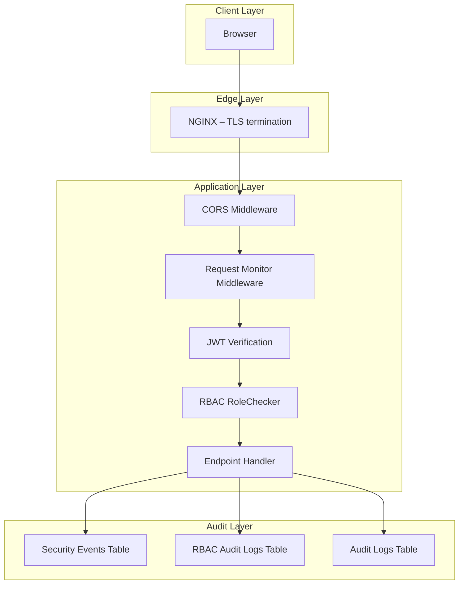
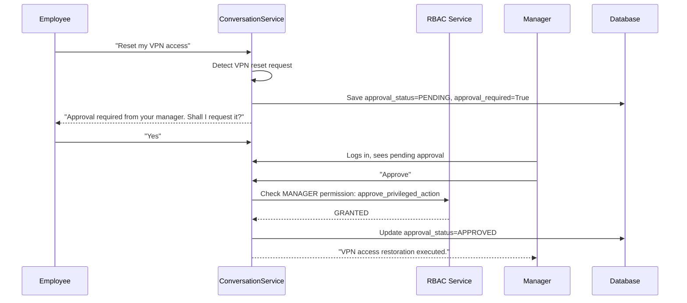

# Security – Bridgestone IT Agent

> **Version:** 1.0.0 | **Last updated:** 2026-07-11

---

## 1. Security Architecture Overview



---

## 2. Authentication

### JWT Tokens

The application uses **JSON Web Tokens (JWT)** with the **HS256** algorithm.

| Token type | Lifetime | Purpose |
|-----------|---------|---------|
| Access token | 30 minutes | Authenticates API requests |
| Refresh token | 7 days | Obtains a new access token without re-login |

Token payload structure:
```json
{
  "sub": "username",
  "role": "EMPLOYEE",
  "exp": 1234567890,
  "type": "access"
}
```

### Secret Key

The `SECRET_KEY` environment variable signs all JWT tokens.

> [!CAUTION]
> The application ships with a **development fallback key** (`bridgestone-it-agent-super-secret-key-123456`). If `SECRET_KEY` is not set in the environment, a `SECURITY WARNING` is logged at startup. **Never deploy to production without setting `SECRET_KEY` to a randomly generated 256-bit value.**

Generate a secure key:
```bash
openssl rand -hex 32
```

### Password Hashing

All passwords are hashed using **bcrypt** with a randomly generated salt per user:
```python
bcrypt.hashpw(password.encode("utf-8"), bcrypt.gensalt())
```

---

## 3. Role-Based Access Control (RBAC)

### Role Hierarchy

```
EMPLOYEE  <  MANAGER  <  ADMIN
```

### Permission Matrix

| Permission | EMPLOYEE | MANAGER | ADMIN |
|-----------|----------|---------|-------|
| `create_ticket` | ✅ | ✅ | ✅ |
| `view_own_tickets` | ✅ | ✅ | ✅ |
| `view_all_tickets` | ❌ | ✅ | ✅ |
| `update_ticket_lifecycle` | ❌ | ✅ | ✅ |
| `resolve_ticket` | ❌ | ✅ | ✅ |
| `close_ticket` | ❌ | ✅ | ✅ |
| `approve_privileged_action` | ❌ | ✅ | ✅ |
| `view_audit_logs` | ❌ | ❌ | ✅ |
| `override_lifecycle` | ❌ | ❌ | ✅ |
| `execute_privileged_action` | ❌ | ❌ | ✅ |

### RBAC Enforcement

RBAC is enforced at two levels:

1. **Endpoint level** – `RoleChecker` FastAPI dependency:
```python
@app.get("/admin/security-logs")
def get_security_logs(user = Depends(RoleChecker(["ADMIN"]))):
    ...
```

2. **Business logic level** – `rbac_service.has_permission()`:
```python
if not has_permission(user_role, "approve_privileged_action"):
    return build_access_denied_response(role, action)
```

### RBAC Audit Logging

Every RBAC denial is recorded in `rbac_audit_logs` with:
- User, role, action attempted
- Timestamp, context details

---

## 4. CORS Configuration

CORS is controlled by the `CORS_ORIGINS` environment variable.

**Default origins (development):**
```
http://localhost:3000
http://127.0.0.1:3000
http://localhost:8000
http://127.0.0.1:8000
```

**Production:** Set `CORS_ORIGINS` to a comma-separated list of allowed origins:
```
CORS_ORIGINS=https://it-agent.bridgestone.com,https://api.it-agent.bridgestone.com
```

> [!WARNING]
> Do **not** use wildcard `*` in production CORS origins. The application does not set `*` by default, but ensure your production env file does not introduce it.

---

## 5. Security Event Logging

All authentication and authorisation events are recorded in the `security_events` table and exposed via `GET /admin/security-logs`.

| Event type | Trigger |
|-----------|---------|
| `LOGIN` | Successful user login |
| `FAILED_LOGIN` | Invalid credentials or deactivated account |
| `LOGOUT` | Explicit logout |
| `PERMISSION_DENIED` | `RoleChecker` blocked a request |

Prometheus counters are also incremented for each event type, enabling real-time monitoring in Grafana.

---

## 6. Privileged Action Approval Workflow

Sensitive IT operations (e.g., VPN access restoration) require manager or admin approval before execution.



If an **EMPLOYEE** attempts to approve a privileged action, `RBAC SERVICE: ACCESS_DENIED` is logged and the operation is blocked:
```
⛔ ACCESS_DENIED – Your role EMPLOYEE does not have permission to perform Approve Privileged Action.
```

---

## 7. Input Handling

- All API inputs are validated through **Pydantic models** (FastAPI's built-in validation)
- SQL queries use **SQLAlchemy ORM** with parameterised bindings — no raw string interpolation
- The production readiness checker (`verify_production_readiness.py`) scans for any raw SQL string concatenation

---

## 8. Secrets Management

**Required secrets (must be set in production):**

| Variable | Purpose | Risk if absent |
|----------|---------|---------------|
| `SECRET_KEY` | JWT signing key | Tokens signed with weak dev key |
| `DATABASE_URL` | PostgreSQL credentials | Falls back to SQLite (data loss risk) |
| `GEMINI_API_KEY` | Google AI API | AI features disabled |
| `SERVICENOW_USERNAME` | ServiceNow API | Uses mock data |
| `SERVICENOW_PASSWORD` | ServiceNow API | Uses mock data |

**Best practices:**
- Store secrets in environment-specific `.env` files (`infrastructure/env/prod.env`)
- Never commit `.env` files — they are excluded in `.gitignore`
- In Kubernetes/Docker Swarm, use native secret management (Docker secrets, K8s Secrets, Azure Key Vault)

---

## 9. Network Security

- All external-facing traffic passes through NGINX
- Backend port `8000` should **not** be exposed publicly in production
- Frontend port `3000` should **not** be exposed publicly in production
- Use the NGINX reverse proxy on port `80` / `443` as the sole public endpoint

---

## 10. Dependency Security

- Python dependencies are pinned in `requirements.txt`
- Regular updates recommended with `pip-audit` or Dependabot
- Node.js dependencies managed with `package-lock.json`

---

## 11. Default User Accounts

The application seeds the following users at startup for development and testing:

| Username | Role | Default Password |
|----------|------|-----------------|
| `employee` | EMPLOYEE | `employeepassword` |
| `manager` | MANAGER | `managerpassword` |
| `admin` | ADMIN | `adminpassword` |

> [!CAUTION]
> These default accounts and passwords **must be changed or removed** before production deployment. They exist solely for development convenience.
