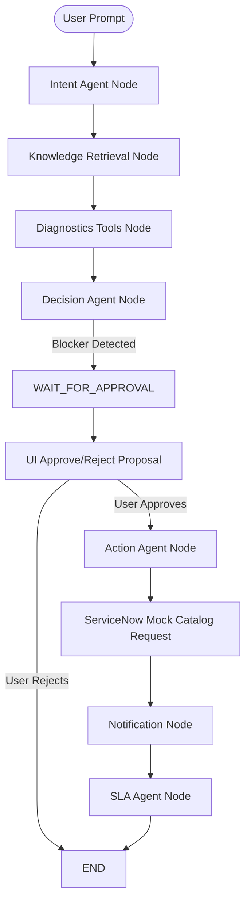

# Action Agent & Human Approval Workflow Architecture

This document describes the design and implementation of the **Action Agent** and the **Human Approval Workflow** integrated into the Bridgestone IT Support Agent.

---

## 1. System Overview

The IT Support Agent transitions from a passive troubleshooting guide to an active problem solver by executing administrative and restoration actions directly on behalf of users. To ensure safety, compliance, and correct routing, actions that alter configuration states (e.g., account access restoration or software installation) require user confirmation before execution.



---

## 2. Component Design

### 2.1 Backend Models and Services
- **Action Service (`action_service.py`)**: Defines methods to execute specific action types:
  - `VPN_ACCESS_RESTORATION`
  - `SOFTWARE_INSTALLATION`
  - `ACCESS_RESTORATION`
  - `GENERAL_SERVICE_REQUEST`
- **ServiceNow Adapter (`servicenow_client.py`)**: Extends mock databases to support ServiceNow Service Catalog Requests (`SRxxxxxx`).
- **Memory History Store**: Persists completed execution logs in-memory and exposes them via `GET /actions`.

### 2.2 LangGraph Orchestration State
The graph state (`AgentState`) is extended with fields that trace the approval flow across stateless HTTP turns:
```python
class AgentState(TypedDict):
    session_id: str
    user_message: str
    category: str
    knowledge_context: str
    tool_result: Dict[str, Any]
    decision: str
    ticket: Dict[str, Any]
    assigned_team: str
    notifications: List[Dict[str, Any]]
    sla: Dict[str, Any]
    # New approval fields
    approval_required: bool
    approval_status: str  # "PENDING" | "APPROVED" | "REJECTED"
    recommended_action: str
    action_result: Dict[str, Any]
```

### 2.3 Sequential Routing Logic
1. **Decision Node**:
   - Inspects the tool results. If `vpn_tools` returns `"user_access": "DISABLED"`, the node overrides typical Gemini reasoning and outputs:
     - `action: "RECOMMEND_ACTION"` (mapped to `WAIT_FOR_APPROVAL`)
     - `approval_required: True`
     - `recommended_action: "VPN_ACCESS_RESTORATION"`
     - Response asking the user for confirmation.
   - On the next turn, if `approval_status` is `APPROVED`, it routes to the `EXECUTE_ACTION` pathway.
   - If `REJECTED`, it halts execution and cleans the flow.
2. **Action Node**:
   - Executes the recommended action payload, registers the Service Request (`SRxxxxxx`) inside ServiceNow, and appends the result to history logs.

---

## 3. UI/UX Interaction Model

The Next.js user interface guides the user directly when an approval state is active:
- **Proposal Cards**: Renders the proposed correction with visual distinctiveness.
- **Button Controls**: Displays **Approve** and **Reject** options while disabling normal chat input textareas.
- **Result Cards**: Displays the successfully completed request containing the request ID, ServiceNow reference, and status once action logs are received.
- **Actions History Panel**: Displays all catalog requests created in the session on the right sidebar in real time.
