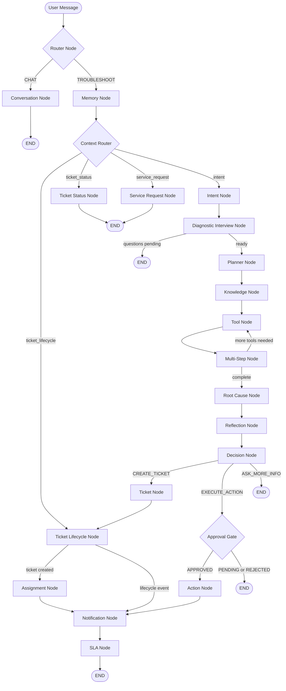
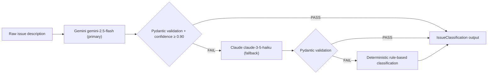
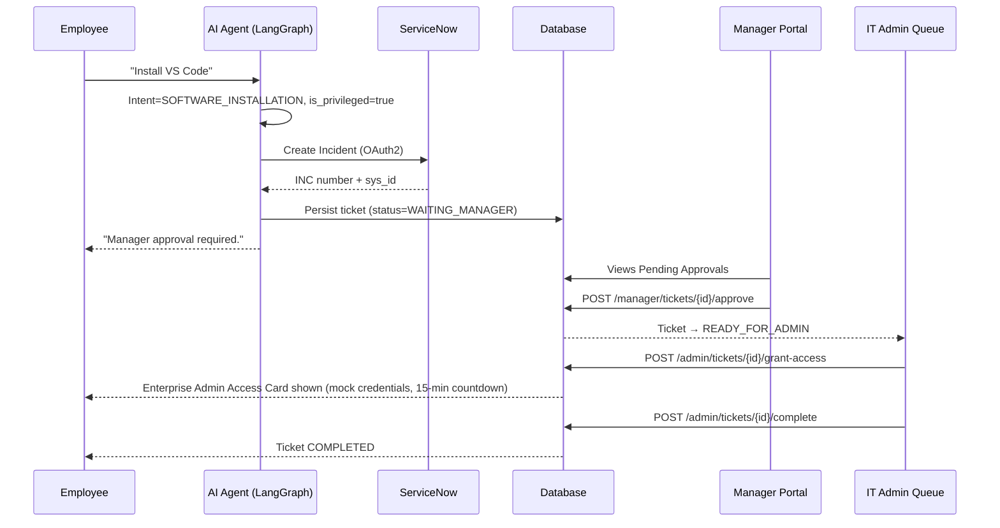

# AI Workflow — LangGraph Pipeline

> **Project:** Bridgestone IT AI Assistant · **Last updated:** 2026-07-26

---

## Overview

The AI conversation pipeline is implemented as a **LangGraph `StateGraph`** with 18 nodes. Every incoming chat message from the frontend is processed by `ConversationService`, which invokes the compiled graph. All conversation state is stored in `AgentState` — a `TypedDict` that flows through the graph and is persisted to the database between turns.

---

## Agent State

The `AgentState` TypedDict (defined in `app/graph/state.py`) is the shared context that each node reads from and writes to:

| Key | Type | Purpose |
|---|---|---|
| `session_id` | `str` | Active conversation session UUID |
| `user_message` | `str` | Latest user message |
| `category` | `str` | Detected issue category (VPN, OUTLOOK, etc.) |
| `classification` | `dict` | Full ITSM classification result (type, priority, urgency, etc.) |
| `knowledge_context` | `str` | Knowledge base content retrieved for this category |
| `tool_result` | `dict` | Result of executing an IT diagnostic tool |
| `decision` | `str` | Node decision: `CREATE_TICKET`, `EXECUTE_ACTION`, `ASK_MORE_INFO`, `RESOLVED` |
| `ticket` | `dict` | Created ticket payload if `CREATE_TICKET` was decided |
| `assigned_team` | `str` | ServiceNow assignment group resolved |
| `notifications` | `list` | Notification records created for this turn |
| `sla` | `dict` | Calculated SLA hours and priority |
| `requires_approval` | `bool` | Whether the action requires manager/admin approval |
| `approval_status` | `str` | Current approval state: `PENDING`, `APPROVED`, `REJECTED` |
| `is_privileged` | `bool` | Whether the request is a privileged software installation |
| `history` | `list` | Conversation turn history |
| `phase` | `str` | Current conversation phase |

---

## Routing Logic

### Router Node (entry point)

The first node determines the top-level execution path:

| Route | Trigger | Destination |
|---|---|---|
| `CHAT` | General conversation not related to IT | Conversation Node → END |
| `TROUBLESHOOT` | IT-related message | Memory Node → Context Router |

### Context Router

After memory is loaded, the context router determines the specific workflow:

| Route | Condition | Destination |
|---|---|---|
| `ticket_status` | User asking about their ticket | Ticket Status Node → END |
| `service_request` | User requesting a service (software install etc.) | Service Request Node → END |
| `ticket_lifecycle` | Ticket already exists; lifecycle transition needed | Ticket Lifecycle Node |
| `intent` | New issue — full diagnostic pipeline | Intent Node |

### Decision Node routes

| Decision | Condition | Next Node |
|---|---|---|
| `CREATE_TICKET` | Issue unresolvable; ticket must be created | Ticket Node |
| `EXECUTE_ACTION` | IT action needed; approval checked | Approval Gate |
| `ASK_MORE_INFO` | More diagnostic information needed | END (response with question) |
| `RESOLVED` | Issue resolved through troubleshooting | END |

---

## Node Descriptions

### Router Node
Classifies the message as general chat or IT troubleshooting.

### Memory Node
Loads the current `ConversationState` from the database to restore context across turns.

### Intent Node
Detects the issue category using keyword matching and AI classification:

| Category | Example triggers |
|---|---|
| `VPN` | vpn, global protect, remote access, tunnel |
| `OUTLOOK` | outlook, email, mailbox, exchange, calendar |
| `PRINTER` | printer, printing, print queue, spooler, scanner |
| `SOFTWARE_INSTALLATION` | install, chrome, zoom, teams, software, vs code, vscode |
| `NETWORK` | wifi, network, internet, connectivity, ip address |
| `PASSWORD_RESET` | password, reset password, locked out, account locked |
| `SAP` | sap, erp, sap gui, fiori |
| `GENERAL` | all other messages |

### Diagnostic Interview Node
Asks the user targeted questions about their issue before beginning tool execution.

### Planner Node
Determines which IT diagnostic tools to invoke based on the category and conversation so far.

### Knowledge Node
Retrieves relevant knowledge base articles (`knowledge_base/*.json`) for the detected category.

### Tool Node
Executes IT diagnostic tools (VPN status check, Outlook connectivity, printer spooler check, etc.).

### Multi-Step Node
Coordinates iterative tool execution — loops back to Tool Node if further diagnostics are needed.

### Root Cause Node
Synthesises tool results and conversation history into a root cause assessment.

### Reflection Node
Reviews the proposed solution for correctness and completeness before committing to a decision.

### Decision Node
Based on the reflection output, decides whether to create a ticket, execute an action, or ask for more information.

### Ticket Node
Invokes `TicketOrchestrator` to:
1. Run `ClassificationService` for ITSM metadata
2. Run `IncidentEnrichmentService` for field resolution
3. Run `FieldMappingService` to build the ServiceNow payload
4. Call `ServiceNowMetadataValidator` to validate all fields
5. Submit the incident to ServiceNow via `ServiceNowClient`
6. Persist the ticket in the local database

### Approval Gate
Checks whether the requested action requires approval. If a pending approval exists, the gate returns `PENDING` and stops. If already approved, it passes to the Action Node.

### Action Node
Executes the approved IT action (mock implementation for this POC). For privileged software installations, it triggers the Enterprise Admin Access Card flow.

### Assignment Node
Resolves the correct IT team from the `FieldMappingService` and records the assignment in the ticket.

### Notification Node
Creates notification records for the assigned team, manager, and employee.

### SLA Node
Records the calculated SLA hours and initial state (`HEALTHY`) on the ticket.

### Ticket Lifecycle Node
Handles status transitions on existing tickets (approve, reject, grant access, complete).

### Ticket Status Node
Retrieves and formats the current status of the user's most recent ticket.

### Service Request Node
Handles service catalog requests without going through the full diagnostic pipeline.

### Conversation Node
Handles general conversation turns that are not IT support issues.

---

## AI Classification

`ClassificationService` is invoked by the Ticket Node to produce structured ITSM metadata:

**Confidence threshold:** `HIGH` ≥ 0.90 required. Below threshold, the system falls back to Claude, then to deterministic rules. This prevents low-confidence classifications from reaching ServiceNow.

**Output fields:**

| Field | Description |
|---|---|
| `category` | ServiceNow incident category |
| `subcategory` | ServiceNow incident subcategory |
| `short_description` | Concise summary for the ServiceNow short_description field |
| `description` | Full narrative for the ServiceNow description field |
| `priority` | CRITICAL / HIGH / MEDIUM / LOW |
| `urgency` | 1–3 (maps to ServiceNow urgency field) |
| `impact` | 1–3 (maps to ServiceNow impact field) |
| `assignment_group` | Resolved ServiceNow assignment group name |
| `is_privileged` | Whether this is a privileged software installation |
| `confidence` | Classifier confidence score (0.0–1.0) |

---

## Prompt Injection Guard

`PromptGuard` (`services/prompt_guard.py`) runs before every LLM call:

| Risk Level | Action |
|---|---|
| `HIGH` | Request blocked; HTTP 400 returned; entry written to RBAC audit log |
| `MEDIUM` | Suspicious fragment removed; pipeline continues with sanitised input |
| `LOW` | Request allowed; structured warning logged with `correlation_id` |

---

## Privileged Software Installation Flow

> **Note on temporary admin credentials:** The `EnterpriseAdminAccessCard` generates static mock credentials (`.\Administrator` / `Temp@4821#`) with a 15-minute countdown timer. This is a deliberate POC simplification designed to be replaced by **Windows LAPS**, **CyberArk PAM**, or **Azure PIM** in production.

---

## Related Documents

- [Architecture](./architecture.md) — System tiers, middleware chain, service map
- [ServiceNow Integration](./servicenow.md) — Incident pipeline and metadata validation
- [Security](./Security.md) — RBAC, JWT, prompt injection guard
