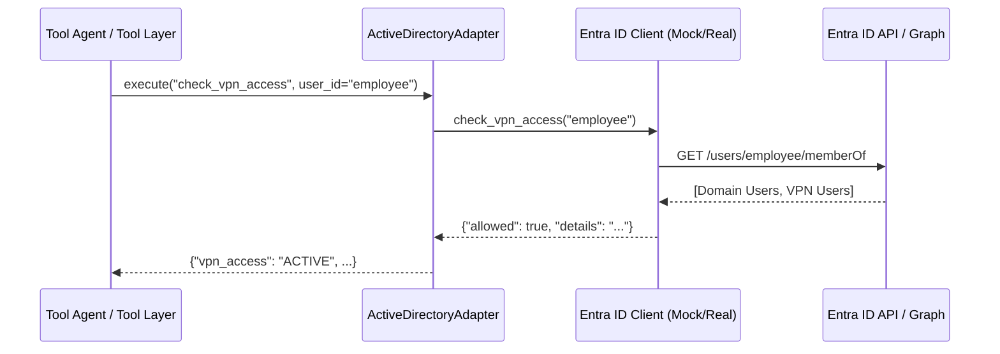

# Production-Ready Azure AD / Microsoft Entra ID Integration

This document describes the design, architecture, configuration, and monitoring model of the production-ready Azure AD / Microsoft Entra ID Integration layer implemented for the Bridgestone IT Support Agent.

---

## 1. Authentication Flow

The client credentials flow is utilized to secure REST API exchanges with Microsoft Entra ID (Azure AD).

### Token Acquisition & Caching
* **Grant Type**: `client_credentials`
* **Token Endpoint**: `https://login.microsoftonline.com/{tenant_id}/oauth2/v2.0/token`
* **Scope**: `https://graph.microsoft.com/.default`
* **Caching**: Access tokens are cached in-memory inside the client singleton to avoid redundant Round Trip Times (RTT) and rate limits.
* **Auto-Refresh**: Access tokens are refreshed dynamically before they expire, utilizing a 60-second safety window.

---

## 2. Directory Architecture

The integration is fully encapsulated in `backend/app/integrations/entra_id/`:

```text
entra_id/
│
├── client.py        # Abstract interface, Real REST Client, and Instrumented Mock Client
├── users.py         # Directory profile, manager, and department wrapper methods
├── groups.py        # Group directory membership checks
├── access.py        # VPN, application policies, and security group validations
├── roles.py         # IT Admin and Manager role resolution
└── models.py        # Pydantic schemas (UserProfile, AccessStatus, DirectoryGroup, Stats)
```

---

## 3. Access Control Flow

Tools throughout the agent layer validate permissions against the ActiveDirectoryAdapter.



### Integrated Tools:
1. **VPN Tools (`vpn_tools.py`)**: `check_user_vpn_access` checks user membership in the `"VPN Users"` security group.
2. **Software Tools (`software_tools.py`)**: `check_installation_permissions` checks user application permissions in the `"Software Center"` group.
3. **Outlook Tools (`outlook_tools.py`)**: `check_mailbox_status` checks the user account state in AD (must be `ACTIVE`) before fetching mailbox sizes/quotas from Graph.

---

## 4. Telemetry & Observability

All operations are instrumented with Prometheus counters and histograms to track operational latency and count failures:

| Metric Name | Type | Labels | Description |
| :--- | :--- | :--- | :--- |
| `ad_requests_total` | Counter | `operation` | Total requests sent to Entra ID APIs |
| `ad_failures_total` | Counter | `operation`, `error_type` | Total failed requests to Entra ID APIs |
| `ad_latency_seconds` | Histogram | `operation` | Request processing latency in seconds |
| `group_checks_total` | Counter | None | Total group membership checks performed |
| `access_checks_total` | Counter | None | Total access validation checks performed |

---

## 5. Fallback Mock AD Strategy

In local and development environments (`USE_MOCK_AD=true`), the system falls back to `EntraIdMockClient`:
* Implements the exact same interface `EntraIdClientInterface` as the production client.
* Loaded with standard seed profiles (employee, manager, admin) and group configurations.
* Increments Prometheus counters and records latencies locally to simulate live telemetry.
* Eliminates external network dependencies, ensuring developers can run the entire agent workspace offline.
