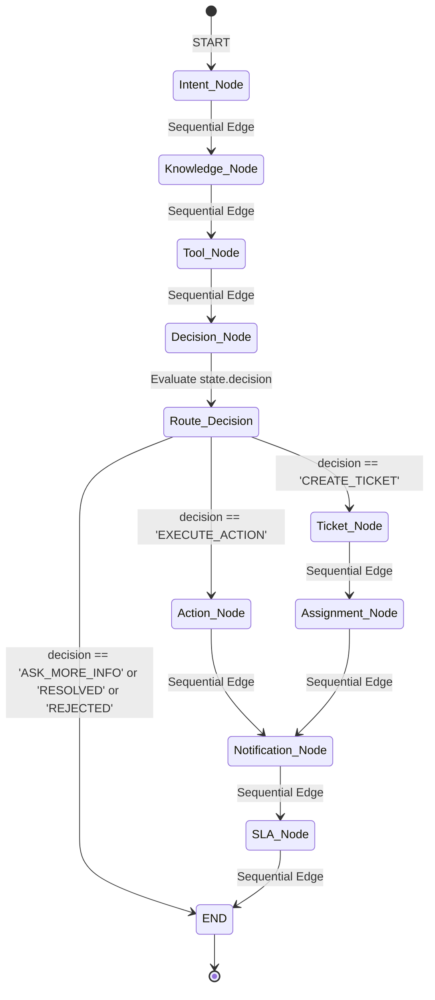
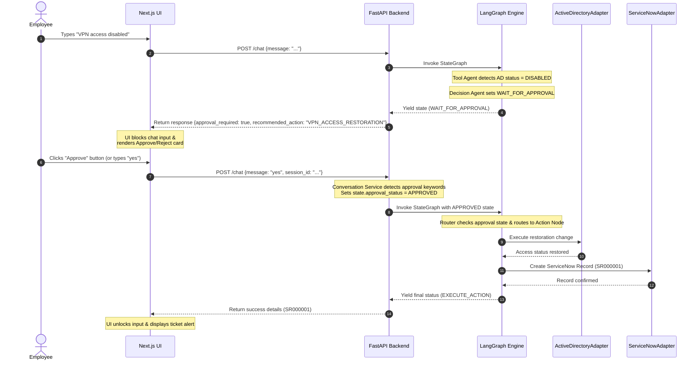

# Bridgestone IT Agent: Enterprise Architecture Document

This document provides a comprehensive technical guide and enterprise architecture reference for the Bridgestone IT Support Agent. Designed to transition Bridgestone IT support from passive troubleshooting guides to active, secure, automated operations, this platform implements a multi-agent orchestration architecture utilizing **LangGraph**, **Gemini LLMs**, a **RAG Knowledge Base**, and an **Enterprise Adapter Layer**.

This architecture reference is prepared for Mentor Review, Technical Architecture Review, Internship Presentation, and future engineering handover.

---

## SECTION 1 — EXECUTIVE SUMMARY

### 1.1 What is Bridgestone IT Agent?
The **Bridgestone IT Agent** is an agentic AI-driven corporate IT support assistant. Built on a modular Python FastAPI backend and a Next.js frontend, it coordinates multi-agent workflows using LangGraph to assist corporate employees in resolving hardware, software, network, and directory issues. 

Unlike conventional chatbots that simply search keywords and output static documents, the Bridgestone IT Agent checks active user environment variables, diagnoses live system configurations (such as VPN gateways and Active Directory states), prompts human technicians or users for validation via structured approval workflows, and invokes transactional changes directly in corporate platforms (e.g. ServiceNow).

### 1.2 Business Objective
* **Deflect Common Helpdesk Tickets**: Lower the average volume of Level-1 helpdesk support queries (specifically account locks, password resets, VPN disconnects, and software installation permissions) through self-service automation.
* **Accelerate Mean Time to Resolution (MTTR)**: Automate direct actions like Active Directory unlocking or ServiceNow ticket logging, reducing resolution delays from hours to seconds.
* **Maintain Strict Compliance**: Provide complete logs of all AI decisions, data flows, and active user requests to ensure adherence to corporate governance, security standards, and IT Service Management (ITSM) requirements.

### 1.3 Key Benefits
* **Grounded RAG Troubleshooting**: Restricts AI answers to approved Bridgestone IT documentation, preventing hallucinations during critical system guidance.
* **Action-Oriented AI**: Executes real actions (via stubs/adapters) rather than merely recommending steps.
* **Auditable Operations**: Logs full node traces, approvals, and adapter operations in a persistent, queryable format.

### 1.4 Expected Enterprise Use Cases
1. **VPN Connectivity Troubleshooting**: Diagnosing gateway status and submitting automated access restoration requests when VPN profiles are disabled.
2. **Account Lockout & Password Resets**: Instantly verifying Active Directory states and prompting a verification link or trigger to unlock the domain profile.
3. **Software Center Requests**: Validating application approval states and initiating remote corporate installation queues.
4. **Exchange Mailbox & Sync Repair**: Resetting localized OST file caches or Outlook profiles and checking Microsoft 365 licensing configurations.

---

## SECTION 2 — CURRENT SYSTEM OVERVIEW

The system is split into distinct backend layers connected to a modern React-based user interface:

* **Frontend**: A Next.js (TypeScript/React) web interface featuring two primary views:
  1. **Service Desk**: The end-user troubleshooting interface featuring rich chat windows, context badges showing utilized documentation sources, and interactive action approval cards.
  2. **Admin Console**: A management dashboard showing live-updating tables for Audit Logs, Action Histories, approvals, and raw monospace LangGraph agent trace logs.
* **Backend**: A FastAPI engine hosting endpoints for conversational runs (`POST /chat`), approval state transitions, and the administrative dashboards.
* **LangGraph Orchestrator**: Manages state propagation and conditional routing rules across a pipeline of specialized agent nodes.
* **RAG & Knowledge Service**: A retrieval service loading text guides from an internal knowledge directory to ground the language model prompts.
* **Gemini LLM Integration**: Generates troubleshooting steps and categorizes issues using structured system rules.
* **Tool Execution Layer**: Houses tools (e.g., VPN, Software, Network, Outlook, Printer stubs) that query system configurations and return structured JSON schemas.
* **Decision Agent**: Evaluates diagnostic results and determines the next system state (e.g., continuing chat, seeking human approval, or creating an incident ticket).
* **Approval Workflow**: A state machine that locks user inputs, presents approval proposals in the UI, and captures confirmation keywords.
* **Action Agent**: Executes changes in target environments (e.g., Active Directory triggers, VPN restoration, ServiceNow catalog submissions).
* **Ticket Agent**: Generates service tickets when troubleshooting fails.
* **Assignment Agent**: Applies routing logic to assign incidents to the appropriate queue (e.g., Network Team, Software Support, Service Desk).
* **Notification Agent**: Dispatches and tracks notifications to stakeholders upon incident creation.
* **SLA Agent**: Sets ticket priority, estimates impact, and maps response timers based on corporate service-level agreements.
* **Audit Logging Framework**: Intercepts operations at all stages to record events into in-memory tables.

---

## SECTION 3 — HIGH LEVEL ARCHITECTURE

The diagram below maps the interaction boundaries between the Employee, Frontend, FastAPI Backend, internal LangGraph agent nodes, and the Enterprise Adapter Layer:

```mermaid
graph TD
    Employee([Bridgestone Employee]) <-->|HTTPS / WebSockets| NextUI[Next.js Frontend]
    
    subgraph FastAPI Backend [FastAPI Backend Service]
        API[API Router main.py] <-->|Invokes| ConvSvc[Conversation Service]
        ConvSvc <-->|State Manager| StateDB[(In-Memory Session Memory)]
        ConvSvc <-->|Orchestrates| GraphEngine[LangGraph Engine]
        
        subgraph Graph Nodes
            GraphEngine --> intent[Intent Agent Node]
            GraphEngine --> knowledge[Knowledge Agent Node]
            GraphEngine --> tool[Tool Agent Node]
            GraphEngine --> decision[Decision Agent Node]
            GraphEngine --> approval[Approval Node]
            GraphEngine --> action[Action Agent Node]
            GraphEngine --> ticket[Ticket Agent Node]
            GraphEngine --> assignment[Assignment Node]
            GraphEngine --> notification[Notification Node]
            GraphEngine --> sla[SLA Node]
        end
        
        subgraph Services Layer
            intent -->|Call| IntentSvc[Intent Service]
            knowledge -->|Call| RAG[RAG Service]
            tool -->|Call| ToolAgent[Tool Agent Service]
            decision -->|Call| DecisionSvc[Decision Service]
            action -->|Call| ActionSvc[Action Service]
            ticket -->|Call| TicketSvc[Ticket Service]
        end
        
        subgraph Audit Logging
            AuditSvc[Audit Service]
            intent -.->|Trace| AuditSvc
            tool -.->|Trace| AuditSvc
            decision -.->|Trace / Approval| AuditSvc
            action -.->|Action Log| AuditSvc
            API -->|Query logs| AuditSvc
            AuditSvc <-->|Store| AuditDB[(Audit & Trace DB)]
        end
    end
    
    subgraph Enterprise Adapter Layer [Enterprise Adapter Layer]
        BaseAdapt[BaseAdapter Interface]
        ActionSvc --> BaseAdapt
        TicketSvc --> BaseAdapt
        ToolAgent --> BaseAdapt
        
        BaseAdapt <|-- SNOW[ServiceNowAdapter]
        BaseAdapt <|-- MSGraph[MicrosoftGraphAdapter]
        BaseAdapt <|-- AD[ActiveDirectoryAdapter]
        BaseAdapt <|-- VPN[VPNAdapter]
    end
    
    subgraph External Corporate Platforms
        SNOW -->|REST API| SNOW_API[ServiceNow Instance]
        MSGraph -->|Graph REST API| MS_API[Microsoft 365 / Entra ID]
        AD -->|LDAP Connection| AD_LDAP[Internal Active Directory]
        VPN -->|SSH / Gateway API| VPN_GW[Cisco/Palo Alto Gateways]
    end
    
    NextUI <-->|Fetch Admin Data| API
```

---

## SECTION 4 — LANGGRAPH WORKFLOW

The orchestration flow runs on a compiled state machine. State is represented via the [AgentState](file:///c:/Projects/it-agent/backend/app/graph/state.py) structure. Below is the layout of the state transitions, conditional edges, and execution nodes:



### Routing Logic Description
* **Conditional Edge**: Evaluated inside the function `route_decision` in [`graph.py`](file:///c:/Projects/it-agent/backend/app/graph/graph.py).
* **Execution Paths**:
  1. If `state["decision"]` is `CREATE_TICKET`, the graph executes the ticket logging and assignment lifecycle: `ticket` -> `assignment` -> `notification` -> `sla` -> `END`.
  2. If `state["decision"]` is `EXECUTE_ACTION` (triggered when an action is recommended and the user has previously confirmed approval), the graph routes to the Action Agent node: `action` -> `notification` -> `sla` -> `END`.
  3. Otherwise, the node exits directly to `END`, and the model prompts the user for clarification (e.g. `ASK_MORE_INFO`) or lists the troubleshooting results.

---

## SECTION 5 — AGENT RESPONSIBILITIES

Each node represents a distinct agent with specialized duties, localized inputs, output parameters, and structural dependencies:

### 5.1 Intent Agent
* **Purpose**: Identifies the core system issue category from the user prompt.
* **Inputs**: `user_message` (str)
* **Outputs**: `category` (str - e.g., `VPN`, `OUTLOOK`, `SOFTWARE_INSTALLATION`, `PRINTER`, `NETWORK`, `GENERAL`)
* **Dependencies**: [Intent Service](file:///c:/Projects/it-agent/backend/app/services/intent_service.py) (`detect_intent`)
* **Decision Logic**: Evaluates regex keywords and token distributions. Falls back to `GENERAL` if no specialized categories match.

### 5.2 Knowledge Agent
* **Purpose**: Retrieves internal support manuals matching the detected category.
* **Inputs**: `category` (str)
* **Outputs**: `knowledge_context` (str)
* **Dependencies**: [RAG Service](file:///c:/Projects/it-agent/backend/app/services/rag_service.py) (`load_knowledge_context`)
* **Decision Logic**: Performs local file scans against registered markdown/text documents in the `knowledge_base` directory.

### 5.3 Tool Agent
* **Purpose**: Orchestrates diagnostic checks based on the issue category.
* **Inputs**: `category` (str), `user_message` (str)
* **Outputs**: `tool_result` (dict)
* **Dependencies**: [Tool Agent Service](file:///c:/Projects/it-agent/backend/app/services/tool_agent.py), target diagnostics tools ([`vpn_tools.py`](file:///c:/Projects/it-agent/backend/app/tools/vpn_tools.py), [`outlook_tools.py`](file:///c:/Projects/it-agent/backend/app/tools/outlook_tools.py))
* **Decision Logic**: Map-dispatches function queries. For example, if category is `VPN`, invokes `check_vpn_gateway` and `check_user_vpn_access`.

### 5.4 Decision Agent
* **Purpose**: Analyzes the diagnostics and determines the next step.
* **Inputs**: `category`, `user_message`, `knowledge_context`, `tool_result`, `conversation_history`
* **Outputs**: `decision`, `decision_response`, `approval_required`, `recommended_action`
* **Dependencies**: [Decision Service](file:///c:/Projects/it-agent/backend/app/services/decision_service.py)
* **Decision Logic**: Uses Gemini API or local rules to classify current diagnostics:
  * If a fixable blocker is found (e.g. account disabled), outputs `WAIT_FOR_APPROVAL` with `recommended_action`.
  * If the issue is already resolved, outputs `RESOLVED`.
  * If diagnostics do not provide a path and the chat exceeds turn limit limits, outputs `CREATE_TICKET`.
  * Otherwise, requests further information (`ASK_MORE_INFO`).

### 5.5 Action Agent
* **Purpose**: Implements administrative modifications in remote environments once approved.
* **Inputs**: `recommended_action` (str)
* **Outputs**: `action_result` (dict - containing status, ServiceNow request ID, and execution timestamps)
* **Dependencies**: [Action Service](file:///c:/Projects/it-agent/backend/app/services/action_service.py), [VPNAdapter](file:///c:/Projects/it-agent/backend/app/adapters/vpn_adapter.py), [ActiveDirectoryAdapter](file:///c:/Projects/it-agent/backend/app/adapters/active_directory_adapter.py)
* **Decision Logic**: Executes the designated adapter action mapping (e.g., unlocking account, adding user to security access groups).

### 5.6 Ticket Agent
* **Purpose**: Escalates unresolved issues by creating an IT Support Incident.
* **Inputs**: `category` (str), `user_message` (str)
* **Outputs**: `ticket` (dict - containing `ticket_id`, `status`, `assigned_team`)
* **Dependencies**: [Ticket Service](file:///c:/Projects/it-agent/backend/app/services/ticket_service.py), [ServiceNowAdapter](file:///c:/Projects/it-agent/backend/app/adapters/servicenow_adapter.py)
* **Decision Logic**: Queries the adapter to register an Incident table record.

### 5.7 Assignment Agent
* **Purpose**: Assigns created tickets to the appropriate support queue.
* **Inputs**: `category` (str)
* **Outputs**: `assigned_team` (str)
* **Dependencies**: [Assignment Service](file:///c:/Projects/it-agent/backend/app/services/assignment_service.py)
* **Decision Logic**: Inspects mappings (e.g., `VPN` -> `Network Team`, `OUTLOOK` -> `Collaboration Team`).

### 5.8 Notification Agent
* **Purpose**: Registers event notifications for created tickets.
* **Inputs**: `ticket` (dict)
* **Outputs**: `notifications` (list)
* **Dependencies**: [Notification Service](file:///c:/Projects/it-agent/backend/app/services/notification_service.py)
* **Decision Logic**: Creates alerts for user visual updates.

### 5.9 SLA Agent
* **Purpose**: Computes target response parameters for logged service requests.
* **Inputs**: `category` (str)
* **Outputs**: `sla` (dict - containing impact level, priority score, and target resolution time)
* **Dependencies**: [SLA Service](file:///c:/Projects/it-agent/backend/app/services/sla_service.py)
* **Decision Logic**: Resolves mapping rules (e.g., `VPN` -> Priority 2 High impact, 4-hour SLA).

---

## SECTION 6 — TOOL EXECUTION LAYER

The diagnostic capabilities of the system are structured into domain-specific modules within the `backend/app/tools/` directory.

### 6.1 Diagnostic Tools

#### VPN Diagnostics ([`vpn_tools.py`](file:///c:/Projects/it-agent/backend/app/tools/vpn_tools.py))
* **`check_vpn_gateway()`**: Checks if the corporate gateway is responding.
* **`check_user_vpn_access(username)`**: Queries active database/adapter values to verify access permissions.
* **`check_vpn_health()`**: Aggregates latency, connection counts, and packet health.

#### Outlook & Mailbox Diagnostics ([`outlook_tools.py`](file:///c:/Projects/it-agent/backend/app/tools/outlook_tools.py))
* **`check_mailbox_status()`**: Returns current capacity utilization and status.
* **`check_exchange_connectivity()`**: Validates network responses to Exchange servers.

#### Network Troubleshooting ([`network_tools.py`](file:///c:/Projects/it-agent/backend/app/tools/network_tools.py))
* **`check_network_status()`**: Evaluates DNS resolution and corporate portal routing.
* **`check_wifi_connectivity()`**: Captures active SSID properties and signal indicators.

#### Software Audit ([`software_tools.py`](file:///c:/Projects/it-agent/backend/app/tools/software_tools.py))
* **`check_software_availability(software_name)`**: Validates if the requested app is approved.
* **`check_installation_permissions()`**: Checks standard group policy constraints.

### 6.2 Adapter Integration Path
To transition these diagnostic modules to production:

| Target System | Current Mock Source | Production Mapping API / Protocol |
| :--- | :--- | :--- |
| **ServiceNow** | `ServiceNowMockClient` | HTTPS REST calls to `/api/now/table/incident` and `/api/now/table/sc_request` |
| **Active Directory** | Dictionary Lookup in AD Adapter | LDAPS (LDAP over SSL) port 636 utilizing `python-ldap` or Microsoft ADWS |
| **Exchange / Mailbox** | OST Size/Online Mock | Microsoft Graph API `/users/{id}/mailboxSettings` endpoint |
| **VPN Gateways** | Gateway Status Dictionary | Palo Alto PAN-OS XML API or Cisco ASA REST API |

---

## SECTION 7 — APPROVAL WORKFLOW

To prevent automated systems from performing unauthorized actions, the IT Agent implements a human approval workflow. 

### Sequence Diagram



---

## SECTION 8 — AUDIT & OBSERVABILITY

The framework maintains persistent audit trails in [`audit_service.py`](file:///c:/Projects/it-agent/backend/app/services/audit_service.py). This telemetry is accessible via admin endpoints (`/audit-logs`, `/actions`, `/approvals`, `/agent-traces`) and is displayed in the Next.js Admin Console.

### 8.1 Audit Schema Architecture

* **Audit Logs Table (`audit_logs_db`)**: Captures user interactions, intent categories, decisions, and ServiceNow ticket numbers.
* **Action History Table (`action_history_db`)**: Tracks operations performed by the Action Agent, including ServiceNow catalog references and approval status.
* **Approval History Table (`approval_history_db`)**: Logs transitions in approval states (PENDING, APPROVED, REJECTED) with associated timestamps.
* **Agent Traces Table (`agent_traces_db`)**: Logs inputs, internal state variables, and outputs from individual nodes in the LangGraph execution path.

### 8.2 Frontend Admin Console
Admins can toggle to the dashboard tab inside the application to monitor the system:

```
[ Service Desk (Chat UI) ] <===============> [ Admin Console (Management View) ]
                                                   |
         +-----------------+-----------------------+------------------------+
         |                 |                       |                        |
  [ Audit Logs ]     [ Action Logs ]        [ Approvals ]           [ Agent Traces ]
  - Timestamp        - Request ID           - Session ID            - Monospace logs
  - User Query       - Action Type          - Recommended Action    - Node inputs
  - Category         - Status (SUCCESS)     - Status (APPROVED)     - Output JSONs
  - Action Output    - ServiceNow ID        - Timestamp             - Step sequence
```

---

## SECTION 9 — SECURITY MODEL

### 9.1 Data Flow Boundaries & Boundaries Map
Data inputs pass through the following validation and isolation gates:

```
[ User Workstation ] =====( HTTPS )=====> [ FastAPI Gateway ] =====( Internal API )=====> [ LangGraph Sandbox ]
                                                                                               |
                                                                                    [ LLM Prompt Templater ]
                                                                                               |
[ Target Enterprise Resource ] <====( Secure VPC )==== [ Adapter Layer ] <=====================+
```

### 9.2 Critical Enterprise Risks
* **Prompt Injection**: Malicious user inputs attempting to bypass the Decision Agent or force ticket creation.
  * *Mitigation*: The system uses structured output schemas and strictly typed routers (`route_decision` in [`graph.py`](file:///c:/Projects/it-agent/backend/app/graph/graph.py)) rather than letting the LLM direct the application's control flow.
* **Unauthorized Tool Actions**: Risk of users invoking actions they are not permitted to request.
  * *Mitigation*: The Active Directory adapter verifies user access levels before executing changes.
* **Data Leakage in LLM Queries**: Sending sensitive corporate user identifiers or IP data to public model endpoints.
  * *Mitigation*: Use PII-filtering middleware or deploy local LLM instances inside the corporate network.

### 9.3 Migration to a Self-Hosted LLM
To transition from the cloud-hosted Gemini API to a self-hosted alternative:
1. **Model Selection**: Deploy **Qwen-2.5-14B-Instruct** or **Llama-3-8B-Instruct** inside a secure Bridgestone virtual network.
2. **Execution Server**: Run the local model using an inference framework like **vLLM** or **Ollama** to expose an OpenAI-compatible REST API.
3. **Service Layer Refactoring**: Update [`llm_service.py`](file:///c:/Projects/it-agent/backend/app/services/llm_service.py) to point to the internal endpoint using the standard OpenAI client SDK:
   ```python
   # Migration path in llm_service.py
   client = OpenAI(
       base_url="https://local-model-server.bridgestone.local/v1",
       api_key="local-token"
   )
   ```

---

## SECTION 10 — ENTERPRISE INTEGRATION ROADMAP

```
+---------------------------------------------------------------------------------------------------+
|  PHASE 1: Current POC         -> Python stubs, Next.js interface, local mock adapters             |
+---------------------------------------------------------------------------------------------------+
                                                   |
                                                   v
+---------------------------------------------------------------------------------------------------+
|  PHASE 2: Real ServiceNow     -> Integrate OAuth credential grant, swap mockup endpoint           |
+---------------------------------------------------------------------------------------------------+
                                                   |
                                                   v
+---------------------------------------------------------------------------------------------------+
|  PHASE 3: Microsoft Graph     -> Connect Graph SDK, authenticate with Azure Key Vault secret      |
+---------------------------------------------------------------------------------------------------+
                                                   |
                                                   v
+---------------------------------------------------------------------------------------------------+
|  PHASE 4: Active Directory     -> LDAP SSL configuration, restrict modification actions           |
+---------------------------------------------------------------------------------------------------+
                                                   |
                                                   v
+---------------------------------------------------------------------------------------------------+
|  PHASE 5: VPN Gateways         -> Secure XML API mapping, configure SSH execution tunnels         |
+---------------------------------------------------------------------------------------------------+
                                                   |
                                                   v
+---------------------------------------------------------------------------------------------------+
|  PHASE 6: Self-Hosted Model    -> Deploy Qwen-2.5-Instruct internally, remove cloud API dependency |
+---------------------------------------------------------------------------------------------------+
```

---

## SECTION 11 — DEPLOYMENT ARCHITECTURE

The deployment lifecycle transitions from local developer environments to secure Kubernetes orchestrations:

### 11.1 Local Development Configuration
Developers run the frontend using `npm run dev` (port 3000) and launch the FastAPI server using Uvicorn (port 8000). The application reads credentials from a local `.env` configuration file.

### 11.2 Target Kubernetes Deployment
The production environment package is split into containerized services managed by Kubernetes:

```
                       [ Ingress Controller ]
                                 |
            +--------------------+--------------------+
            | (Path /)                                | (Path /api)
            v                                         v
   [ Frontend Service ]                      [ Backend Service ]
   - ReplicaSet: 3 Pods                      - ReplicaSet: 3 Pods
   - Next.js Server Image                    - FastAPI Server Image
            |                                         |
            |                                         +--> [ Redis Session Cache ]
            |                                         |
            +-----------------------------------------+--> [ PostgreSQL DB (Auditing) ]
```

* **Production Security Constraints**:
  * Run containers as non-root users.
  * Store API tokens and secrets in Kubernetes Secrets or pull them from hashicorp Vault.
  * Restrict container resource limits to prevent denial-of-service vectors.

---

## SECTION 12 — FUTURE ENHANCEMENTS

### 12.1 Conversation State Machine
Migrate session history to a structured database like PostgreSQL or Redis to ensure consistency and support failover across instances in high-availability deployments.

### 12.2 Advanced Agent Memory
Implement semantic search over past conversation sessions using vector search databases (e.g., pgvector) to enable the agent to reference previous troubleshooting steps.

### 12.3 Multi-Agent Collaboration
Create specialized agents for distinct technical domains (e.g., database, hardware, cloud services) that run as sub-graphs and report back to the main Decision Router.

### 12.4 Predictive SLA and Ticket Routing
Train lightweight classifier models on historical ticket routing data to assign incidents to the correct engineering queue and flag potential SLA breaches before they occur.

---

## SECTION 13 — PRODUCTION READINESS & MATURITY ASSESSMENT

### 13.1 Production Readiness Checklist

- [x] **Separation of Concerns**: Adapters decouple business logic from external API structures.
- [x] **Human-in-the-Loop Controls**: The system blocks automated execution until user approval is received.
- [x] **Structured Observability**: Graph traces, actions, and approvals are stored in a queryable format.
- [ ] **Persistent Storage**: Session memory needs to be migrated from in-memory dicts to a persistent database (e.g., PostgreSQL/Redis).
- [ ] **High Availability**: The FastAPI and Next.js applications need to be containerized and run behind a load balancer.
- [ ] **Secret Management**: Move API keys from `.env` files to an enterprise secret manager.

### 13.2 Architecture Maturity Assessment

| Metric | Current State | Target State | Gap Analysis / Mitigation |
| :--- | :--- | :--- | :--- |
| **State Handling** | In-Memory python dicts | Redis Distributed Cache | Active sessions will be lost if the backend server restarts. Deploy a Redis cluster to store AgentState context. |
| **Integrations** | Local mock adapters | Live REST and LDAPS APIs | Implement OAuth credential helper authentication and establish secure network tunnels (VPN/DirectConnect) to ServiceNow and Active Directory endpoints. |
| **Audit Trails** | Volatile in-memory lists | PostgreSQL Database | Write log records to an enterprise database system with read-only permission limits for users. |
| **API Rate Limits** | No throttling rules | API Gateways Rate Limiters | Configure rate limiting middleware in FastAPI to prevent system overloading. |
