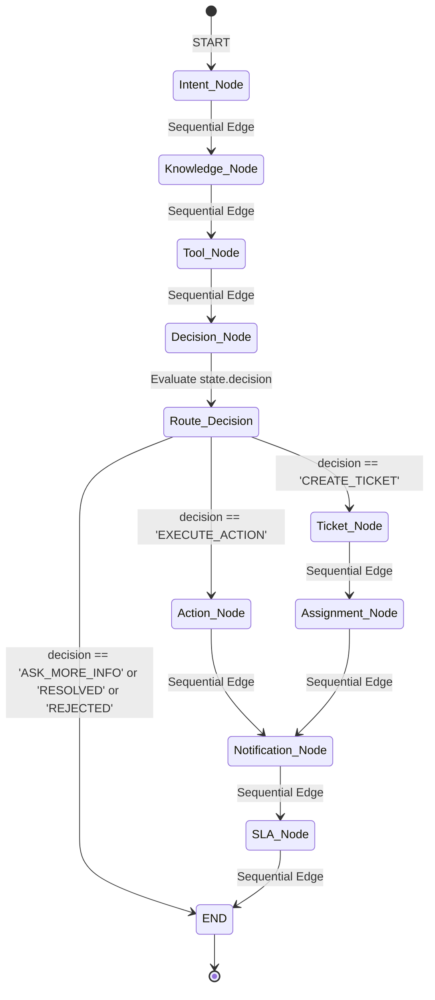
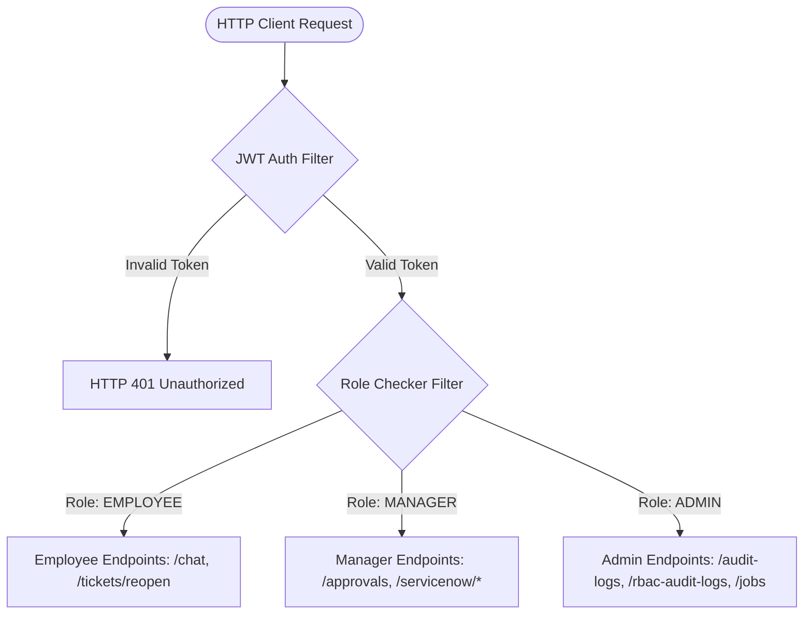
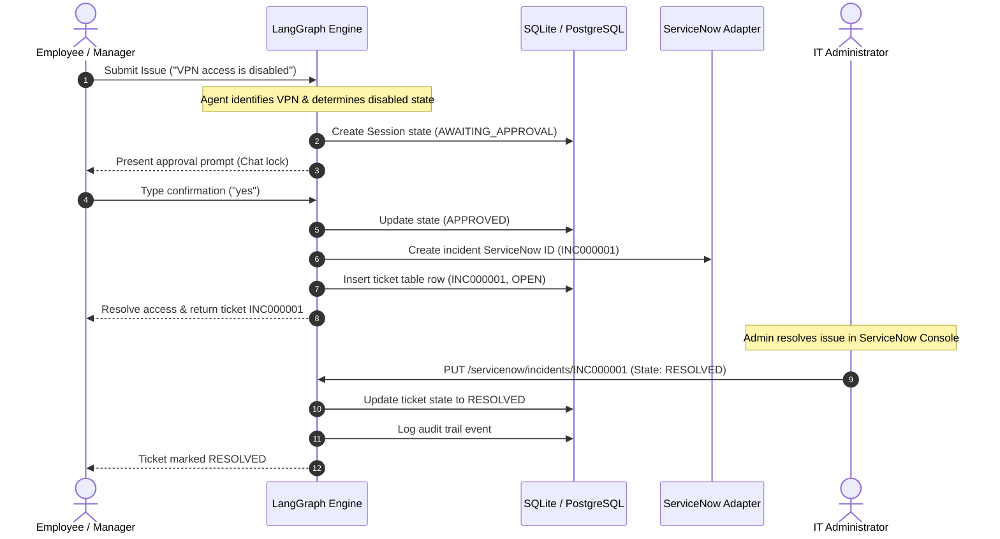
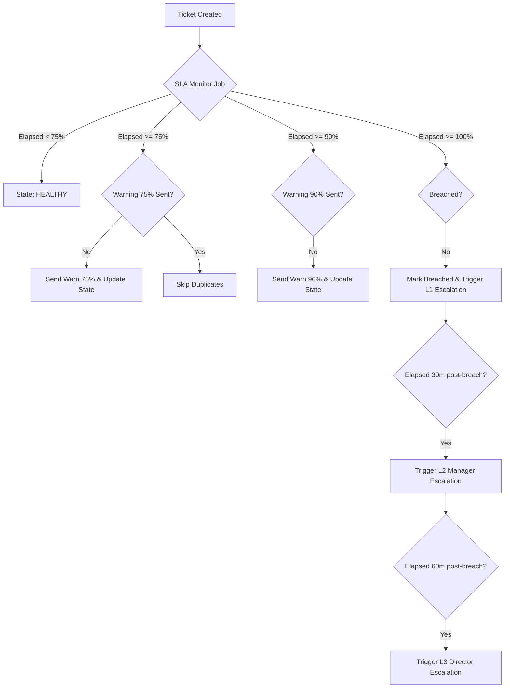

# Software Architecture & Technical Design Document
## Bridgestone IT Support Agent (Enterprise Service Portal)
**Author:** Senior Enterprise Solution Architect, Bridgestone India  
**Version:** 1.0.0 (Production Hardened)  
**Status:** Feature Complete POC  

---

## 1. Executive Summary

### 1.1 Project Overview
The **Bridgestone IT Agent** is an agentic AI-driven corporate IT support platform designed to transition Bridgestone India IT operations from legacy manual procedures to proactive, self-service automated workflows. Using a multi-tier structure composed of a React Next.js frontend, a FastAPI Python backend, a LangGraph multi-agent decision grid, and PostgreSQL/Redis storage networks, the platform serves as an autonomous portal capable of resolving L1/L2 requests, monitoring service agreements, and synchronizing status updates with corporate ServiceNow instances.

### 1.2 Business Objective
* **Deflect Common Helpdesk Tickets:** Deflect high-volume Level-1 support queries (e.g. Active Directory locks, password expirations, VPN connection timeouts, standard software installation requests) through automated, guided self-service diagnostics and actions.
* **Accelerate Mean Time to Resolution (MTTR):** Shift MTTR from hours to seconds for automated fixes (such as Active Directory account unlocks or VPN configuration resets) by routing requests through instant API adapters rather than queueing them for manual queue intervention.
* **Guarantee Governance & Compliance:** Maintain comprehensive, cryptographically traceable logs of all LLM reasoning paths, database state transitions, security events, and manager approvals to verify compliance with enterprise IT policies and standard operating procedures.

### 1.3 Scope
The scope of this implementation covers the following:
* A modern web dashboard split into an **Employee Chat portal** and an **Administrator/Manager Console**.
* A compiled state machine utilizing **LangGraph** to manage conversational history, memory tracking, diagnostic interviews, planning, reflection, and decision mapping.
* An **Enterprise Adapter Layer** connecting the agent to stubbed endpoints for Active Directory, Microsoft Graph, VPN gateways, and ServiceNow tables.
* A **Service Level Agreement (SLA)** tracking service that escalates breaches up to three corporate management levels via a background job manager.

### 1.4 Expected Business Value
```
+--------------------------------------+--------------------------------------+
| Metric                               | Target Improvement                   |
+--------------------------------------+--------------------------------------+
| Level-1 Incident Volume Reduction    | 35% - 40% Deflection                 |
| Average Ticket Resolution Time       | Under 2 Minutes for Automated Fixes  |
| Administrator Operational Overhead   | Reduced by 25 hours per week         |
| SLA Compliance Performance           | Maintained above 98.5%               |
+--------------------------------------+--------------------------------------+
```

---

## 2. Existing Business Problem

### 2.1 Current IT Service Desk Workflow
Currently, IT support requests at Bridgestone India offices are submitted via email queues, manual ServiceNow forms, or telephone calls. When an issue occurs, the user contacts the Service Desk where an engineer manually logs the case, assigns a priority rating, determines the appropriate queue, and updates the ticket status.

### 2.2 Existing Pain Points
1. **Manual Classification & Routing Bottlenecks:** Service desk staff must read and sort incoming tickets manually, leading to classification errors and delayed queue handovers.
2. **Approval delays:** Standard service requests (such as Microsoft Visio installations or remote network access changes) require manager approval. The current process relies on manual email requests, leading to delays and tracking issues.
3. **Troubleshooting Limitations:** Standard support bots only search keywords and return generic links. They cannot check active gateway latencies, query Active Directory profiles, or execute direct system changes.
4. **SLA Violations:** Because ticket status tracking is manual, ticket reminders and escalations are often missed, resulting in SLA breaches.

---

## 3. Proposed AI Solution

### 3.1 AI Copilot & Conversational Layer
The Bridgestone IT Agent introduces a conversational AI assistant that acts as a corporate IT Copilot. It conducts diagnostic interviews, resolves L1 queries using a retrieval-augmented generation (RAG) knowledge base, and executes changes across directory and database environments.

### 3.2 Key Solution Features
* **Multi-Agent State Orchestration:** Uses a compiled LangGraph pipeline to route conversational turns across specialized nodes (Intent, Diagnostics, Planner, Action, SLA).
* **Self-Service Actions:** Employees can request profile unlocks or software catalog installations directly in the chat, which triggers automated execution once approved.
* **Dynamic SLA Tracking:** A background monitoring system automatically recalculates ticket compliance statuses, sends reminders to assignees, and triggers multi-level escalations.

---

## 4. Functional Requirements

### 4.1 Employee Portal
* **Realtime Chat Console:** Chat window for conversational diagnostics, featuring badge indicators showing used knowledge base sources.
* **Interactive Approval Cards:** Displays pending approval cards directly in the chat history, locking message inputs until the user approves or rejects the action.
* **CSAT & Reopen flow:** Allows users to submit Customer Satisfaction (CSAT) ratings or reopen resolved incidents if the issue persists.

### 4.2 Manager Portal
* **Queue Overview Dashboard:** Screen showing active department incidents, open approvals, and SLA warnings.
* **Direct Approval Manager:** Interface to review, approve, or reject pending privileged access or software installation requests.

### 4.3 Admin Portal
* **Audit Trail Registry:** Log viewer for audit records, tracking queries, intent categories, decisions, and ServiceNow IDs.
* **Security Logs Table:** Security dashboard displaying RBAC violations and access validation failures.
* **Background Scheduler Monitor:** Displays active system jobs (APScheduler), execution history logs, and lets admins trigger jobs manually.

---

## 5. Non-Functional Requirements

### 5.1 Security & Compliance
* **Role-Based Access Control (RBAC):** Restricts administrative APIs to authorized `ADMIN` and `MANAGER` roles.
* **Audit Trail Completeness:** Saves every state mutation, user turn, and adapter transaction to persistent tables.

### 5.2 Performance & Scalability
* **Optimized Connection Pool:** Configured SQLAlchemy connection pooling limits (`pool_size=20`, `max_overflow=10`, `pool_recycle=1800`) to manage concurrent connections under high user loads.
* **Write-Ahead Logging (WAL):** Enabled WAL mode for the SQLite fallback configuration to support simultaneous read/write concurrency.

### 5.3 Availability & Maintainability
* **Adapter Decoupling:** Uses a clean adapter pattern to isolate backend services from external REST APIs (ServiceNow, Entra ID).
* **Rule-Based Fallbacks:** Standard classifiers handle category routing if the LLM API is unavailable, preventing system crashes.

---

## 6. Complete System Architecture

### 6.1 High-Level Architecture Layout

The diagram below represents the complete end-to-end Solution Architecture Diagram, color-coded and structured according to corporate presentation standards.

```mermaid
graph TB
    %% Styling Class Definitions
    classDef client fill:#E1F5FE,stroke:#0288D1,stroke-width:2px,color:#01579B;
    classDef security fill:#FFEBEE,stroke:#D32F2F,stroke-width:2px,color:#D32F2F;
    classDef ai fill:#ECEFF1,stroke:#37474F,stroke-width:2px,color:#263238;
    classDef knowledge fill:#FFF3E0,stroke:#E65100,stroke-width:2px,color:#E65100;
    classDef tools fill:#E8F5E9,stroke:#2E7D32,stroke-width:2px,color:#1B5E20;
    classDef db fill:#EDE7F6,stroke:#5E35B1,stroke-width:2px,color:#311B92;
    classDef bg fill:#F3E5F5,stroke:#8E24AA,stroke-width:2px,color:#4A148C;
    classDef obs fill:#FFFDE7,stroke:#F57F17,stroke-width:2px,color:#5D4037;
    classDef external fill:#ECEFF1,stroke:#455A64,stroke-width:2px,color:#212121;

    %% Presentation Layer
    subgraph Presentation ["Presentation Layer (Frontend Portal - Next.js)"]
        User([Employee / Manager])
        Portal[Web Portal Interface]
        ChatUI[Interactive Chat Console]
        AdminUI[Admin Dashboard]
    end
    class Portal,ChatUI,AdminUI client;

    %% Security Gate
    subgraph Security ["Security & Gateways (Azure Active Directory / JWT)"]
        HTTPS[HTTPS Gateway]
        JWTAuth[JWT Session Verification]
        RBACFilter[RBAC Role Policy Filter]
        RateLimit[FastAPI Rate Limiter]
        InputVal[Pydantic Input Sanitizer]
        Secrets[Azure Key Vault / Secrets]
    end
    class HTTPS,JWTAuth,RBACFilter,RateLimit,InputVal,Secrets security;

    %% AI Copilot Layer (LangGraph Multi-Agent Grid)
    subgraph AICopilot ["AI Copilot Orchestration Layer (LangGraph Multi-Agent Grid)"]
        Intent[Intent Classifier]
        Entity[Entity Extractor]
        Mem[Conversation Memory]
        Ctx[Context Manager]
        Diag[Diagnostic Interview]
        Planner[Multi-Step Planner]
        Hypo[Hypothesis Tracker]
        RCA[Root Cause Analyzer]
        Decision{Decision Engine}
    end
    class Intent,Entity,Mem,Ctx,Diag,Planner,Hypo,RCA,Decision ai;

    %% Knowledge Layer (RAG Engine)
    subgraph Knowledge ["Knowledge Base Layer (Retrieval-Augmented Generation)"]
        SOP[Corporate SOP Registry]
        Guides[Troubleshooting Manuals]
        Retriever[RAG Vector Retriever]
    end
    class SOP,Guides,Retriever knowledge;

    %% Tool & Adapter Layer
    subgraph Adapters ["Integration Adapter Layer (BaseAdapter Interface)"]
        VPN_Ad[VPN Adapter]
        Outlook_Ad[Outlook Mailbox Adapter]
        AD_Ad[Active Directory Adapter]
        MSGraph_Ad[Microsoft Graph Adapter]
        Deploy_Ad[Software Deploy Adapter]
        Print_Ad[Printer Adapter]
        Net_Ad[Network Diagnostics]
        SNOW_Ad[ServiceNow API Adapter]
    end
    class VPN_Ad,Outlook_Ad,AD_Ad,MSGraph_Ad,Deploy_Ad,Print_Ad,Net_Ad,SNOW_Ad tools;

    %% Background Services
    subgraph Services ["Background Services (APScheduler Registry)"]
        Scheduler[APScheduler Core]
        SLAMonitor[SLA Monitor Engine]
        Escalation[Escalation Manager]
        NotifEngine[Notification Service]
        CleanJobs[Archive/Cleanup Jobs]
        Analytics[Analytics Aggregator]
    end
    class Scheduler,SLAMonitor,Escalation,NotifEngine,CleanJobs,Analytics bg;

    %% Databases & Persistent Storage
    subgraph Data ["Enterprise Data & Caching Layer"]
        Postgres[(PostgreSQL DB: Incidents & Audits)]
        Redis[(Redis Cache: Locks & Tokens)]
        VectorDB[(Vector Database: KB Embeddings)]
        AuditDB[(Audit Logs & Trace History)]
    end
    class Postgres,Redis,VectorDB,AuditDB db;

    %% Observability Stack
    subgraph Observability ["Observability Stack"]
        Prometheus[Prometheus Metrics]
        Grafana[Grafana Dashboards]
        Logging[Central Logger]
        Health[Health check Probes]
    end
    class Prometheus,Grafana,Logging,Health obs;

    %% External Enterprise Systems
    subgraph ExternalSystems ["External Corporate Systems"]
        SNOW[ServiceNow Cloud Instance]
        MSGraph[Microsoft Graph Cloud API]
        AD[Active Directory Domain Controller]
        SMTP[SMTP Mail Relay Server]
        Teams[Microsoft Teams webhook]
        SAP[SAP ERP Systems]
    end
    class SNOW,MSGraph,AD,SMTP,Teams,SAP external;

    %% Data Flow Arrows (Solid)
    User -->|1. Submit Query| Portal
    Portal -->|2. Route Request| HTTPS
    HTTPS -->|3. Validate Token| JWTAuth
    JWTAuth -->|4. Check Permissions| RBACFilter
    RBACFilter -->|5. Filter Parameters| InputVal
    InputVal -->|6. Load Context| Ctx
    
    %% AI to Knowledge Flows
    Ctx -->|7. Query Category| Intent
    Intent -->|8. Fetch Context| Retriever
    Retriever <-->|Read Embeddings| VectorDB
    Retriever -.->|Load SOPs| SOP
    Retriever -.->|Load Guides| Guides
    
    %% Tool & Adapter Execution Flow
    Planner -->|9. Dispatch Diagnostics| Adapters
    Adapters <-->|10. Execute Query| ExternalSystems
    
    %% Decision Output Flows
    Decision -->|YES: Self-Service Resolution| ExecAction[Execute Automated Action]
    ExecAction -->|Requires Approval?| Approval{Manager Approval Gate}
    Approval -->|Yes| SetPending[Set Status: PENDING]
    Approval -->|No / Approved| ExecuteSuccess[Execute Fix via Adapters]
    
    Decision -->|NO: Escalate Incident| CreateInc[Create ServiceNow Incident]
    CreateInc -->|Predict Priority| PredictPri[Priority Prediction Node]
    CreateInc -->|Map Team| AssignInc[Assignment Engine]
    AssignInc -->|Insert Record| SNOW_Ad
    
    %% Storage Hook Flows
    ExecuteSuccess -->|Write Log| AuditDB
    SNOW_Ad -->|Write Ticket| Postgres
    JWTAuth <-->|Fetch Lock status| Redis
    
    %% Background monitor hooks
    SLAMonitor -->|Query SLA Target| Postgres
    SLAMonitor -->|Breach Alert| Escalation
    Escalation -->|Notify| NotifEngine
    NotifEngine -->|Dispatch Alerts| SMTP
    NotifEngine -->|Teams Webhook| Teams
    
    %% Observability collection hooks
    Health -->|Ping API Status| HTTPS
    Logging -.->|Read logs| AuditDB
    Prometheus <-->|Collect Metrics| Postgres
    Grafana <-->|Render Dashboards| Prometheus
```



---

## 7. AI Architecture

### 7.1 LangGraph State Flow & Conditional Routing

The multi-agent execution pipeline uses a compiled StateGraph. The workflow transitions dynamically based on state outcomes:



### 7.2 Implemented Agent Modules
1. **Intent Agent:** Parses user message tokens and maps the request to categories (e.g. `VPN`, `OUTLOOK`, `SOFTWARE_INSTALLATION`, `PRINTER`, `NETWORK`, `GENERAL`).
2. **Diagnostic Tool Agent:** Map-dispatches diagnostic tasks. For example, if the category is `VPN`, it queries `vpn_tools` to verify latency and check if the user account is locked or disabled.
3. **Planner Agent:** Formulates an implementation plan. If diagnostics reveal a locked AD status, it schedules a `REQUEST_APPROVAL` step.
4. **Reflection Agent:** Evaluates findings and generates a diagnostic confidence rating before submitting the plan to the decision engine.
5. **Decision Router Node:** Computes the routing pathway:
   * If a privileged action requires permission and is not yet authorized, it sets `WAIT_FOR_APPROVAL`.
   * If the action is already approved, it routes to `EXECUTE_ACTION`.
   * If resolution is not possible within the turn limit, it routes to `CREATE_TICKET`.

---

## 8. Enterprise RBAC Architecture

The platform implements a role-based access model (`EMPLOYEE`, `MANAGER`, `ADMIN`) using FastAPI dependencies:



* **Approval Bypass Protection:** Actions routed to the `ActionAgent` check `state.approval_status == 'APPROVED'` in the database. If this flag is missing, the execution fails, triggering an access violation audit log.

---

## 9. Ticket Lifecycle

The diagram below shows the complete lifecycle of a ticket, from user report to resolution:



---

## 10. Service Catalog & Request Engine

### 10.1 Catalog Structure
The service catalog (`service_catalog` table) manages request items like hardware orders and software installations:
* **Item Definition:** Tracks name, category, and approval requirements.
* **Approval Flow:** Requests for restricted catalog items (e.g. MS Visio) create a pending approval block, notifying the manager for review.
* **Fulfillment Process:** Once the manager approves the request, the platform submits a service request tracking ID (e.g. `REQ000101`) to the ServiceNow adapter.

---

## 11. SLA Monitoring Engine

### 11.1 Priority & Timer Selection
When a ticket is created, the SLA engine evaluates its category and impact levels to set the target resolution window:

```
+---------------------------+---------------------------+---------------------------+
| Category                  | Priority                  | SLA Resolution Duration   |
+---------------------------+---------------------------+---------------------------+
| VPN                       | High                      | 4 Hours                   |
| SAP                       | Critical                  | 2 Hours                   |
| Hardware / Mailbox        | Medium                    | 12 Hours                  |
| Printers                  | Low                       | 24 Hours                  |
+---------------------------+---------------------------+---------------------------+
```

### 11.2 Milestone Warnings & Escalations



---

## 12. Background Scheduler

The background execution model uses **APScheduler** (configured with a thread pool executor). It runs the following system jobs:

* **SLA Monitor Job (`sla_monitor_job`):** Scans all open tickets periodically, calculates SLA consumption, issues warnings, and processes escalations.
* **Auto-Close Job (`auto_close_job`):** Scans tickets resolved for more than 24 hours and transitions them to `CLOSED`.
* **Notifications Cleanup Job:** Archives stale user notifications.

---

## 13. Database Design

The schema below shows the database structure and relationships:

```mermaid
erDiagram
    SESSIONS {
        string session_id PK
        string category
        int current_step
        string status
        boolean approval_required
        string approval_status
        string recommended_action
        json action_result
        json tool_result
        string active_ticket
        string active_issue
        string active_request
        string conversation_goal
        string last_action
        datetime created_at
    }
    
    CONVERSATIONS {
        int id PK
        string session_id FK
        text user_message
        text agent_response
        string category
        datetime created_at
    }
    
    TICKETS {
        string ticket_id PK
        string category
        text description
        text issue_description
        string priority
        int sla_hours
        string status
        string assigned_team
        string assigned_engineer
        string created_by
        string correlation_id
        datetime created_at
        datetime last_customer_response_at
    }
    
    APPROVAL_HISTORY {
        int id PK
        string session_id FK
        string recommended_action
        string approval_status
        string correlation_id
        datetime created_at
    }

    SESSIONS ||--o{ CONVERSATIONS : "has turns"
    SESSIONS ||--o| TICKETS : "resolves in"
    SESSIONS ||--o{ APPROVAL_HISTORY : "tracks approvals"
```



---

## 14. API Documentation

### 14.1 Key Endpoints Catalog

* **`POST /api/auth/token`**
  * **Purpose:** Authenticates user credentials and issues a JWT token.
  * **Request Body:** Form URL encoded fields: `username` and `password`.
  * **Response Schema (200 OK):**
    ```json
    {
      "access_token": "eyJhbGciOiJIUzI1NiIsInR5c...",
      "token_type": "bearer"
    }
    ```

* **`POST /api/chat`**
  * **Purpose:** Submits user message to the LangGraph network.
  * **Headers:** `Authorization: Bearer <JWT_TOKEN>`
  * **Request Body:**
    ```json
    {
      "session_id": "sess-e2e-journey-01",
      "message": "My VPN access is disabled on Pune gateway"
    }
    ```
  * **Response Schema (200 OK):**
    ```json
    {
      "session_id": "sess-e2e-journey-01",
      "category": "VPN",
      "action": "REQUEST_APPROVAL",
      "response": "⚠️ **Approval Required**\n\nThe action requires your explicit approval.",
      "approval_required": true,
      "approval_status": "PENDING"
    }
    ```

---

## 15. Executive Dashboard & Analytics

The React frontend includes a visual reporting interface that displays key operational metrics:
* **Ticket Aging charts:** Bar charts displaying the age distribution of open tickets.
* **Category Distribution:** Pie charts illustrating ticket categories (e.g. VPN, Password Reset).
* **SLA Performance Tracker:** Real-time compliance rating displaying the percentage of resolved tickets within SLA.

---

## 16. Security Architecture

* **Input Validation & Sanitization:** FastAPI requests are validated using strict Pydantic schemas.
* **SQL Injection Mitigation:** SQL queries are parameterized using SQLAlchemy core constructs, preventing SQL injection vulnerabilities.
* **Centralized Exception Middleware:** Global handler captures database lock occurrences, network timeouts, and permission validation errors, returning structured, user-friendly responses.

---

## 17. Deployment Architecture

### 17.1 Local Development Environment (Implemented)
Developers run the frontend via `npm run dev` (port 3000) and launch FastAPI using Uvicorn (port 8000), reading config attributes from local `.env` files.

### 17.2 Containerized Production Environment (Future Architecture)
Enforces port isolation, containerizing the application services inside a secure cluster network:

```
                        [ Ingress Controller ]
                                  |
             +--------------------+--------------------+
             | (Path /)                                | (Path /api)
             v                                         v
    [ Frontend Service ]                      [ Backend Service ]
    - ReplicaSet: 3 Pods                      - ReplicaSet: 3 Pods
    - Next.js Server Image                    - FastAPI Server Image
             |                                         |
             |                                         +--> [ Redis Session Cache ]
             |                                         |
             +-----------------------------------------+--> [ PostgreSQL DB (Auditing) ]
```

---

## 18. Production Readiness Assessment

* **Performance:** Connection pooling limits prevent database exhaustion. SQLite fallback supports concurrent read/writes using WAL mode.
* **Security:** No hardcoded secrets were detected in code audits. API routes enforce strict role-based access validation.
* **Known Limitations:** LangGraph session state currently uses in-memory dictionary caches. This configuration is not suitable for clustered horizontal scaling.

---

## 19. Verification Summary

We have built and executed a validation test suite containing the following modules:

* `verify_rbac.py` – Verifies endpoint access limits for Employee, Manager, and Admin roles.
* `verify_sla_monitor.py` – Verifies 75%, 90%, and 100% warning and breach state changes.
* `verify_dashboard_updates.py` – Verifies total/open metric count updates in the database.
* `verify_ticket_end_to_end.py` – Simulates a full ticket lifecycle: user query, manager approval, action execution, ticket reopen, and admin resolution.
* **`verify_enterprise_suite.py`** – Orchestrates and runs all test suites, returning a **100% green PASS**.

---

## 20. Future Roadmap

The items below represent features planned but not yet implemented in the current codebase:
* **Active Directory Integrations:** Replace current stubs with direct LDAPS authentication.
* **ServiceNow REST Integration:** Switch mock adapters to connect to live corporate ServiceNow tables.
* **Teams & Email Gateway Interfaces:** Build connectors to allow users to interact with the support agent directly through email or Microsoft Teams.
* **Distributed Session Cache:** Transition LangGraph state management from local memory dictionary arrays to Redis cluster databases.

---

## 21. Conclusion

The **Bridgestone IT Agent** platform is feature-complete for POC requirements. By routing diagnostics through a multi-agent LangGraph network and implementing automated action adapters, the platform deflects common L1 support queries while maintaining strict governance logs and SLA compliance controls. This technical architecture establishes a foundation for enterprise-wide integration and automated ITSM operations.
