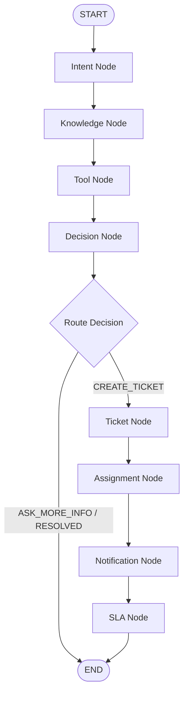

# LangGraph Orchestration Architecture

This document describes the design and orchestration architecture of the Bridgestone IT Agent using LangGraph.

## Graph Diagram

Below is the state transitions and execution path of the IT Agent:



---

## State Model

The graph utilizes `AgentState` (defined in [`state.py`](file:///c:/Projects/it-agent/backend/app/graph/state.py)) as the unified context model:

* **`session_id`** (str): Active user session identifier.
* **`user_message`** (str): The latest user prompt or query.
* **`category`** (str): The current detected category/topic.
* **`knowledge_context`** (str): Context loaded from the RAG knowledge guides.
* **`tool_result`** (dict): The output payload after executing domain tools.
* **`decision`** (str): The agent's decision (`ASK_MORE_INFO`, `RESOLVED`, or `CREATE_TICKET`).
* **`ticket`** (dict): Created ticket detail payload if `CREATE_TICKET` is triggered.
* **`assigned_team`** (str): Designated support team.
* **`notifications`** (list): Created incident notifications.
* **`sla`** (dict): Calculated priority and response time constraints.

---

## Node Descriptions

### 1. Intent Node ([`intent_node.py`](file:///c:/Projects/it-agent/backend/app/graph/nodes/intent_node.py))
* **Responsibility**: Calls `intent_service.py` (`detect_intent`) to identify the user's topic category (e.g. `VPN`, `OUTLOOK`, `SOFTWARE_INSTALLATION`, `PRINTER`, `NETWORK`, `GENERAL`).
* **Output**: Updates state `category`.

### 2. Knowledge Node ([`knowledge_node.py`](file:///c:/Projects/it-agent/backend/app/graph/nodes/knowledge_node.py))
* **Responsibility**: Invokes `rag_service.py` (`load_knowledge_context`) to retrieve reference documentation matching the category.
* **Output**: Updates state `knowledge_context`.

### 3. Tool Node ([`tool_node.py`](file:///c:/Projects/it-agent/backend/app/graph/nodes/tool_node.py))
* **Responsibility**: Calls the new tool orchestration agent [`tool_agent.py`](file:///c:/Projects/it-agent/backend/app/services/tool_agent.py), routing system operations to the specialized module stubs (e.g. `vpn_tools.py`, `printer_tools.py`, etc.).
* **Output**: Updates state `tool_result`.

### 4. Decision Node ([`decision_node.py`](file:///c:/Projects/it-agent/backend/app/graph/nodes/decision_node.py))
* **Responsibility**: Invokes `decision_service.py` (`analyze_conversation`) with category, history, user query, and context to compute the next step.
* **Output**: Updates state `decision`.

### 5. Ticket Node ([`ticket_node.py`](file:///c:/Projects/it-agent/backend/app/graph/nodes/ticket_node.py))
* **Responsibility**: Triggers ticket creation in `ticket_service.py` (`create_ticket`) using the original user query.
* **Output**: Updates state `ticket`.

### 6. Assignment Node ([`assignment_node.py`](file:///c:/Projects/it-agent/backend/app/graph/nodes/assignment_node.py))
* **Responsibility**: Assigns the ticket to the correct team using `assignment_service.py`.
* **Output**: Updates state `assigned_team`.

### 7. Notification Node ([`notification_node.py`](file:///c:/Projects/it-agent/backend/app/graph/nodes/notification_node.py))
* **Responsibility**: Tracks sent notifications in `notification_service.py` associated with the created ticket.
* **Output**: Updates state `notifications`.

### 8. SLA Node ([`sla_node.py`](file:///c:/Projects/it-agent/backend/app/graph/nodes/sla_node.py))
* **Responsibility**: Retains/tracks priority level and SLA hours from `sla_service.py`.
* **Output**: Updates state `sla`.

---

## Routing Logic

Routing uses conditional rules on the decision node output:
1. **`ASK_MORE_INFO`** / **`RESOLVED`** -> Terminates the workflow (`END`), returning the response.
2. **`CREATE_TICKET`** -> Enters the ticket pipeline (`ticket` -> `assignment` -> `notification` -> `sla` -> `END`).

---

## Future ServiceNow Integration Path

To transition from mock databases to a real ServiceNow instance:
1. **Client Setup**: Configure real HTTP client settings (endpoints, basic authentication, API tokens) in the ServiceNow REST implementation inside [`servicenow_client.py`](file:///c:/Projects/it-agent/backend/app/integrations/servicenow/servicenow_client.py) (`ServiceNowRealClient`).
2. **Environment Variables**: Populate secure parameters in `.env`:
   ```bash
   SERVICENOW_BASE_URL="https://bridgestone.service-now.com"
   SERVICENOW_USER="api_user"
   SERVICENOW_PASS="secure_password"
   ```
3. **Toggle Clients**: Instantiate `ServiceNowRealClient` instead of `ServiceNowMockClient` inside `ticket_service.py` and node layers based on environmental configuration.
