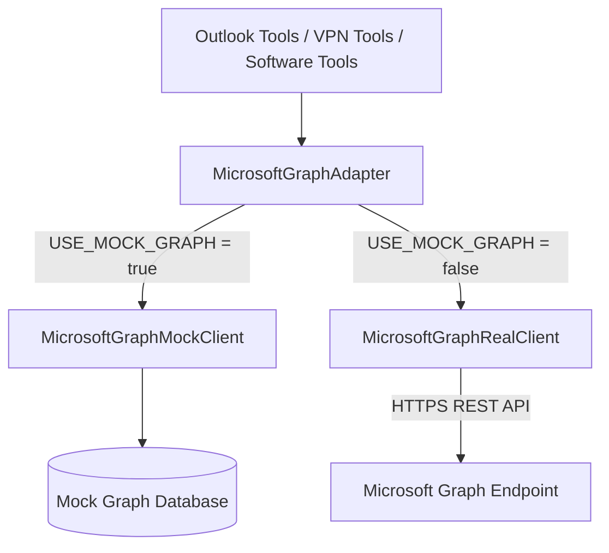

# Microsoft Graph Integration Layer

This document details the architectural layout, authentication flows, API mapping, Prometheus telemetry, and fallback strategies for the Bridgestone Microsoft Graph Integration Layer.

---

## 1. Architectural Overview

The Microsoft Graph integration layer wraps communication with the Microsoft Entra ID directory, licenses, groups, and Exchange Online mailbox REST endpoints. The system delegates all calls through the `MicrosoftGraphAdapter` which dynamically determines whether to route calls to the local mock database or the real HTTP REST endpoints based on environment settings.



---

## 2. Authentication Flow

The production client `MicrosoftGraphRealClient` connects to the Microsoft Graph API using the **OAuth2 Client Credentials Flow**:

* **Token Request**: Sends a `POST` request to the Microsoft Entra ID token endpoint:
  `https://login.microsoftonline.com/{tenant_id}/oauth2/v2.0/token`
  Using Azure AD credentials:
  * `grant_type`: `client_credentials`
  * `client_id`: `AZURE_CLIENT_ID`
  * `client_secret`: `AZURE_CLIENT_SECRET`
  * `scope`: `https://graph.microsoft.com/.default`
* **Token Caching**: Retained in-memory with automatic cache validation. The client checks token expiration timestamps and proactively refreshes the cached access token when within a 60-second expiration safety window.

---

## 3. Environment Variables Configuration

Managed dynamically within `.env` configuration files (`dev.env`, `qa.env`, `prod.env`):

```ini
# Toggle mode: true maps to Mock Client, false maps to Real client
USE_MOCK_GRAPH=false

# Azure Active Directory Credentials
AZURE_TENANT_ID=your_azure_tenant_guid_or_domain
AZURE_CLIENT_ID=your_azure_ad_app_client_id
AZURE_CLIENT_SECRET=your_azure_ad_app_client_secret
```

---

## 4. API Endpoint Mappings

### User Operations
* **Get User**: `GET /users/{user_id}`
* **Get User Profile**: `GET /users/{user_id}`
* **Get Manager**: `GET /users/{user_id}/manager`
* **Get Member Groups**: `GET /users/{user_id}/memberOf`
* **List Users**: `GET /users`

### Mailbox Operations
* **Get Mailbox Status / Settings**: `GET /users/{user_id}/mailboxSettings`
* **Exchange Connectivity**: `GET /users?$top=1`

### License Operations
* **Get Assigned Licenses**: `GET /users/{user_id}?$select=assignedLicenses`
* **Verify Office License**: Checks for Office 365 E3/E5 SKU ids (e.g. `c7ad517e-7c09-42b0-844d-d18309f68590`, `06371584-c816-4af5-bc91-ae0e2d6349c2`, `18181a46-0d4e-45cd-891e-60aabd171b4e`).
* **Verify Exchange Online License**: Checks for license items providing Exchange plans.

### Group Operations
* **Get Group Membership**: `GET /groups/{group_id}/members`
* **Verify VPN Group membership**: Lists user member groups and validates presence of `"VPN Users"` group.
* **List Groups**: `GET /groups`

---

## 5. Telemetry & Metrics Collection

All operations record Prometheus telemetry counters and latency tracking:
* `graph_requests_total` (Labels: `operation` - e.g. `get_user_profile`, `get_all_users`)
* `graph_failures_total` (Labels: `operation`, `error_type` - e.g. `401`, `ConnectionError`)
* `graph_latency_seconds` (Labels: `operation` - records REST API duration)
* `graph_mailbox_checks_total` (Counts total mailbox status audits performed)
* `graph_license_checks_total` (Counts total license checks completed)

---

## 6. Fallback & Resilience Strategy

If connectivity to Microsoft Entra ID or the Graph endpoints is degraded:
1. **Mock Fallback**: Toggle `USE_MOCK_GRAPH=true` in environment configuration and restart the backend. The system falls back cleanly to the stable `MicrosoftGraphMockClient` which retrieves details from `microsoft_graph_mock_db` singleton (seeded with mock profiles).
2. **Health Diagnostics**: The `/system-status` health checks report exact roundtrip latency and token validity.
