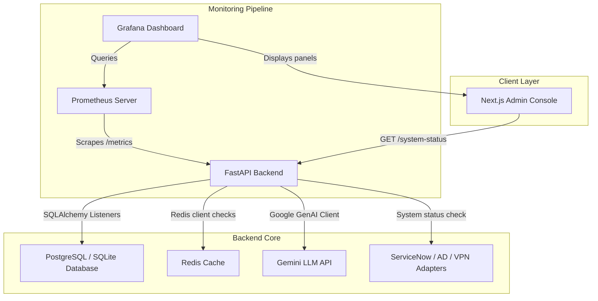

# Bridgestone IT Support Agent - Observability Architecture

This document describes the observability, monitoring, and metrics collection architecture implemented for the Bridgestone IT Support Agent platform.

## Overview

The platform uses **Prometheus** for scraping metrics and **Grafana** for visualizing dashboard trends and active alerts. The backend uses the official `prometheus-client` library to expose standard HTTP request and custom system metrics.

---

## Metric Reference Catalog

### 1. HTTP Request Metrics
* `http_requests_total` (Counter): Total HTTP Requests received, partitioned by `method` and `path`.
* `http_failures_total` (Counter): Total HTTP request failures, partitioned by `method`, `path`, and `status_code`.
* `http_request_duration_seconds` (Histogram): Request latency buckets, partitioned by `method` and `path`.

### 2. Security Metrics
* `security_logins_total` (Counter): Total successful authentication logins, partitioned by `username`.
* `security_failed_logins_total` (Counter): Total failed authentication login attempts, partitioned by `username`.
* `security_permission_denied_total` (Counter): Access denied attempts to routes, partitioned by `username`.
* `security_jwt_expired_total` (Counter): Requests carrying expired JWT tokens.
* `security_unauthorized_total` (Counter): Requests carrying invalid/missing credentials.

### 3. Agent Execution Metrics
* `agent_execution_duration_seconds` (Histogram): Node processing latency in LangGraph workflow execution, partitioned by `agent_name` (e.g. `Intent Agent`, `Knowledge Agent`, `Decision Agent`, `Tool Agent`, `Action Agent`, `SLA Agent`, `Ticket Agent`).

### 4. LLM / Gemini Metrics
* `llm_requests_total` (Counter): Total requests sent to Gemini generative models.
* `llm_success_total` (Counter): Total successful LLM API answers.
* `llm_failures_total` (Counter): Total failed LLM API requests, partitioned by `error_type` (e.g. `rate_limit`, `empty_response`, `missing_api_key`).
* `llm_latency_seconds` (Histogram): Response latencies of Gemini generation calls.
* `llm_token_usage_total` (Counter): Count of consumed tokens, partitioned by `token_type` (`prompt_tokens` or `candidate_tokens`).
* `llm_rate_limit_errors_total` (Counter): Rate limiting occurrences (HTTP 429) hit on Gemini APIs.
* `llm_fallback_events_total` (Counter): Fallbacks triggered due to LLM exceptions or empty answers.

### 5. Database Metrics
* `db_connections_active` (Gauge): Current count of active database connections checked out via session dependency managers.
* `db_query_duration_seconds` (Histogram): Database SQL statement latency buckets.
* `db_failures_total` (Counter): Total database queries resulting in driver failures.
* `db_transactions_total` (Counter): Total SQL transactions committed.

### 6. Cache Metrics (Redis)
* `redis_availability` (Gauge): Current connection status of the Redis server (`1` if connected/healthy, `0` if disconnected/offline).
* `redis_cache_hits_total` (Counter): Total read hit counts from local memory cache fallback.
* `redis_cache_misses_total` (Counter): Total read miss counts from local memory cache fallback.
* `redis_session_restorations_total` (Counter): Sessions restored from database after fallback cache misses.

### 7. Business Metrics
* `business_tickets_created_total` (Counter): Total support tickets created.
* `business_tickets_resolved_total` (Counter): Total tickets successfully closed/resolved.
* `business_approvals_total` (Counter): Total approval cycles processed, partitioned by `status` (`requested`, `approved`, `rejected`).
* `business_actions_executed_total` (Counter): Total automated corrective actions executed by the Action Agent.
* `business_notifications_sent_total` (Counter): Total recipient alerts triggered.
* `business_sla_breaches_total` (Counter): Total SLA target breach occurrences computed dynamically.

---

## Prometheus Alert Rules (`alerts.yml`)

The platform implements 6 core production alerting thresholds:

1. **BackendDown**: Triggered when the FastAPI backend metrics exporter is unreachable for >10 seconds (`severity: critical`).
2. **DatabaseDown**: Triggered when the count of database transaction failures exceeds 5 (`severity: critical`).
3. **RedisDown**: Triggered when Redis availability checks report offline status (`redis_availability == 0`) for >10 seconds (`severity: warning`).
4. **GeminiHighFailRate**: Triggered when the failure rate of Gemini generation calls exceeds 10% in the last 5 minutes (`severity: critical`).
5. **SlaBreachThreshold**: Triggered when SLA breaches exceed 3 events in the last 5 minutes (`severity: warning`).
6. **AuthenticationFailureSpike**: Triggered when failed login attempts exceed 5 in the last 5 minutes (`severity: warning`).

---

## Front-end Live Monitoring Console

Admins can view real-time system metrics directly inside the Bridgestone IT Portal via the **Monitoring** tab. This console provides:

1. **Core Status badges** with animated indicator lights for Database, Redis, and Gemini.
2. **Enterprise Adapter indicators** verifying connection status to ServiceNow, Microsoft Graph, Active Directory, and VPN Gateway.
3. **Operational counters** for Tickets Created, Actions Executed, Pending Approvals, and Security Incidents.
4. **Real-time Alert Banner** display notifying of active system alerts and security anomalies.
