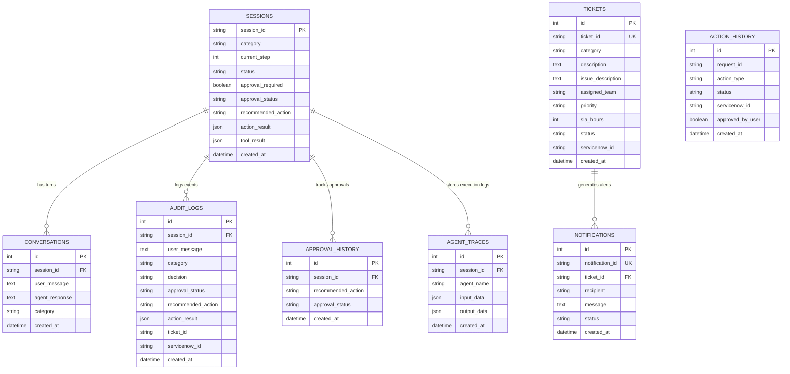

# Production Persistence Layer Architecture

This document describes the design, schema definitions, repository pattern, database connections, and operational backup strategy for the PostgreSQL persistence layer integrated into the Bridgestone IT Agent.

---

## 1. Database Schema

The persistence layer uses a relational database model implemented with SQLAlchemy ORM. The tables are configured to be fully compatible with PostgreSQL and fall back to local SQLite files for testing.

### Entity Relationship (ER) Diagram



---

## 2. Repository Pattern

To separate database operations from the business logic, the application uses the **Repository Pattern**. Services and LangGraph nodes never access SQLAlchemy sessions directly. Instead, they interact with the database using repository abstractions.

### Repository Classes

* **[ConversationRepository](file:///c:/Projects/it-agent/backend/app/database/repositories/conversation_repository.py)**: Manages metadata state updates for sessions and logs user-agent chat turns.
* **[AuditRepository](file:///c:/Projects/it-agent/backend/app/database/repositories/audit_repository.py)**: Saves high-level audit logs for chat turns and decisions.
* **[ActionRepository](file:///c:/Projects/it-agent/backend/app/database/repositories/action_repository.py)**: Tracks Action Agent command execution results and execution metrics.
* **[ApprovalRepository](file:///c:/Projects/it-agent/backend/app/database/repositories/approval_repository.py)**: Records approval lifecycle states (PENDING, APPROVED, REJECTED).
* **[TraceRepository](file:///c:/Projects/it-agent/backend/app/database/repositories/trace_repository.py)**: Persists developer agent trace metrics from LangGraph execution runs.
* **[TicketRepository](file:///c:/Projects/it-agent/backend/app/database/repositories/ticket_repository.py)**: Manages ticket creation details and notification listings.

---

## 3. Persistence Strategy

### 3.1 Transparent Engine Fallback
To support both developer local runs and enterprise Kubernetes deployments, the engine creation logic in [`connection.py`](file:///c:/Projects/it-agent/backend/app/database/connection.py) uses a fallback strategy:

1. Attempt connection using the `DATABASE_URL` environment variable.
2. If connection times out or fails (e.g. database service not running on port 5432), catch the exception.
3. Automatically configure and connect to a local SQLite database (`sqlite:///bridgestone_it_agent.db`).
4. Initialize tables and run the application without interruption.

### 3.2 Stateless Session Hydration
The `ConversationState` memory is stateless across requests. When the backend receives a message:
1. `get_conversation(session_id)` is called.
2. The database is queried for the `SessionModel` metadata and all conversation turns associated with that `session_id`.
3. If records exist, a new `ConversationState` is instantiated and populated with the database values (restoring category, current steps, history logs, tool results, and approval properties).
4. The conversation continues seamlessly, surviving server restarts.

---

## 4. Backup & Recovery Strategy (Production Environment)

To secure the database in a production environment, implement the following backup policy:

### 4.1 Automated Daily Backups
Configure a cron utility to run `pg_dump` daily. Export backups to a compressed file and copy it to a secure, write-once-read-many (WORM) storage container (e.g., AWS S3 with Object Lock or internal enterprise storage):
```bash
pg_dump -U postgres -d bridgestone_it_agent -F c -b -v -f /backups/it_agent_$(date +%F).backup
```

### 4.2 Point-in-Time Recovery (PITR)
Enable **Write-Ahead Logging (WAL)** archiving to support restoring the database state to a specific millisecond in the event of database corruption.
* Set `wal_level = replica` in `postgresql.conf`.
* Set `archive_mode = on`.
* Specify an `archive_command` script to move WAL logs to backup storage.

### 4.3 Retention Rules
* Retain daily backups for **30 days**.
* Keep weekly backups for **12 weeks**.
* Keep monthly snapshots for **1 year** to comply with auditing requirements.
