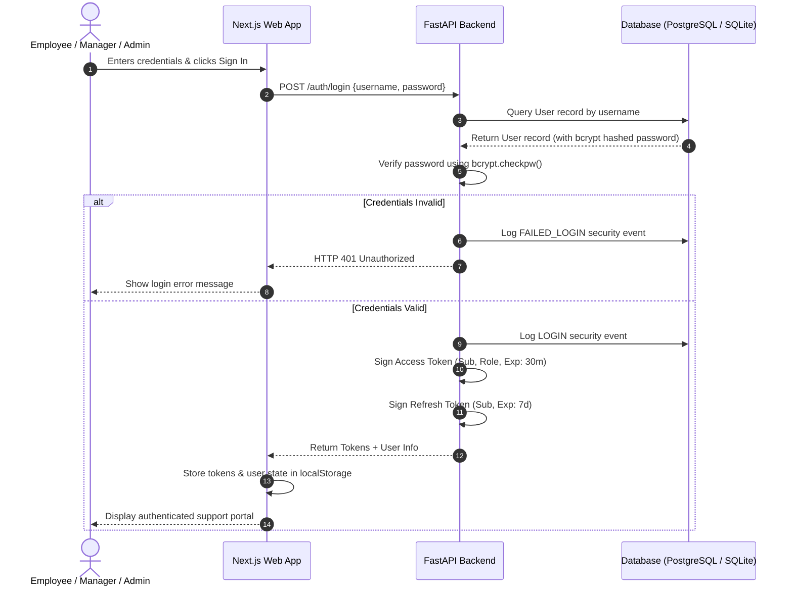
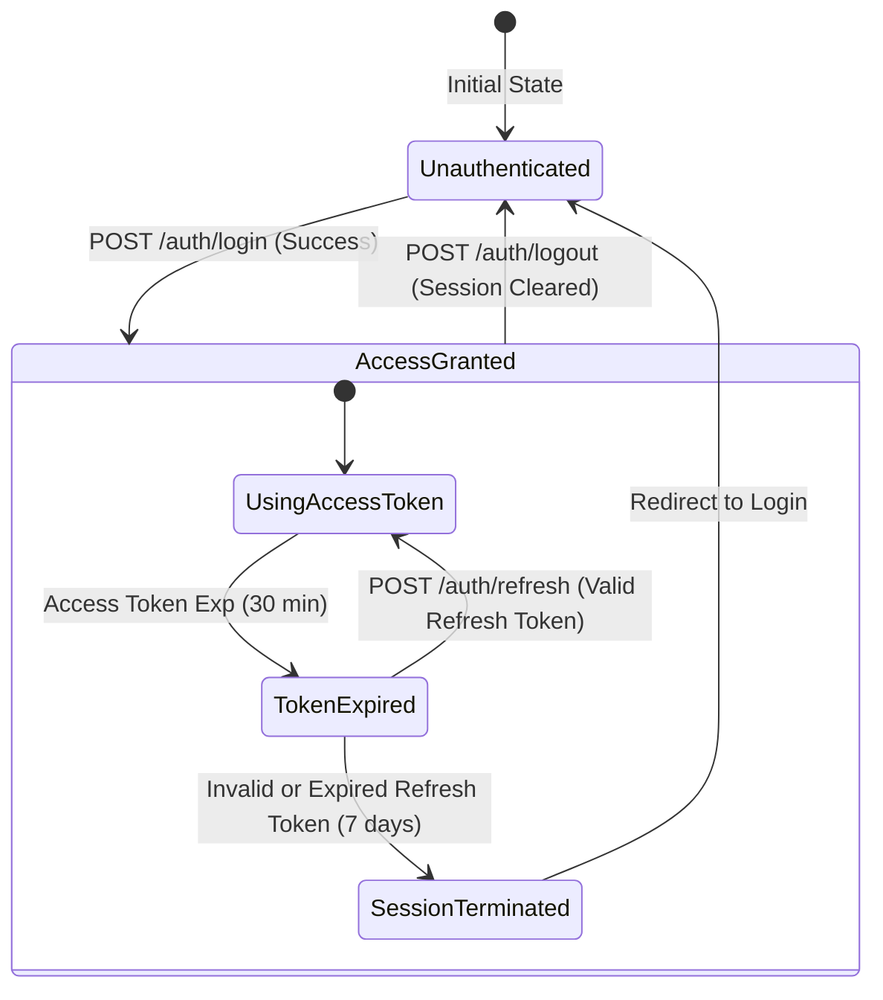

# Security Architecture Documentation

This document outlines the security architecture, authentication mechanisms, Role-Based Access Control (RBAC) model, JWT lifecycle, and security auditing framework implemented for the Bridgestone IT Support Agent.

---

## 1. Authentication Flow

The platform uses a token-based authentication mechanism. Clients authenticate via username and password to obtain short-lived Access Tokens and long-lived Refresh Tokens.

---

## 2. Authorization & Role-Based Access Control (RBAC)

The application enforces path-based and resource-level authorization via FastAPI dependency injection guards.

### The RBAC Matrix

| Role | Allowed Actions / APIs | Protected Views / Tabs |
| :--- | :--- | :--- |
| **EMPLOYEE** | <ul><li>Chat (`/chat`)</li><li>Create manual tickets (`/ticket`)</li><li>Approve own requests (in-chat)</li><li>View own history (filtered `/tickets`, `/notifications`, `/sla`)</li></ul> | <ul><li>Service Desk</li><li>Admin Console (Hidden)</li><li>Traces / Logs (Hidden)</li></ul> |
| **MANAGER** | <ul><li>View team tickets (`/tickets`)</li><li>View approvals history (`/approvals`)</li><li>View executed actions history (`/actions`)</li><li>SLA details for all tickets (`/sla`)</li></ul> | <ul><li>Service Desk</li><li>Admin Console (Hidden)</li><li>Traces / System logs (Hidden)</li></ul> |
| **ADMIN** | <ul><li>Access everything</li><li>Full system Audit logs (`/audit-logs`)</li><li>AI Agent Traces (`/agent-traces`)</li><li>System Health endpoint (`/health`)</li><li>Security events (`/admin/security-logs`)</li></ul> | <ul><li>Service Desk</li><li>Admin Console (Visible)</li><li>Traces / Logs (Visible)</li></ul> |

---

## 3. JWT Token Lifecycle

* **Access Token**: Short-lived (30 minutes) token signed with `HS256`. Includes `sub` (username) and `role` claims.
* **Refresh Token**: Long-lived (7 days) token stored securely on the client. Used to request a new access token without re-entering credentials.
* **Revocation**: Handled during `/auth/logout` which logs the logout event and destroys tokens on the client side.

---

## 4. Security Audit Logging

All security-critical events are captured in the `security_events` database table. The logged events include:

1. **`LOGIN`**: Recorded when a user successfully enters correct credentials.
2. **`FAILED_LOGIN`**: Recorded when incorrect credentials or deactivated accounts are submitted.
3. **`LOGOUT`**: Recorded when a user explicitly terminates their session.
4. **`PERMISSION_DENIED`**: Recorded when a user attempts to call an API endpoint above their role permissions (e.g. Employee calling `/audit-logs`).
5. **`ROLE_CHANGE`**: Designed to track configuration updates or role escalations.

These logs are fetched via `/admin/security-logs` and are rendered in the Admin Console dashboard for real-time monitoring.

---

## 5. Enterprise Security Roadmap

To scale this security layer for global production deployment, we recommend the following roadmap additions:

### Phase 1: Identity & Access Management (IAM)
* **Single Sign-On (SSO)**: Replace standard credential logging with SAML 2.0 or OpenID Connect (OIDC) protocols to integrate with corporate directories (Active Directory, Azure AD, Okta, Ping Identity).
* **Multi-Factor Authentication (MFA)**: Enforce mandatory secondary authentication via authenticator apps (TOTP), SMS, or hardware keys (FIDO2) for managers and administrators.

### Phase 2: API & Network Layer Security
* **IP Whitelisting & VPN**: Ensure API routes are only accessible from within the corporate VPN or trusted enterprise networks.
* **API Gateway & Rate Limiting**: Deploy an API gateway (e.g., Kong, AWS API Gateway, Cloudflare) with rate limiting to prevent brute-force attacks and DDOS attempts.

### Phase 3: Data Security & Privacy
* **Data Encryption at Rest**: Use database column encryption for sensitive ticket descriptions and user emails using AES-256.
* **Data Masking (PII)**: Implement an LLM pre-filtering middleware to mask PII (Personally Identifiable Information) before requests are sent to public or third-party AI models.
