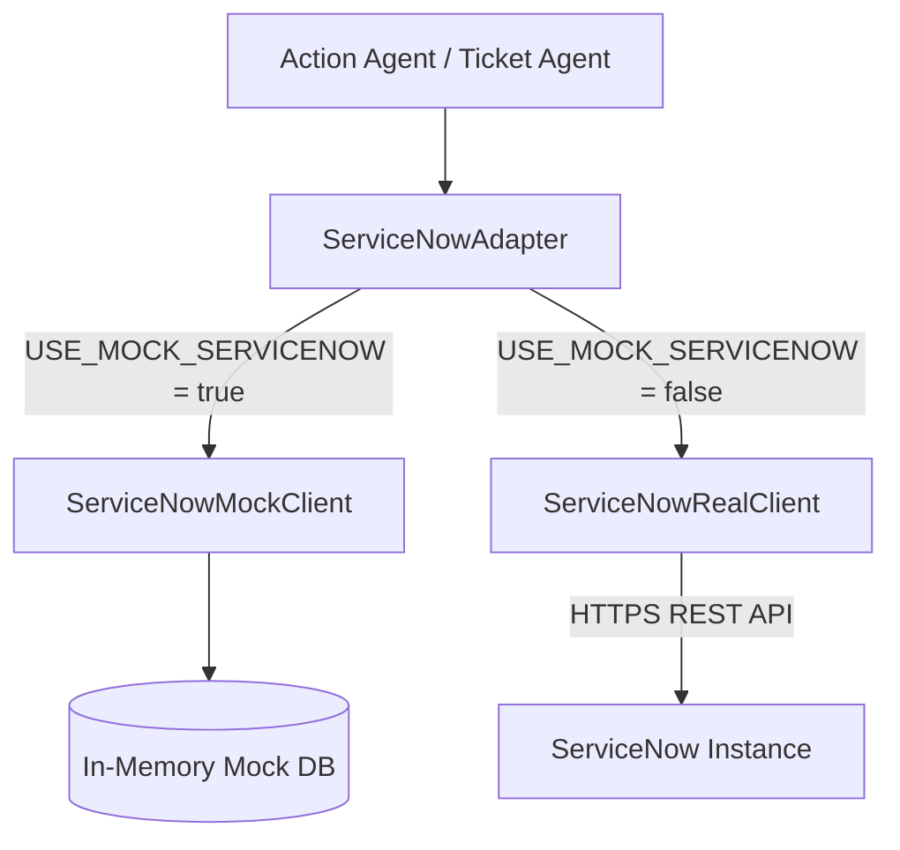

# ServiceNow Integration Layer

This document details the architectural layout, authentication modes, incident and catalog request workflows, adapters integration, Prometheus telemetry, and rollback procedures for the Bridgestone ServiceNow Integration Layer.

---

## 1. Architectural Overview

The integration layer sits between the LangGraph Action/Ticket Agents and the production ServiceNow REST Table APIs. Callers interact with the `ServiceNowAdapter` abstraction, which dynamically switches between a mock implementation and the real HTTP client based on the environment configurations.



---

## 2. Authentication Modes

The real ServiceNow integration client (`ServiceNowRealClient`) supports two authentication mechanisms:

1. **OAuth2 Flow (Primary)**:
   * Uses Client Credentials or Resource Owner Password Flow.
   * Sends a `POST` request to `/oauth_token.do` to obtain an access token.
   * Caches the token in-memory and automatically injects it as a `Bearer` token in the `Authorization` header of downstream API requests.

2. **HTTP Basic Authentication (Fallback)**:
   * If the OAuth2 token request fails or is unconfigured, the client falls back to standard HTTP Basic Authentication using `SERVICENOW_USERNAME` and `SERVICENOW_PASSWORD` via a `requests.auth.HTTPBasicAuth` handler wrapper.

---

## 3. Environment Variables Configuration

The integration behavior is controlled by environment variables specified in `.env` files (`dev.env`, `qa.env`, `prod.env`):

```ini
# Toggle mode: true maps to Mock Client, false maps to Real Client
USE_MOCK_SERVICENOW=false

# ServiceNow Target Instance URL
SERVICENOW_INSTANCE_URL=https://devXXXXX.service-now.com

# Basic/OAuth Credentials
SERVICENOW_USERNAME=admin
SERVICENOW_PASSWORD=securepassword

# OAuth Client App Credentials
SERVICENOW_CLIENT_ID=client_id_from_servicenow
SERVICENOW_CLIENT_SECRET=client_secret_from_servicenow
```

---

## 4. Assignment Group Mapping & OOTB Resolvers

To route tickets correctly to resolving teams without manual intervention, categories are dynamically resolved to their corresponding ServiceNow OOTB assignment groups.

### Mapping Schema
* **VPN** -> "Network Team"
* **Outlook** -> "Messaging Team"
* **Software** -> "Desktop Support Team"
* **SAP** -> "SAP Support Team"

### Resolution Flow
* **Real Mode**: The client queries `/api/now/table/sys_user_group` filtering by group name (e.g. `name=Network Team`) to fetch the target group's `sys_id`. If the group doesn't exist, it defaults back to the raw team name string.
* **Mock Mode**: Falls back directly to the raw team name string.

---

## 5. Incidents and Service Requests Workflows

### Incidents Lifecycle
* **Create Incident**: Sends `POST /api/now/table/incident` payload with `short_description`, `description`, `category`, `assignment_group`, and `caller_id`.
* **Get Incident**: Sends `GET /api/now/table/incident/{sys_id}` to retrieve active fields.
* **Update Incident**: Sends `PATCH /api/now/table/incident/{sys_id}` with updated fields.
* **Close Incident**: Closes the incident by triggering `PATCH` with `"state": "7"` (Closed status in ServiceNow OOTB schema).

### Service Requests Lifecycle
* **Create Request**: Sends `POST /api/now/table/sc_request` for catalog request lifecycle initialization.
* **Get Request Status**: Sends `GET /api/now/table/sc_request/{sys_id}` to fetch states.
* **Update Request**: Sends `PATCH /api/now/table/sc_request/{sys_id}` (e.g., closing request by updating status to `"closed_complete"`).

---

## 6. Telemetry and Observability

Prometheus metrics are collected automatically on every operation:
* `servicenow_requests_total` (Labels: `operation` e.g., `create_incident`, `get_all_requests`)
* `servicenow_failures_total` (Labels: `operation`, `error_type` e.g., `500`, `ConnectionError`)
* `servicenow_latency_seconds` (Labels: `operation` - records REST API duration)
* `incidents_created_total` (Total incidents created successfully)
* `service_requests_created_total` (Total service requests created successfully)

---

## 7. Rollback & Troubleshooting

If you encounter connection drops, rate-limiting, or invalid OAuth token issues in production:

1. **Quick Switch to Mock Mode**:
   Set `USE_MOCK_SERVICENOW=true` in `prod.env` or QA configs and restart the backend service. This forces the system back to the stable local/in-memory mock client.
2. **Verify Connectivity Diagnostics**:
   Call `/system-status` or `/health` endpoints. It reports latency and adapter states:
   ```json
   "adapters": {
     "ServiceNow": {
       "status": "healthy",
       "latency": 0.124,
       "details": "Authentication and API connectivity verified."
     }
   }
   ```
