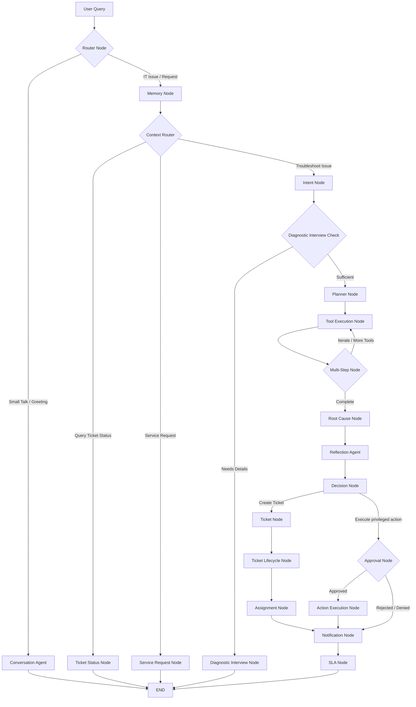
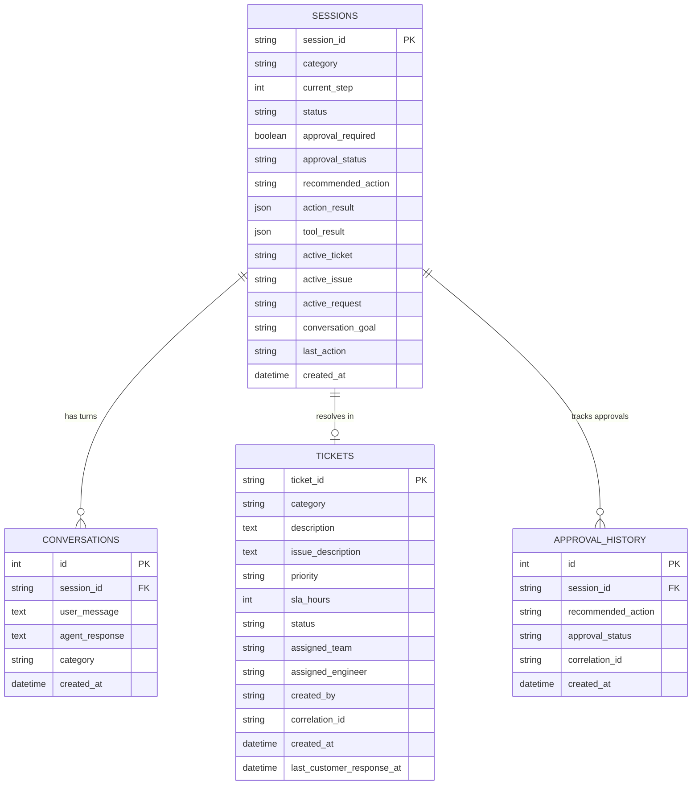

# Bridgestone IT Agent — System Architecture Document

This document provides a technical description of the Bridgestone IT Agent's multi-agent runtime, state management, database schema design, and external API adapter models.

---

## 1. High-Level Architectural Layout

The Bridgestone IT Agent POC platform consists of three main decoupled layers:

1. **User Presentation (Frontend):** 
   * Next.js 14 Web UI.
   * Leverages server-side rendering for administrative logs and reactive client-side rendering for realtime chat conversations.
2. **Business Orchestration (Backend Service):**
   * Python FastAPI web service.
   * Exposes stateless REST endpoints and invokes LangGraph StateGraph state machines to process messages.
3. **Database & Cache (Storage):**
   * PostgreSQL (production) or SQLite (local development fallback).
   * Redis for active caches (session tokens, locks, metrics registries).

---

## 2. Multi-Agent Pipeline (LangGraph Workflow)

---

## 3. Database Schema Blueprint

---

## 4. Integration Adapter Model

To ensure clean isolation and security:
* **ServiceNowAdapter:** Manages mapping internal database tickets to target enterprise incident numbers. Translates ticket statuses (OPEN, WAITING_FOR_USER, RESOLVED) to ServiceNow states.
* **MicrosoftGraphAdapter / Entra ID:** Performs account lookup checks (locked status, password expiration, group membership attributes) against mocked active directories.
* **ActiveDirectoryAdapter:** Integrates AD check tools into the automated tool agent nodes.
