# Enterprise Solution Architecture: Agentic IT Service Desk
**Company:** Bridgestone India  
**Target Audience:** CTO, Architecture Review Board (ARB), ServiceNow Integration Team  
**Visual Layout:** 16:9 Landscape Optimized for PowerPoint (CTO Review Grade)

---

## 1. System Topology & Layers

The diagram below represents the complete structural topology of the Bridgestone India IT Agent, dividing components into Presentation, Security, AI Orchestration, Knowledge base, Integration Adapters, Databases, Background Services, Observability, and External Corporate Systems.

```mermaid
graph TB
    %% Styling Class Definitions
    classDef client fill:#E1F5FE,stroke:#0288D1,stroke-width:2px,color:#01579B;
    classDef security fill:#FFEBEE,stroke:#D32F2F,stroke-width:2px,color:#B71C1C;
    classDef ai fill:#ECEFF1,stroke:#37474F,stroke-width:2px,color:#263238;
    classDef knowledge fill:#FFF3E0,stroke:#E65100,stroke-width:2px,color:#E65100;
    classDef tools fill:#E8F5E9,stroke:#2E7D32,stroke-width:2px,color:#1B5E20;
    classDef db fill:#EDE7F6,stroke:#5E35B1,stroke-width:2px,color:#311B92;
    classDef bg fill:#F3E5F5,stroke:#8E24AA,stroke-width:2px,color:#4A148C;
    classDef obs fill:#FFFDE7,stroke:#F57F17,stroke-width:2px,color:#5D4037;
    classDef external fill:#ECEFF1,stroke:#455A64,stroke-width:2px,color:#212121;

    %% Presentation Layer
    subgraph Presentation ["Presentation Layer (Frontend Portal - Next.js)"]
        User([Employee / Manager])
        Portal[Web Portal Interface]
        ChatUI[Interactive Chat Console]
        AdminUI[Admin Dashboard]
    end
    class Portal,ChatUI,AdminUI client;

    %% Security Gate
    subgraph Security ["Security & Gateways (Azure Active Directory / JWT)"]
        HTTPS[HTTPS Gateway]
        JWTAuth[JWT Session Verification]
        RBACFilter[RBAC Role Policy Filter]
        RateLimit[FastAPI Rate Limiter]
        InputVal[Pydantic Input Sanitizer]
        Secrets[Azure Key Vault / Secrets]
    end
    class HTTPS,JWTAuth,RBACFilter,RateLimit,InputVal,Secrets security;

    %% AI Copilot Layer (LangGraph Multi-Agent Grid)
    subgraph AICopilot ["AI Copilot Orchestration Layer (LangGraph Multi-Agent Grid)"]
        Intent[Intent Classifier]
        Entity[Entity Extractor]
        Mem[Conversation Memory]
        Ctx[Context Manager]
        Diag[Diagnostic Interview]
        Planner[Multi-Step Planner]
        Hypo[Hypothesis Tracker]
        RCA[Root Cause Analyzer]
        Decision{Decision Engine}
    end
    class Intent,Entity,Mem,Ctx,Diag,Planner,Hypo,RCA,Decision ai;

    %% Knowledge Layer (RAG Engine)
    subgraph Knowledge ["Knowledge Base Layer (Retrieval-Augmented Generation)"]
        SOP[Corporate SOP Registry]
        Guides[Troubleshooting Manuals]
        Retriever[RAG Vector Retriever]
    end
    class SOP,Guides,Retriever knowledge;

    %% Tool & Adapter Layer
    subgraph Adapters ["Integration Adapter Layer (BaseAdapter Interface)"]
        VPN_Ad[VPN Adapter]
        Outlook_Ad[Outlook Mailbox Adapter]
        AD_Ad[Active Directory Adapter]
        MSGraph_Ad[Microsoft Graph Adapter]
        Deploy_Ad[Software Deploy Adapter]
        Print_Ad[Printer Adapter]
        Net_Ad[Network Diagnostics]
        SNOW_Ad[ServiceNow API Adapter]
    end
    class VPN_Ad,Outlook_Ad,AD_Ad,MSGraph_Ad,Deploy_Ad,Print_Ad,Net_Ad,SNOW_Ad tools;

    %% Background Services
    subgraph Services ["Background Services (APScheduler Registry)"]
        Scheduler[APScheduler Core]
        SLAMonitor[SLA Monitor Engine]
        Escalation[Escalation Manager]
        NotifEngine[Notification Service]
        CleanJobs[Archive/Cleanup Jobs]
        Analytics[Analytics Aggregator]
    end
    class Scheduler,SLAMonitor,Escalation,NotifEngine,CleanJobs,Analytics bg;

    %% Databases & Persistent Storage
    subgraph Data ["Enterprise Data & Caching Layer"]
        Postgres[(PostgreSQL DB: Incidents & Audits)]
        Redis[(Redis Cache: Locks & Tokens)]
        VectorDB[(Vector Database: KB Embeddings)]
        AuditDB[(Audit Logs & Trace History)]
    end
    class Postgres,Redis,VectorDB,AuditDB db;

    %% Observability Stack
    subgraph Observability ["Observability Stack"]
        Prometheus[Prometheus Metrics]
        Grafana[Grafana Dashboards]
        Logging[Central Logger]
        Health[Health check Probes]
    end
    class Prometheus,Grafana,Logging,Health obs;

    %% External Enterprise Systems
    subgraph ExternalSystems ["External Corporate Systems"]
        SNOW[ServiceNow Cloud Instance]
        MSGraph[Microsoft Graph Cloud API]
        AD[Active Directory Domain Controller]
        SMTP[SMTP Mail Relay Server]
        Teams[Microsoft Teams webhook]
        SAP[SAP ERP Systems]
    end
    class SNOW,MSGraph,AD,SMTP,Teams,SAP external;

    %% Data Flow Arrows (Solid)
    User -->|1. Submit Query| Portal
    Portal -->|2. Route Request| HTTPS
    HTTPS -->|3. Validate Token| JWTAuth
    JWTAuth -->|4. Check Permissions| RBACFilter
    RBACFilter -->|5. Filter Parameters| InputVal
    InputVal -->|6. Load Context| Ctx
    
    %% AI to Knowledge Flows
    Ctx -->|7. Query Category| Intent
    Intent -->|8. Fetch Context| Retriever
    Retriever <-->|Read Embeddings| VectorDB
    Retriever -.->|Load SOPs| SOP
    Retriever -.->|Load Guides| Guides
    
    %% Tool & Adapter Execution Flow
    Planner -->|9. Dispatch Diagnostics| Adapters
    Adapters <-->|10. Execute Query| ExternalSystems
    
    %% Decision Output Flows
    Decision -->|YES: Self-Service Resolution| ExecAction[Execute Automated Action]
    ExecAction -->|Requires Approval?| Approval{Manager Approval Gate}
    Approval -->|Yes| SetPending[Set Status: PENDING]
    Approval -->|No / Approved| ExecuteSuccess[Execute Fix via Adapters]
    
    Decision -->|NO: Escalate Incident| CreateInc[Create ServiceNow Incident]
    CreateInc -->|Predict Priority| PredictPri[Priority Prediction Node]
    CreateInc -->|Map Team| AssignInc[Assignment Engine]
    AssignInc -->|Insert Record| SNOW_Ad
    
    %% Storage Hook Flows
    ExecuteSuccess -->|Write Log| AuditDB
    SNOW_Ad -->|Write Ticket| Postgres
    JWTAuth <-->|Fetch Lock status| Redis
    
    %% Background monitor hooks
    SLAMonitor -->|Query SLA Target| Postgres
    SLAMonitor -->|Breach Alert| Escalation
    Escalation -->|Notify| NotifEngine
    NotifEngine -->|Dispatch Alerts| SMTP
    NotifEngine -->|Teams Webhook| Teams
    
    %% Observability collection hooks
    Health -->|Ping API Status| HTTPS
    Logging -.->|Read logs| AuditDB
    Prometheus <-->|Collect Metrics| Postgres
    Grafana <-->|Render Dashboards| Prometheus
```



---

## 2. Dynamic Transaction Flow Matrix

The execution path is divided into **Data Flow** (solid lines - operational business data transfer) and **Control Flow** (dashed lines - system state changes, approvals, and authorization checking).

```
[ User Request ]
       │  (Data: Message payload)
       ▼
[ Gateway Filters ] ──(Control: JWT & RBAC Policy Verified)──► [ LangGraph Engine ]
                                                                     │
                                                      (Category & Context resolved)
                                                                     ▼
                                                             [ Diagnostic check ]
                                                                     │
                                                       (Tool output returned to Planner)
                                                                     ▼
                                                             [ Decision Engine ]
                                                                     │
                         ┌───────────────────────────────────────────┴───────────────────────────────────────────┐
                         ▼ (Option A: Solvable)                                                  (Option B: Unsolvable) ▼
                 [ Approval Check ]                                                               [ Create Incident ]
                         │                                                                               │
             ┌───────────┴───────────┐                                                       ┌───────────────────┴───────────────────┐
             ▼ (Pending)             ▼ (Approved)                                            ▼ (Predict Priority)                    ▼ (Assign Team)
     [ Present Card ]        [ Execute Action ]                                      [ Priority: High/Crit ]                 [ Queue Mapping ]
             │                       │                                                       │                                       │
     (Lock Chat Box)         (Directory Update)                                      (SLA Target Set)                        (ServiceNow API)
             │                       │                                                       │                                       │
             ▼                       ▼                                                       ▼                                       ▼
     [ User Click ] ──► [ Ticket Resolved / Logs ]                                   [ Monitor Loop ] ──► [ Notification & Closure ]
```

---

## 3. Layer Descriptions (CTO Review Reference)

### 3.1 Presentation Layer (Frontend - Next.js)
* **Web Portal Interface:** Renders the dashboard and user workspaces. Built with Tailwind CSS and React Server Components.
* **Interactive Chat Console:** Connects to the backend via REST and SSE (Server-Sent Events) to display streaming diagnostic alerts and interactive approval forms.
* **Admin Dashboard:** Real-time console that displays transaction graphs, audit logs, and scheduled background task histories.

### 3.2 Security & Gateway Layer
* **JWT Token Verification:** Validates standard user signatures on every incoming API request.
* **RBAC Policy Filter:** Restricts access to administrative endpoints (e.g. `/audit-logs`, `/jobs`) to authenticated administrators and managers.
* **FastAPI Rate Limiter:** Throttles incoming API requests to prevent resource depletion and denial-of-service attempts.

### 3.3 AI Copilot Orchestration Layer (LangGraph)
* **Intent Classifier:** Translates text prompts into structured categories (VPN, Active Directory, SAP, Outlook).
* **Multi-Step Planner:** Formulates a plan based on the diagnostic results (e.g., triggering a VPN access reset).
* **Decision Engine:** Evaluates the diagnostic plan and determines the routing path: executing an action, requesting approval, or creating a support ticket.

### 3.4 Data & Caching Layer
* **PostgreSQL Database:** Stores long-term incident records, SLA compliance milestones, and RBAC security logs.
* **Redis Cache:** Manages active user session tokens, diagnostic locks, and API rate-limiting metrics.
* **Vector Store:** Index storage containing text embeddings of company SOPs and troubleshooting manuals.
